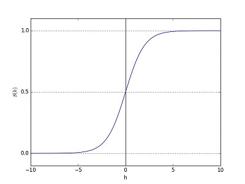
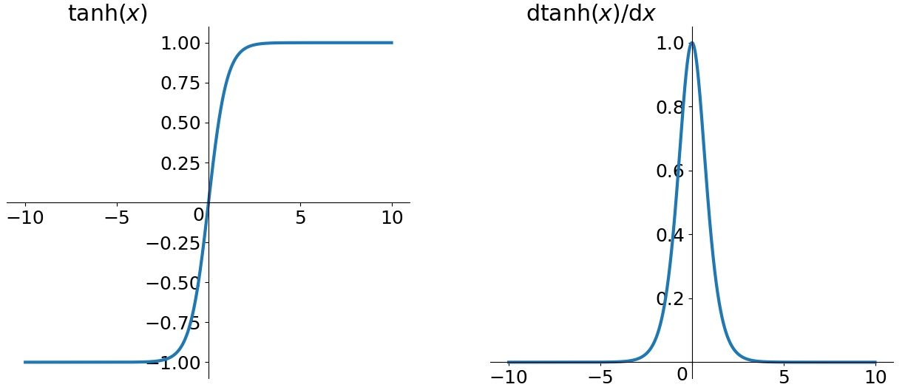
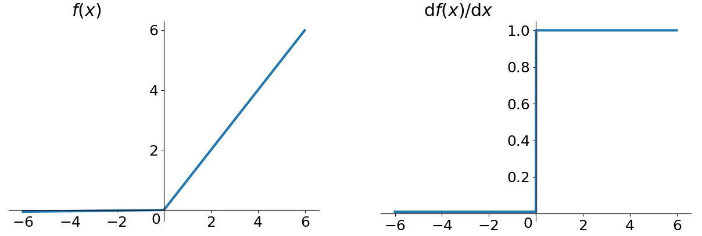
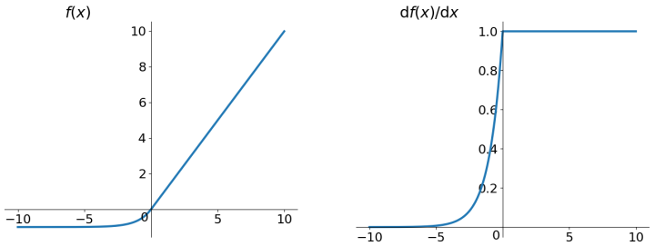

- [聊一聊深度学习的activation function](https://zhuanlan.zhihu.com/p/25110450)
- [什么是激活函数](https://zhuanlan.zhihu.com/p/32824193)
- [谈谈激活函数以零为中心的问题](https://liam.page/2018/04/17/zero-centered-active-function/)

建议使用ReLU函数，但是要注意初始化和learning rate的设置；可以尝试使用Leaky ReLU或ELU函数；不建议使用tanh，尤其是sigmoid函数。

## ReLU

$$ReLU=\max(0,x)$$

优先使用ReLU (Rectified Linear Unit) 函数作为神经元的激活函数:
- 解决了gradient vanishing问题 (在正区间)
- 计算速度非常快，只需要判断输入是否大于0
- 收敛速度远快于sigmoid和tanh

存在的问题：
- 不是zero-centered
- dead relu problem: 某些神经元可能永远不会被激活，导致相应的参数永远不能被更新

## Sigmoid

$$\sigma(x)=\frac{1}{1+e^{-x}}$$

它是便于求导的平滑函数，其导数为$d\sigma(x)=\sigma(x)(1-\sigma(x))$，这是优点。然而，Sigmoid有三大缺点：
- 容易出现gradient vanishing: x较大或较小时，导数趋近于0；导数最大值为0.25，则每一层会被压缩为原来的1/4.
- 函数输出并不是zero-centered：输出值恒大于0,回导致收敛速度慢
- 幂运算相对来讲比较耗时

## tanh

$$tanh(x)=\frac{e^x-e^{-x}}{e^x+e^{-x}}$$

tanh(Hyperbolic Tangent):它解决了zero-centered的输出问题，然而，gradient vanishing的问题和幂运算的问题仍然存在。

## Leaky ReLU

$$f(x)=\max (0.01x,x)$$

## ELU

ELU:Exponential Linear Units

$$f(x=)\left\{  
        \begin{array}{**lr**}  
             x,& if x>0  \\  
             \alpha(e^x-1), & otherwise
             \end{array}  
\right. 
$$

ELU也是为解决ReLU存在的问题而提出，显然，ELU有ReLU的基本所有优点，以及：
- 不会有Dead ReLU问题
- 输出的均值接近0，zero-centered

它的一个小问题在于计算量稍大。类似于Leaky ReLU，理论上虽然好于ReLU，但在实际使用中目前并没有好的证据ELU总是优于ReLU。
