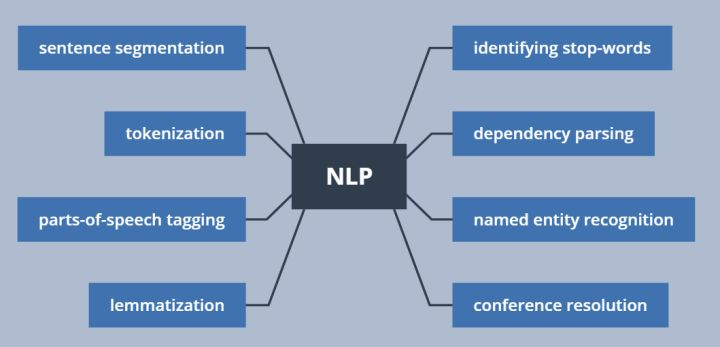

- wordvector
- bert
- tsne
    - [blog-How to Use t-SNE Effectively](https://distill.pub/2016/misread-tsne/)
- nlp reference
    - [zhihu-自然语言处理怎么最快入门？](https://www.zhihu.com/question/19895141)
    - [github-fastetext](https://github.com/facebookresearch/fastText)
    - [nlp roadmap](https://github.com/graykode/nlp-roadmap)
    - [复旦大学自然语言处理实验室](https://github.com/FudanNLP)
    - [Deep Learning for NLP resources](https://github.com/andrewt3000/dl4nlp)
    - [blog-52nlp](http://www.52nlp.cn/)
    - [zhihu-自然语言处理(NLP)入门学习资源清单](https://zhuanlan.zhihu.com/p/29791380)
    - [github-concrete_NLP_tutorial](https://github.com/hundredblocks/concrete_NLP_tutorial)
    - [吴恩达深度学习笔记](https://github.com/fengdu78/deeplearning_ai_books)
    - [zhihu-nlp](https://zhuanlan.zhihu.com/p/80217404)
    - [github-ml-nlp](https://github.com/NLP-LOVE/ML-NLP): 知识点和代码实现，也是作为一个算法工程师必会的理论基础知识
    - [有三AI学院-自然语言处理](https://zhuanlan.zhihu.com/c_1192412642935922688)
    - [谷歌黑板报数学之美](https://china.googleblog.com/2006/04/blog-post_7327.html)
    - [Analyzing Text with the Natural Language Toolkit](http://www.nltk.org/book/)
- course
    - [stanford-CS224d: Deep Learning for Natural Language Processing](http://web.stanford.edu/class/cs224n/index.html#schedule)
    - [stanford-CS229: Machine Learning](http://cs229.stanford.edu/)
    - [oxford-cs-deepnlp](https://github.com/oxford-cs-deepnlp-2017)

- ml
    - [final](https://mp.weixin.qq.com/s?__biz=MzI0ODcxODk5OA==&mid=2247503047&idx=4&sn=dc75752a388cd21292432f884b1115e5&chksm=e99eff3edee97628e7947a8ca3f3ba8e6d3bd18ae87b93a0840ac95da748a1cfffaf32f8e257&mpshare=1&scene=1&srcid=03062NInvNwU7SUFzSjJxHKJ&key=06b9089f8b38a19daaedd342d3857c308173269183c64809cf6cb2fd5e09c48df60d5d35a133b36859811764c06121495a0a83a88529812f28494c3f83e5317dd8863c066ec3b82842a5a330ea8b2bc5&ascene=0&uin=MjM2ODI2NDIwMQ%3D%3D&devicetype=iMac+MacBookPro11%2C1+OSX+OSX+10.12.6+build(16G1408)&version=12020810&nettype=WIFI&lang=zh_CN&fontScale=100&pass_ticket=pCvyYrLxxZ6vJ2PIxP7GzQRL%2BuW9dsL0uSnuYrb34IpRPAte%2BnGUz%2B16S50kwo25)
    - [github-100-Days-Of-ML-Code](https://github.com/Avik-Jain/100-Days-Of-ML-Code)
    - [lihang_book_algorithm](https://github.com/WenDesi/lihang_book_algorithm)
        - [csdn-author](https://blog.csdn.net/wds2006sdo/category_6314784.html)

### open source tool

-  spaCy（网站，博客）[Python; 新兴的开放源码库并自带炫酷的用法示例、API文档和演示应用程序]
    - 网站网址：https://spacy.io/
    - 博客网址：https://explosion.ai/blog/
    - 演示应用网址: https://spacy.io/docs/usage/showcase

- 自然语言工具包（NLTK）（网站，图书）[Python; NLP实用编程介绍，主要用于教学目的]
    - 网站网址：http://www.nltk.org
    - 图书网址: http://www.nltk.org/book/
- 斯坦福CoreNLP（网站）[由Java开发的高质量的自然语言分析工具包]
    - 网站网址: https://stanfordnlp.github.io/CoreNLP/

- [12 open source tools for natural language processing](https://opensource.com/article/19/3/natural-language-processing-tools)

