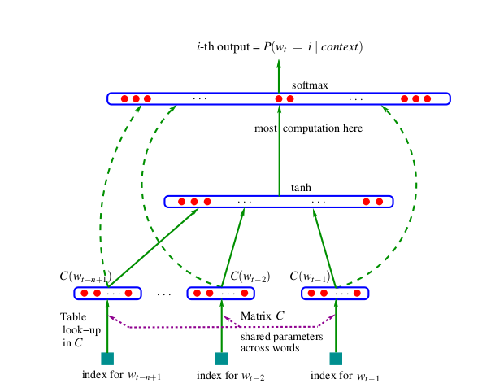

## refer
- [了解N-Gram模型](https://zhuanlan.zhihu.com/p/34219483)
- [speech and language processing]

tookits:
- [SRILM](http://www.speech.sri.com/projects/srilm/)
- [KenLM](https://kheafield.com/code/kenlm/)

language model:
- count-based (statistical)
- neural langiage models

## n-gram

- one word sentence $W={w_1,w_2,\dots,w_n}$
- $w^n_1$ means the string $w_1,w_2,\dots,w_n$

With the chain rule of probability(链式规则), the probability of W:
$$P(w^n_1)=P(w_1)P(w_2|w_1)P(w_3|w_1^2)\dots P(w_n|w_1^{n-1})\\
=\prod_{k=1}^{n}P(w_k|w_1^{k-1}) $$

In n-gram, approximate the history by just the last few words(markov assumption):
$$\text{for 1-gram: }P(w_n|w_1^{n-1})\approx P(w_n|w_{n-1}) \\
\text{for N-gram: }P(w_n|w_1^{n-1})\approx P(w_n|w^{n-1}_{n-N+1}) \\
\text{thus for the sentence: }P(w_1^n)\approx \prod_{k=1}^n P(w_k|w^{k-1}_{k-N+1})$$

By maximum likelihood estimation(计算词频), 为了计算$w_{n-1}$下$w_{n}$的概率，把$w_{n-1}$和$w_{n}$出现在一起的次数除以$w_{n-1}$与所有词出现在一起的次数的总和，而事实上$w_{n-1}$与所有词出现在一起的次数就等于$w_{n-1}$出现的次数:
$$P(w_n|w_{n-1})=\frac{C(w_{n-1}w_n)}{\sum_w C(w_{n-1}w)}=\frac{C(w_{n-1}w_n)}{C(w_{n-1}w)}$$ 

unigram, bigram, trigram

两大问题：

1. 稀疏问题 Sparsity Problem。在我们之前的大量文本中，可能分子或分母的组合没有出现过，则其计数为零。并且随着n的增大，稀疏性更严重。
2. 我们必须存储所有的n-gram对应的计数，随着n的增大，模型存储量也会增大。

## deeper in n-gram

#### 0. backoff:
"quietly on the" is not seen $\longrightarrow$ try "on the"
\[
P\left(w_{i} \mid \text {quietly on the}\right) \approx P\left(w_{i} \mid \text {on the}\right)
\]
"on the" is not seen $\longrightarrow$ try"the"
\[
P\left(w_{i} \mid \text { on the }\right) \approx P\left(w_{i} \mid \text { the }\right)
\]
"the" is not seen $\longrightarrow$ try unigram
\[
P\left(w_{i} \mid \text { the }\right) \approx P\left(w_{i}\right)
\]

#### 1. weight: mix unigram, bigram, trigram

$$ \begin{aligned}
\widehat{P}\left(w_{i} \mid w_{i-1}, w_{i-2}, w_{i-3}\right) & \approx \lambda_{3} P\left(w_{i} \mid w_{i-1}, w_{i-2}, w_{i-3}\right)+\\
&+\lambda_{2} P\left(w_{i} \mid w_{i-1}, w_{i-2}\right) \\
&+\lambda_{1} P\left(w_{i} \mid w_{i-1}\right) \\
&+\lambda_{0} P\left(w_{i}\right)
\end{aligned}   \\
\sum_{k=0}^{n-1} \lambda_{k}=1$$

katz backoff: adjusting $\lambda$
$$P_{\mathrm{BO}}\left(w_{n} \mid w_{n-N+1}^{n-1}\right)=\left\{\begin{array}{ll}
P^{*}\left(w_{n} \mid w_{n-N+1}^{n-1}\right), & \text { if } C\left(w_{n-N+1}^{n}\right)>0 \\
\alpha\left(w_{n-N+1}^{n-1}\right) P_{\mathrm{BO}}\left(w_{n} \mid w_{n-N+2}^{n-1}\right), & \text { otherwise }
\end{array}\right.$$

#### 2. smoothing

Laplace-smoothing(aka add-one smoothing): If 1 is too rude, add small $\delta$ to count for every $w_i\in V$

$$\widehat{P}\left(w_{i} \mid w_{i-1}, \ldots, w_{i-n+1}\right)=\frac{\delta+P\left(w_{i}, w_{i-1}, \ldots, w_{i-n+1}\right)}{\delta \cdot|V|+P\left(w_{i-1}, \ldots, w_{i-n+1}\right)}$$

Kneser-Ney Smoothing:

#### evaluation

cross-entropy:
$$H_{M}\left(w_{1} w_{2} \ldots w_{n}\right)=-\frac{1}{n} \cdot \log P_{M}\left(w_{1} w_{2} \ldots w_{n}\right)$$

perplexity:
perplexity $=2^{c r o s s-e n t r o p y}$

## NNLM: neural networks language models

 - [paper](https://link.zhihu.com/?target=http%3A//www.jmlr.org/papers/volume3/bengio03a/bengio03a.pdf)

 Fighting the Curse of Dimensionality with Distributed Representations:
 - associate with each word in the vocabulary a distributed word feature vector
 - express the joint probability function of word sequences in terms of the feature vectors of these words in the sequence
- learn simultaneously the word feature vectors and the parameters of that probability function

learn model:

$$\begin{aligned} C(i)\in  \mathbb{R}^{m}&: \text{feature vector} \\ 
g&: \text{a conditional probabilit distribution function} w_t \end{aligned}\\\Downarrow \\ f\left(w_{t}, \cdots, w_{t-n+1}\right)=\hat{P}\left(w_{t} \mid w_{1}^{t-1}\right) \\ 
 f\left(i, w_{t-1}, \cdots, w_{t-n+1}\right)=g\left(i, C\left(w_{t-1}\right), \cdots, C\left(w_{t-n+1}\right)\right)$$

maximizes the object function:
$$L=\frac{1}{T} \sum_{t} \log f\left(w_{t}, w_{t-1}, \cdots, w_{t-n+1} ; \theta\right)+R(\theta)    \\
R: \text{regularization term, weight decay penalty}$$

the network structure:
- input: $x=\left(C\left(w_{t-1}\right), C\left(w_{t-2}\right), \cdots, C\left(w_{t-n+1}\right)\right)$
- hidden layer: $y=b+W x+U \tanh (d+H x)$
- softmax output layer: $\hat{P}\left(w_{t} \mid w_{t-1}, \cdots w_{t-n+1}\right)=\frac{e^{y_{w_{t}}}}{\sum_{i} e^{y_{i}}}$
- update: $\theta \leftarrow \theta+\varepsilon \frac{\partial \log \hat{P}\left(w_{t} \mid w_{t-1}, \cdots w_{t-n+1}\right)}{\partial \theta}$

## 

- [rnn-2010](https://link.zhihu.com/?target=https%3A//www.isca-speech.org/archive/archive_papers/interspeech_2010/i10_1045.pdf)
- lstm-rnn 2012
- bi-rnn
- cnn
- bert
- 

## lm

- 在纠错上的应用
- 语言模型，概念
