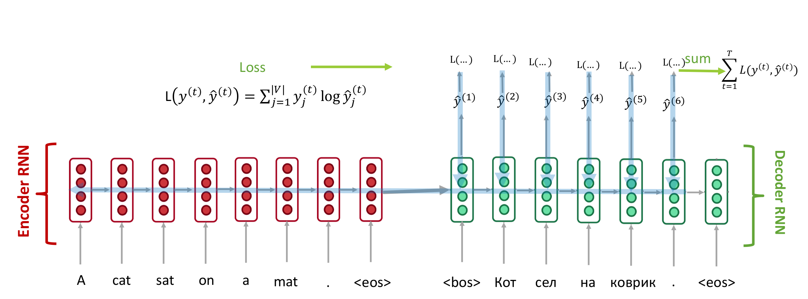
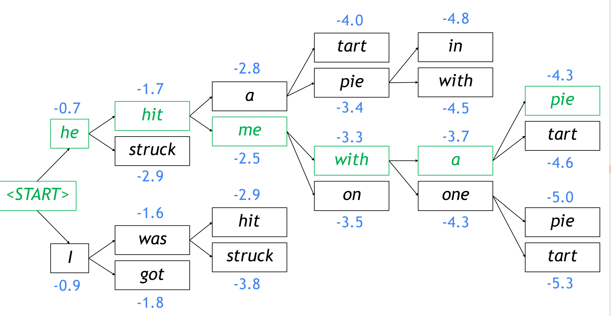
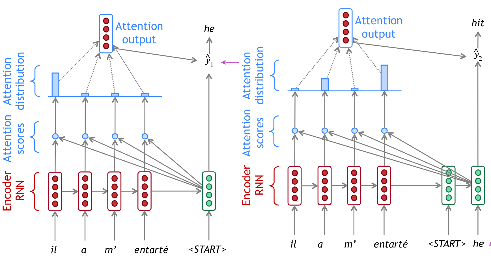

## seq2seq

decoding:
1. greedy decoding: 取softmax最大值最为下一个输入
2. beam search:
    

## attention

In equations:
$$\begin{aligned} 
\text{encoder hidden states:  } &  h_{1}, \ldots, h_{N} \in \mathbb{R}^{h} \\
\text{decoder hidden states on timestep $t$:  } &  s_t \in s_{t} \in \mathbb{R}^{h}    \\
\text{attention scores on timestep $t$:  } &  \boldsymbol{e}^{t}=\left[\boldsymbol{s}_{t}^{T} \boldsymbol{h}_{1}, \ldots, \boldsymbol{s}_{t}^{T} \boldsymbol{h}_{N}\right] \in \mathbb{R}^{N}     \\
\text{attention distribution:  } & \alpha^{t}=\operatorname{softmax}\left(e^{t}\right) \in \mathbb{R}^{N}   \\
\text{attention output from weighted sum of $\boldsymbol{h}_i$:  } & \boldsymbol{a}_{t}=\sum_{i=1}^{N} \alpha_{i}^{t} \boldsymbol{h}_{i} \in \mathbb{R}^{h}
\end{aligned}$$

any function can be applied to calculated attention scores:
- Basic dot-product attention: $e_{i}=s^{T} h_{i} \in \mathbb{R}$
- Multiplicative attention: $e_{i}=s^{T} W h_{i} \in \mathbb{R}$, where $W \in \mathbb{R}^{d_{2} \times d_{1}}$ is a weight matrix
- Additive attention:
$$\boldsymbol{e}_{i}=\boldsymbol{v}^{T} \tanh \left(\boldsymbol{W}_{1} \boldsymbol{h}_{i}+\boldsymbol{W}_{2} \boldsymbol{s}\right) \in \mathbb{R}$$
    - $\quad W_{1} \in \mathbb{R}^{d_{3} \times d_{1}}, W_{2} \in \mathbb{R}^{d_{3} \times d_{2}}$ are weight matrices 
    - $v \in \mathbb{R}^{d_{3}}$ is a weight vector.
    - $d_{3}($ the attention dimensionality) is a hyperparameter

## ref

- [zhihu-Attention机制详解](https://zhuanlan.zhihu.com/p/47063917)
- [Visualizing A Neural Machine Translation Model](https://jalammar.github.io/visualizing-neural-machine-translation-mechanics-of-seq2seq-models-with-attention/)
- [TF seq2seq文档](https://google.github.io/seq2seq/)