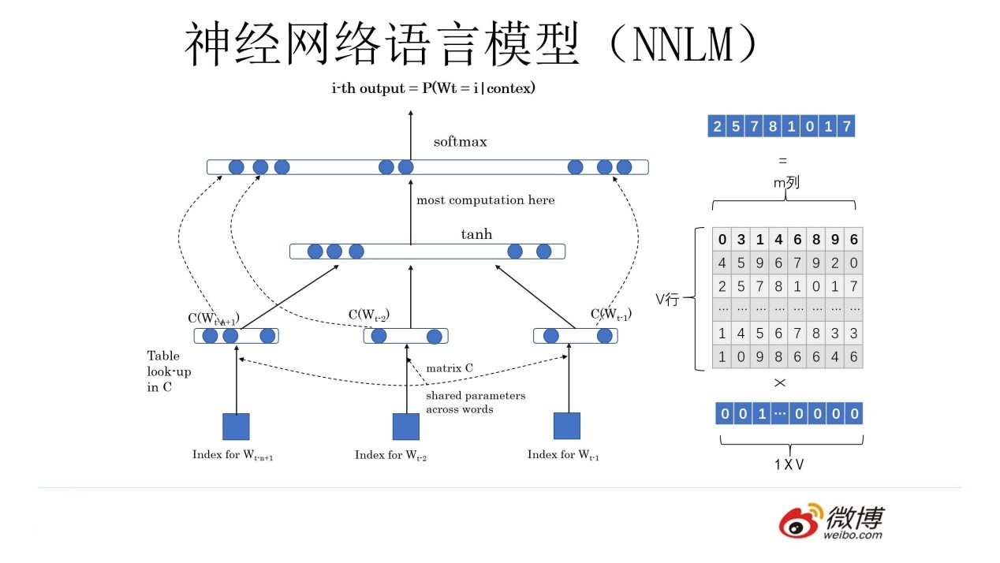
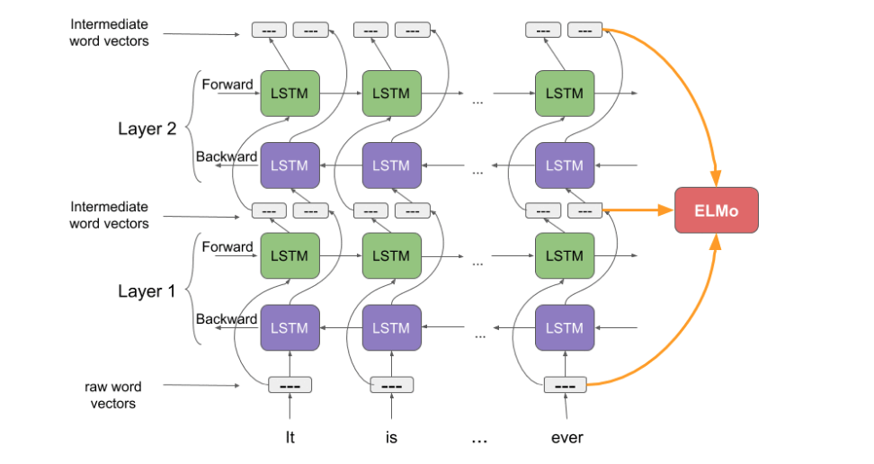

## pre-trained model

预训练模型在图像领域是比较常规的一种做法，即对于一些较复杂的多层次网络，可以直接以预训练好的具有相似网络结构的低层网络来初始化网络参数，提高训练效率。如果在复杂网络的训练过程中这些预训练参数保持不变被称为“Frozen”方法; 而预训练参数随着训练过程改变的被称为"Fine-Tuning"方法。

预训练方法的有效性在于，对于不同任务的多层级复杂网络，其浅层网络一般学习到的都是共有的基础特征，故这些参数可以相互借用。比如图片中一般第一层学习到的是简单集合特征，再高层次才是面向不同CV任务的高级特征，比如五官轮廓

#### word embedding and pre-trained model

在2003年提出的神经网络语言模型(NNLM)中，每个词被转化为One-hot向量，之后乘以一个权重矩阵C得到高维向量作为网络输入。从另一个角度看One-hot向量与矩阵C相乘之后得到的就是某一行的权重值，这样就把词转化为了向量，这其实跟2013年提出的Word2Vec的思想是一致的，即NNLM在训练结束事实上也得到了一个副产物——矩阵C，其每一行都对应着一个词向量。与NNLM不同的是，词向量在2013年的Word2Vec中不再是副产物，而是主要产物。通过Word2Vec得到的向量也可以直接用来初始化NNLM的C矩阵，而事实上在2013年之后，Word Embedding也确实成为自然语言处理中的主流的编码方式。因此可以把Word Embedding看作一种预训练模型。我们在使用Word Embedding时，直接把词语的one-hot向量一一映射到词向量上作为网络输入就相当于完成了第一层网络参数的初始化。

Word Embedding也有自身的缺陷，即单一的向量无法充分表达多义词在不同语境下的语义的不同。而2018年之后，这一问题也逐渐被新的模型所改善。

## ELMO
Embeddings from Language Models (ELMo): 
- [2018-Deep contextualized word representations](https://arxiv.org/abs/1802.05365)
- [slides-A Review of Deep Contextualized Word Representations](https://www.slideshare.net/shuntaroy/a-review-of-deep-contextualized-word-representations-peters-2018)
- [pre-trained models]()
- [ELMO tutorial with code](https://github.com/PrashantRanjan09/Elmo-Tutorial)

根据整个语义环境给出词向量。

采用双向LSTM网络结构（bi-directional LSTM, biLM), 对前向和反向网络输出的向量以及初始向量着三个向量进行加权求和得出最终的词向量。
$$$$

$$\begin{aligned} Forward:& \quad p\left(t_{1}, t_{2}, \ldots, t_{N}\right)=\prod_{k=1}^{N} p\left(t_{k} \mid t_{1}, t_{2}, \ldots, t_{k-1}\right) \\
 Backward:& \quad p\left(t_{1}, t_{2}, \ldots, t_{N}\right)=\prod_{k=1}^{N} p\left(t_{k} \mid t_{k+1}, t_{k+2}, \ldots, t_{N}\right) \end{aligned}$$

## ULM-FiT

## OpenAI Transformer

use transformer decoder

## BERT

clever models build on:
- semi-supervised sequence learning
- ELMO
- ULM-FiT
- OpenAI transformer
- transformer

The paper presents two model sizes for BERT:
- BERT BASE – Comparable in size to the OpenAI Transformer in order to compare performance
- BERT LARGE – A ridiculously huge model which achieved the state of the art results reported in the paper

- transformer encoder
- masked tokens

## code
- [google bert](https://github.com/google-research/bert)
- [BertViz:a tool for visualizing attention in the Transformer model](https://github.com/jessevig/bertviz)
- [kerasbert](https://github.com/CyberZHG/keras-bert)
- [bertsearch: elasticsearch with bert](https://github.com/Hironsan/bertsearch)

## ref

- [从Word Embedding到Bert模型—自然语言处理中的预训练技术发展史](https://zhuanlan.zhihu.com/p/49271699)
- [A Step-by-Step NLP Guide to Learn ELMo for Extracting Features from Text](https://www.analyticsvidhya.com/blog/2019/03/learn-to-use-elmo-to-extract-features-from-text/)
- [ BERT FineTuning with Cloud TPUs notebook](https://colab.research.google.com/github/tensorflow/tpu/blob/master/tools/colab/bert_finetuning_with_cloud_tpus.ipynb)
- [语言模型和迁移学习b457 ](https://zhuanlan.zhihu.com/p/42618178)
- [BERT-related-papers](https://github.com/tomohideshibata/BERT-related-papers)

<table>
  <tr></tr>
  <tr>
      <td width="30%">
    
    </td>
    <td width="70%">
<h3><a href="https://github.com/jina-ai/jina/tree/master/docs/chapters/101">► Jina 101: First Thing to Learn About Jina</a></h3>
&nbsp;&nbsp;<a href="https://github.com/jina-ai/jina/tree/master/docs/chapters/101">English</a> •
  <a href="https://github.com/jina-ai/jina/tree/master/docs/chapters/101/README.ja.md">日本語</a> •
  <a href="https://github.com/jina-ai/jina/tree/master/docs/chapters/101/README.fr.md">français</a> •
  <a href="https://github.com/jina-ai/jina/tree/master/docs/chapters/101/README.de.md">Deutsch</a> •
  <a href="https://github.com/jina-ai/jina/tree/master/docs/chapters/101/README.ru.md">Русский язык</a> •
  <a href="https://github.com/jina-ai/jina/tree/master/docs/chapters/101/README.zh.md">中文</a>
 
    <h3><a href="https://github.com/jina-ai/examples/tree/master/x-as-service">► From BERT-as-Service to X-as-Service</a></h3>
Learn how to use Jina to extract feature vector using any deep learning representation	

</td>
  </tr>
</table>