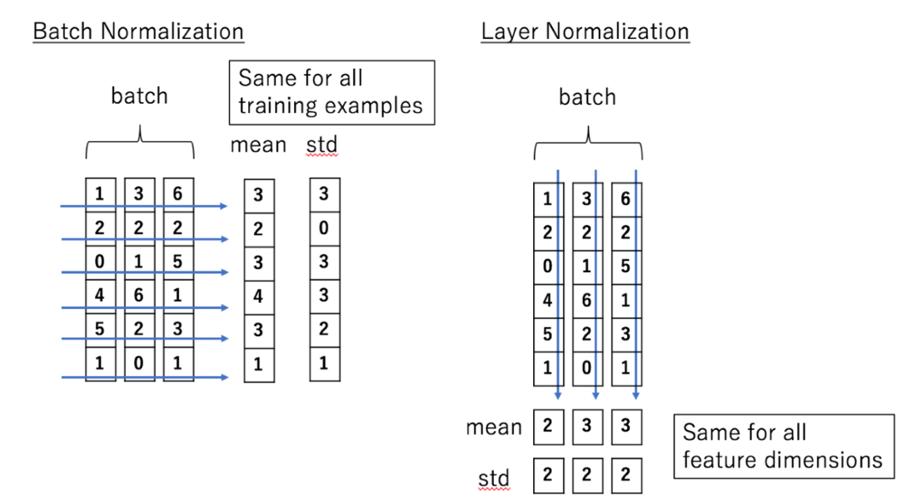

## Batch normalization

$$\begin{array}{l}
\mu_{j}=\frac{1}{m} \sum_{i=1}^{m} x_{i j} \\
\sigma_{j}^{2}=\frac{1}{m} \sum_{i=1}^{m}\left(x_{i j}-\mu_{j}\right)^{2} \\
\hat{x_{i j}}=\frac{x_{i j}-\mu_{j}}{\sqrt{\sigma_{j}^{2}+\epsilon}}
\end{array}$$

## Layer normalization

$$\begin{array}{l}
\mu_{i}=\frac{1}{m} \sum_{j=1}^{m} x_{i j} \\
\sigma_{i}^{2}=\frac{1}{m} \sum_{j=1}^{m}\left(x_{i j}-\mu_{i}\right)^{2} \\
\hat{x_{i j}}=\frac{x_{i j}-\mu_{i}}{\sqrt{\sigma_{i}^{2}+\epsilon}}
\end{array}$$

## ref
