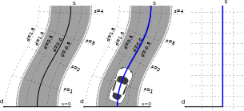
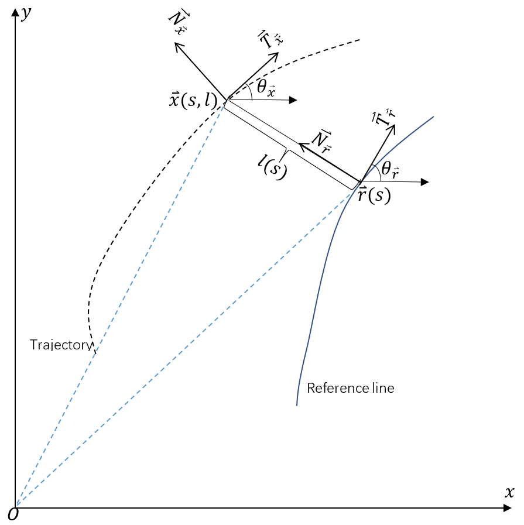

## Frenet坐标系

由于道路一般是弯曲的，使用笛卡尔坐标系会增加描述路线的复杂度，同时难以直观看出车辆相对于道路的偏离程度。自动驾驶中一般使用Frenet坐标系描述汽车相对于道路的位置。一般以车道中心线(或者车道中心线的切向量)为纵坐标，记为s轴(Longitudinal axis);垂直s轴作为横坐标，记为d轴(lateral axis). Frenet的两个坐标值直接给出了车辆的纵向行驶距离和横向偏移距离，这也符合我们对驾驶的物理感受。



## 坐标转换



**曲率$\kappa$**:曲线密切圆的半径的倒数。曲线越弯曲，则密切圆半径越小，曲率越大。
$$
\kappa=\frac{|f''(x_0)|}{(1+f'(x_0)^2)^{\frac{3}{2}}}$$


**frenet坐标: $(s,l)$**. 这里的s是一个坐标变量，如果单看这样一个坐标表示是没有任何意义的，与单纯的$(x,y)$没有任何区别。而frenet是相对于参考曲线的坐标，因此需要知道参考曲线的方程$\vec{r}(s)=(r_x(s),r_y(s))$,表示参考线s坐标下当前参考点在笛卡尔坐标系下的向量坐标

**曲线速率和切向量**：$r(t)=(t,t)$和$r(t)=(2t,2t)$事实上是同一条曲线，但是两者的速率不同，可以认为第二条曲线是第一条的两倍。因此以时间t为参数的曲线可以以不同的速率走完同一条曲线。而$\vec{r}(s)$是以曲线本身为坐标。
- 切向量：$\vec{T}=\frac{dr}{ds}$
- 单位切向量：$T=\frac{dr}{ds}/||\frac{dr}{ds}||$
- 速率: $\frac{ds}{dt}=|v(t)|$
- 单位法向量: $N=\frac{\frac{dT}{ds}}{||\frac{dT}{ds}||}$
- 曲率：单位切向量的转动率，$\kappa=||\frac{d \mathbf{T}}{d s}||$，事实上就是法向量的长度

**符号约定**：
$$[\theta_r,s,\kappa_r,r(s),r',r'',l,l',l'']\rightleftharpoons [\theta_x,X,\kappa_x,v_x,a_x]$$

**cartesian_to_frenet**:

[Apollo项目中的坐标系转换](https://blog.csdn.net/davidhopper/article/details/79162385)

已知：$$[\theta_r,s,\kappa_r,r(s) | \theta_x,X,\kappa_x,v_x,a_x ] \rightarrow [r(s),r',r'',l,l',l'']$$

$$\begin{aligned}l&=\overrightarrow{\mathbf{N}}_{r}^{T}[\vec{x}-\vec{r}]=[\vec{x}-\vec{r}]^{T} \overrightarrow{\mathbf{N}}_{r}  \\
\Delta \theta &=\theta_{x}-\theta_{r}   \\
l'&=v_xsin(\Delta\theta)    \\
l^{\prime \prime}&=-\left(\kappa_{r}^{\prime} l+\kappa_{r} l^{\prime}\right) \tan \Delta \theta+\frac{\left(1-\kappa_{r} l\right)}{\cos ^{2} \Delta \theta}\left[\kappa_{x} \frac{1-\kappa_{r} l}{\cos \Delta \theta}-K_{r}\right]
\end{aligned}$$

```c++
void CartesianFrenetConverter::cartesian_to_frenet(
    const double rs, const double rx, const double ry, const double rtheta,
    const double rkappa, const double rdkappa, const double x, const double y,
    const double v, const double a, const double theta, const double kappa,
    std::array<double, 3>* const ptr_s_condition,
    std::array<double, 3>* const ptr_d_condition) {
  const double dx = x - rx;
  const double dy = y - ry;

  const double cos_theta_r = std::cos(rtheta);
  const double sin_theta_r = std::sin(rtheta);

  const double cross_rd_nd = cos_theta_r * dy - sin_theta_r * dx;
  // 求解d
  ptr_d_condition->at(0) =
      std::copysign(std::sqrt(dx * dx + dy * dy), cross_rd_nd);

  const double delta_theta = theta - rtheta;
  const double tan_delta_theta = std::tan(delta_theta);
  const double cos_delta_theta = std::cos(delta_theta);

  const double one_minus_kappa_r_d = 1 - rkappa * ptr_d_condition->at(0);
  // 求解d' = dd / ds
  ptr_d_condition->at(1) = one_minus_kappa_r_d * tan_delta_theta;

  const double kappa_r_d_prime =
      rdkappa * ptr_d_condition->at(0) + rkappa * ptr_d_condition->at(1);

  // 求解d'' = dd' / ds
  ptr_d_condition->at(2) =
      -kappa_r_d_prime * tan_delta_theta +
      one_minus_kappa_r_d / cos_delta_theta / cos_delta_theta *
          (kappa * one_minus_kappa_r_d / cos_delta_theta - rkappa);

  // 求解s
  ptr_s_condition->at(0) = rs;
  // 求解ds / dt
  ptr_s_condition->at(1) = v * cos_delta_theta / one_minus_kappa_r_d;

  const double delta_theta_prime =
      one_minus_kappa_r_d / cos_delta_theta * kappa - rkappa;
  // 求解d(ds) / dt
  ptr_s_condition->at(2) =
      (a * cos_delta_theta -
       ptr_s_condition->at(1) * ptr_s_condition->at(1) *
           (ptr_d_condition->at(1) * delta_theta_prime - kappa_r_d_prime)) 
           / one_minus_kappa_r_d;
  return;
}

```

**frenet to cartesian**:
已知：$$[\theta_r,s,\kappa_r,r(s),r',r'',l,l',l''] \rightarrow [\theta_x,X,\kappa_x,v_x,a_x]$$

$$\begin{aligned}v_{x}&=r' \frac{1-\kappa_{r} l}{\cos \Delta \theta}   \\
a_{x}&=r'' \frac{1-\kappa_{r} l}{\cos \Delta \theta}+\frac{r'^2}{\cos \Delta \theta}\left[\left(1-\kappa_{r} l\right) \tan \Delta \theta\left[\kappa_{x} \frac{1-\kappa_{r} l}{\cos \Delta \theta}-\kappa_{r}\right]-\left(k_{r}^{\prime} l+k_{r} l^{\prime}\right)\right]\end{aligned}$$


```c++
void CartesianFrenetConverter::frenet_to_cartesian(
    const double rs, const double rx, const double ry, const double rtheta,
    const double rkappa, const double rdkappa,
    const std::array<double, 3>& s_condition,
    const std::array<double, 3>& d_condition, double* const ptr_x,
    double* const ptr_y, double* const ptr_theta, double* const ptr_kappa,
    double* const ptr_v, double* const ptr_a) {
  CHECK(std::abs(rs - s_condition[0]) < 1.0e-6)
      << "The reference point s and s_condition[0] don't match";

  const double cos_theta_r = std::cos(rtheta);
  const double sin_theta_r = std::sin(rtheta);

  *ptr_x = rx - sin_theta_r * d_condition[0];
  *ptr_y = ry + cos_theta_r * d_condition[0];

  const double one_minus_kappa_r_d = 1 - rkappa * d_condition[0];

  const double tan_delta_theta = d_condition[1] / one_minus_kappa_r_d;
  const double delta_theta = std::atan2(d_condition[1], one_minus_kappa_r_d);
  const double cos_delta_theta = std::cos(delta_theta);

  *ptr_theta = common::math::NormalizeAngle(delta_theta + rtheta);

  const double kappa_r_d_prime =
      rdkappa * d_condition[0] + rkappa * d_condition[1];
  *ptr_kappa = (((d_condition[2] + kappa_r_d_prime * tan_delta_theta) *
                 cos_delta_theta * cos_delta_theta) /
                    (one_minus_kappa_r_d) +
                rkappa) *
               cos_delta_theta / (one_minus_kappa_r_d);

  const double d_dot = d_condition[1] * s_condition[1];
  *ptr_v = std::sqrt(one_minus_kappa_r_d * one_minus_kappa_r_d *
                         s_condition[1] * s_condition[1] +
                     d_dot * d_dot);

  const double delta_theta_prime =
      one_minus_kappa_r_d / cos_delta_theta * (*ptr_kappa) - rkappa;

  *ptr_a = s_condition[2] * one_minus_kappa_r_d / cos_delta_theta +
           s_condition[1] * s_condition[1] / cos_delta_theta *
               (d_condition[1] * delta_theta_prime - kappa_r_d_prime);
}

```

## udacity course

- [CarND-Path-Planning-Project](https://github.com/udacity/CarND-Path-Planning-Project)
- [term3-simulator](https://github.com/udacity/self-driving-car-sim/releases/tag/T3_v1.2)


## 坐标转换


## ref

- blog
    
- code
- project
- paper
    - [Optimal Trajectory Generation for Dynamic Street Scenarios in a Frenet Frame](http://vigir.missouri.edu/~gdesouza/Research/Conference_CDs/IEEE_ICRA_2010/data/papers/1650.pdf)
        - [blog](https://fjp.at/posts/optimal-frenet/)

