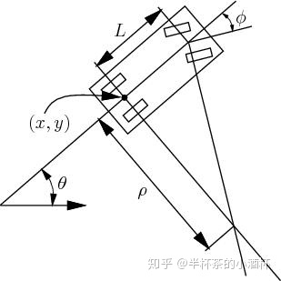

- unicycle car model
- length scale
- time scale

normalize tf:

dx * dt -> dx

- collision

## 自行车模型

自行车模型中心点位于后车轮中心。$L$为前后轮距。

- state:
    - x:
    - y
    - $\theta$: heading angle
    - v: velocity
    - $\kappa$: curvature
- control:
    - $\phi$: steer angle
    - a: acceleration
    - $\delta$: steer angle rate
    - $\alpha$: sharpness, curvature rate
- other parameters
    - s: path length

## model1

推倒关系式:

$$\begin{align}
 \dot{x} &=v\cdot cos(\theta)  \\
 \dot{y} &=v\cdot sin(\theta)  \\
 \dot{\theta} &=\frac{v \cdot tan(\phi)}{L}  \\
 \dot{v} &= a
\end{align}$$

**linealize**

You can get a discrete-time mode with Forward Euler Discretization with sampling time dt.

$$z_{k+1}=z_k+f(z_k,u_k)dt$$

Using first degree Tayer expantion around zbar and ubar
$$z_{k+1}=z_k+(f(\bar{z},\bar{u})+A'z_k+B'u_k-A'\bar{z}-B'\bar{u})dt$$

$$z_{k+1}=(I + dtA')z_k+(dtB')u_k + (f(\bar{z},\bar{u})-A'\bar{z}-B'\bar{u})dt$$

$$z_{k+1}=Az_k+Bu_k +C$$

where:

$$\begin{align}A &= (I + dtA')\\
&=\begin{bmatrix} 
1 & 0 & cos(\bar{\phi})dt & -\bar{v}sin(\bar{\phi})dt\\
0 & 1 & sin(\bar{\phi})dt & \bar{v}cos(\bar{\phi})dt \\
0 & 0 & 1 & 0 \\
0 & 0 &\frac{tan(\bar{\delta})}{L}dt & 1 \\
\end{bmatrix}   \\
    \\
B &= dtB'\\
&=
\begin{bmatrix} 
0 & 0 \\
0 & 0 \\
dt & 0 \\
0 & \frac{\bar{v}}{Lcos^2(\bar{\delta})}dt \\
\end{bmatrix} \end{align}   $$

$$\begin{align}
C &= (f(\bar{z},\bar{u})-A'\bar{z}-B'\bar{u})dt\\
&= dt(
\begin{bmatrix} 
\bar{v}cos(\bar{\phi})\\
\bar{v}sin(\bar{\phi}) \\
\bar{a}\\
\frac{\bar{v}tan(\bar{\delta})}{L}\\
\end{bmatrix}   
\begin{bmatrix} 
\bar{v}cos(\bar{\phi})-\bar{v}sin(\bar{\phi})\bar{\phi}\\
\bar{v}sin(\bar{\phi})+\bar{v}cos(\bar{\phi})\bar{\phi}\\
0\\
\frac{\bar{v}tan(\bar{\delta})}{L}\\
\end{bmatrix}   
\begin{bmatrix} 
0\\
0 \\
\bar{a}\\
\frac{\bar{v}\bar{\delta}}{Lcos^2(\bar{\delta})}\\
\end{bmatrix}
)\\
& =\begin{bmatrix} 
\bar{v}sin(\bar{\phi})\bar{\phi}dt\\
-\bar{v}cos(\bar{\phi})\bar{\phi}dt\\
0\\
-\frac{\bar{v}\bar{\delta}}{Lcos^2(\bar{\delta})}dt\\
\end{bmatrix}
\end{align}$$

## 轨迹上的运动学模型(不包括速度)

对于任一变量 a:

$$\frac{da}{ds} = \frac{da}{dt} \frac{dt}{ds} = \frac{1}{v}\frac{da}{dt}$$

因此上述运动学模型变为:

$$\left\{ \begin{align}
 \dot{x} &= cos(\theta)  \\
 \dot{y} &=sin(\theta)  \\
 \dot{\theta} &=\frac{tan(\phi)}{L}  \\
 \text{and} \\
 \dot{\phi} &= \delta
\end{align}
\right.$$

或者从曲线几何的角度也可一推倒出上述模型,其中注意到$\frac{tan(\phi)}{L}$实际就是由于方向盘转弯而导致的曲率,对于自行车模型.曲率和方向盘转角是一一对应的,因此运动学模型也可以写为:

$$\left\{\begin{align}
 \dot{x} &= cos(\theta)  \\
 \dot{y} &=sin(\theta)  \\
 \dot{\theta} &=\kappa
\end{align}\right.$$

**曲率变化**

曲率和方向盘转角是一一对应的,因此可以根据方向盘转角的范围求出曲率的范围,因此曲率的取值范围也是确定的. 但是考虑到舒适性以及可跟踪性,需要对曲率的变化率作出限制,在优化问题的求解上可以有多种处理办法.

第一种,把曲率$\kappa$本身作为控制量,限制曲率的取值范围.曲率的变化率的限制可以写入损失函数里面:

$$\Delta E_{\kappa} = \sum (\kappa_{i+1} - \kappa_{i})$$

第二种,把曲率写成关于路径长度的函数表达式(表达式上保证连续变化),优化问题转变为求解表达式的参数. 比如把曲率写成关于路径长度多项式:
$$\kappa(s) = a+bs+cs^2+\cdots$$

**路径长度**

在使用此模型通过优化的方法进行轨迹规划的问题上,这里的s的总长度是不确定的,因此如何对优化问题进行离散也是一个问题.

上述模型其实是一个非线性模型,需要对其进行线性化. 线性化的离散过程依赖路径的离散长度$ds = \eta$. 由于总路径长度不确定,因此我们可以固定离散个数,同时把$\eta$当作一个变量,并限定$\eta$的范围:$\eta \in [0, \eta_{max}]$,线性化后的模型:

$$q_{i+1} = \begin{bmatrix} x_{i+1} \\ y_{i+1} \\\theta_{i+1}  \end{bmatrix}
= \begin{bmatrix} x_{i} + \eta_i cos(\theta_{i} + \eta_i \kappa_i) \\ y_{i} + \eta_i sin(\theta_{i} + \eta_i \kappa_i) \\ \theta_{i} + \eta_i \kappa_i \end{bmatrix} $$

控制量为$\{\eta_i, \kappa_i\}$

另一种方法为把总长S当作一个变量,固定离散个数,每次迭代通过S/n得到离散的$\Delta s$

