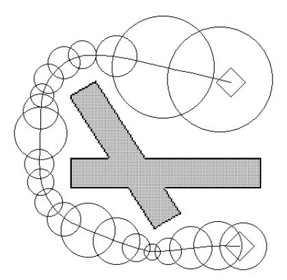
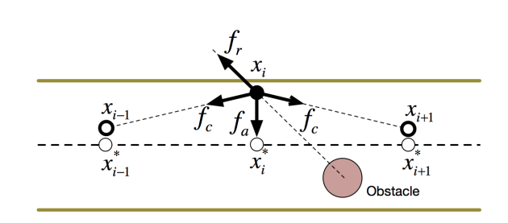
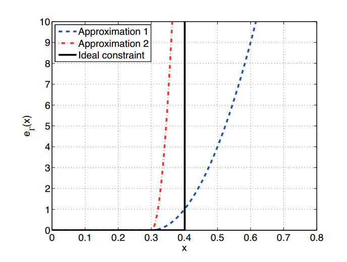

## Elastic Band

EB is a local planner which needs an origin path to optimize.

two force:

- internal contraction force: 收缩力，消除松弛，张紧路线
- external repulsive force: 障碍物的排斥力

performance:

- handle dynamic obstacles
- may fail when changes are large(resort to global planner)

#### Bubbles

在b位置与障碍物的最小距离，这实际上定义了一个无障碍的圆空间：

$$\rho(b)$$

则b处的bubble：

$$B(b)=\{\mathbf{q}:\|\mathbf{b}-\mathbf{q}\|<\rho(\mathbf{b})\}$$

而elastic band可以看作是由有限个bubble组成。落在这些bubbles中的点保证是无碰撞的。为了保证路径无碰撞，假设各个相邻bubble重叠，则连接邻近bubble的圆心的线段可以保证无碰撞。

距离障碍物越近，bubble越小，数量也会越多。bubble的形状不限于圆形，也可以为椭圆，但是计算量会增大。

force demonstration

#### deform strategy

$$\begin{align}
\mathbf{f}_{c} & =k_{c}\left(\frac{\mathbf{b}_{i-1}-\mathbf{b}_{i}}{\left\|\mathbf{b}_{i-1}-\mathbf{b}_{i}\right\|}+\frac{\mathbf{b}_{i+1}-\mathbf{b}_{i}}{\left\|\mathbf{b}_{i+1}-\mathbf{b}_{i}\right\|}\right)  \\
\mathbf{f}_{r} & = \begin{cases}k_{r}\left(\rho_{0}-\rho\right) \frac{\partial \rho}{\partial \mathbf{b}} & \rho<\rho_{0} \\ 0 & \rho \geq \rho_{0}\end{cases}
\end{align}$$

## Time Elastic Band

global planner -> local planner

Teb 把各种约束条件通过线性相加的形式整合到一起（scalarized multi-objective optimization problem），比如时间/路径长度/避障/动力学约束/运动学约束/集合约束。这些约束大部分依赖于局部的运动状态，其结构可以使用稀疏矩阵来表述，因而可以方便地使用g2o优化库来解决。

#### optimization problem

TEB is a local planner

- configuration: $Q=\left\{\mathbf{x}_{i}\right\}_{i=0 \ldots n} \quad n \in \mathbb{N}$
- time sequence: $\tau=\left\{\Delta T_{i}\right\}_{i=0 \ldots n-1}$
- TEB: $B:=(Q, \tau)$, a tuple of both sequence

$$\begin{aligned}
f(B) &=\sum_{k} \gamma_{k} f_{k}(B) \\
B^{*} &=\underset{B}{\operatorname{argmin}} f(B)
\end{aligned}$$
运动被视为在teb上一系列的约束函数的集合，规划则是在约束的基础上找到最优的序列。这些约束一般是针对局部特性而言，因此约束的系数矩阵将会是一个对称的稀疏矩阵，这能够极大加速优化过程。

#### hyper-graph

把该稀疏系统以hyper-graph的形式表示

为了让边界约束可微，论文设计了一个函数：
$$e_{\Gamma}\left(x, x_{r}, \epsilon, S, n\right) \simeq \begin{cases}\left(\frac{x-\left(x_{r}-\epsilon\right)}{S}\right)^{n} & \text { if } x>x_{r}-\epsilon \\ 0 & \text { otherwise }\end{cases}$$

$$\text{蓝色：}e_{\Gamma}(x,0.4,0.1, 0.1, 2) \quad \text{红色：}e_{\Gamma}(x,0.4,0.1, 0.05, 2)$$

#### obstacles

$$\begin{aligned}
f_{\text {path }} &=e_{\Gamma}\left(d_{\min , j}, r_{p_{\max }}, \epsilon, S, n\right) \\
f_{o b} &=e_{\Gamma}\left(-d_{\min , j},-r_{o_{\min }}, \epsilon, S, n\right)
\end{aligned}$$

#### velocity and acceleration

#### non-holonomic kinematics

#### fastest path

之前的elastic band通过“收缩力”减少路径长度，这里是定义了时间长度作为优化目标

$$f_{k}=\left(\sum_{i=1}^{n} \Delta T_{i}\right)^{2}$$

## ref

- blog
- projects
    - [teb_local_planner](https://github.com/rst-tu-dortmund/teb_local_planner)
    - [eband_local_planner](https://github.com/utexas-bwi/eband_local_planner)
    - [eband planner](https://github.com/bhaskara/eband_planner)
    - [pp-ElasticBand- standlone](https://github.com/youmnam/pp-ElasticBand)
- paper
    - elastic band
        - [1993-elastic Bands: Connecting Path Planning and Control]()
    - common
        - [2012-Trajectory modification considering dynamic constraints of autonomous robots]()
        - [2013-  Efficient trajectory optimization using a sparse model]()
    - extensive
        - [2015 Planning of Multiple Robot Trajectories in Distinctive Topologie]()
        -[2017 Integrated online trajectory planning and optimization in distinctive topologies]()
        - [2017- Kinodynamic Trajectory Optimization and Control for Car-Like Robots]()
        - [2014 TEB + NMPC: Timed-Elastic-Bands for Predictive Control]()
        - [2015 TEB + NMPC: Timed-elastic-bands for time-optimal point-to-point nonlinear model predictive control]()
        - [2014-Planning of optimal collision avoidance trajectories with timed elastic bands]()
        - [2015- A Convex Optimization Approach to Smooth  trajectoriesfor Motion Planning with Car-Like Robots ]()