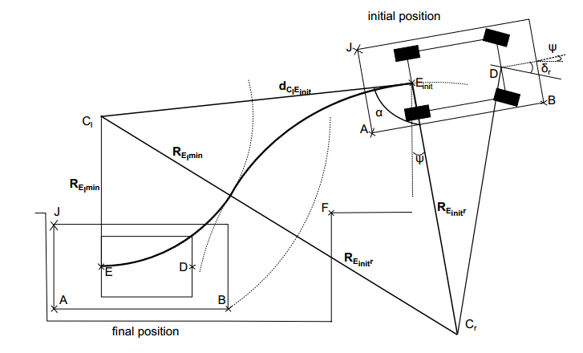
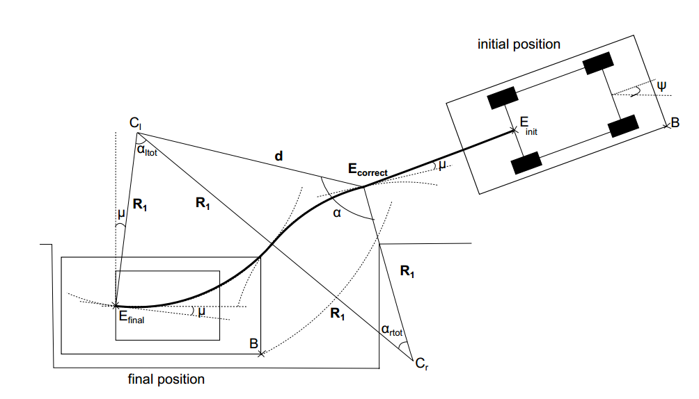
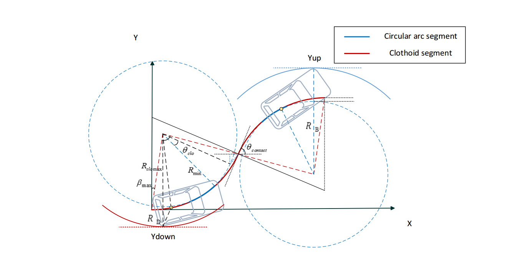
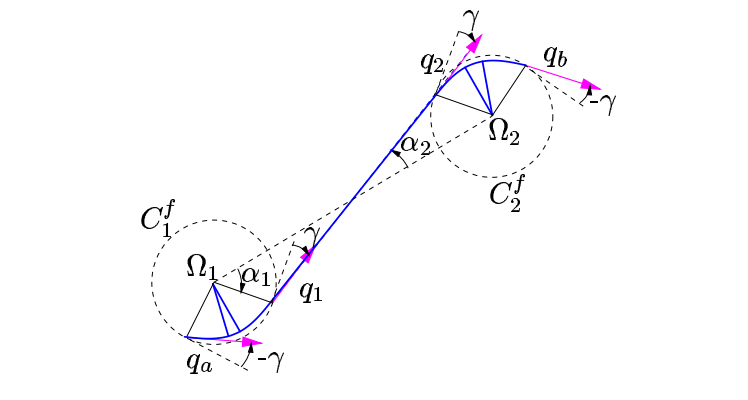
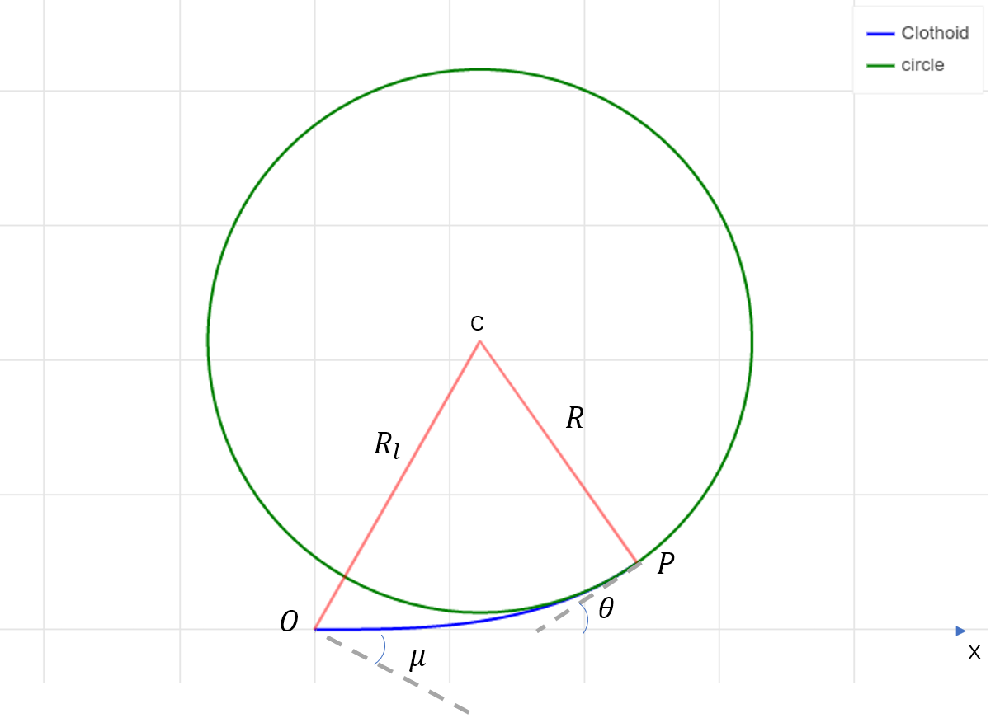
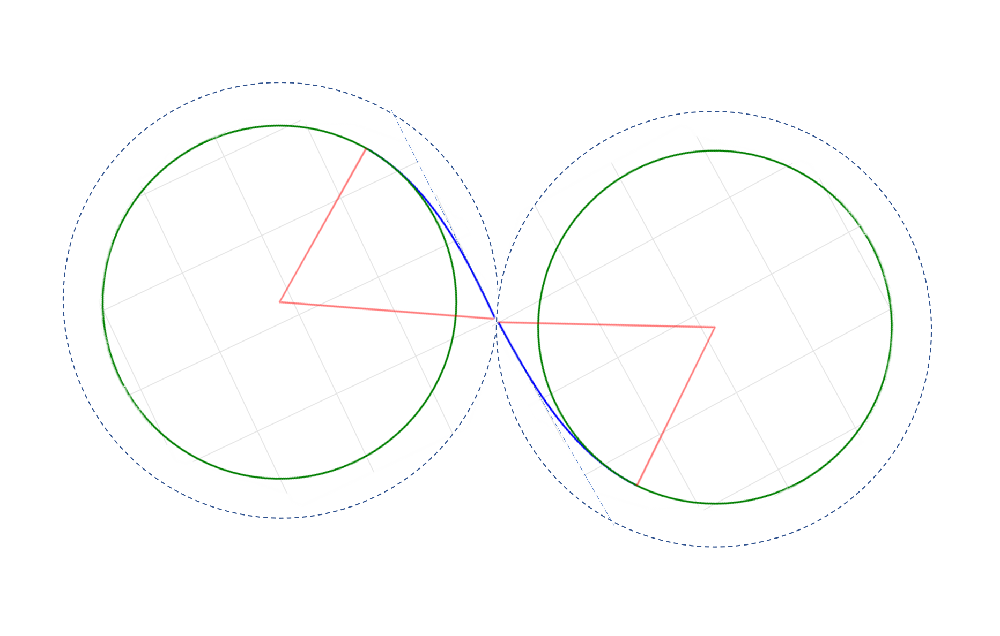

## Continuous-Curvature Path Planning

- 2013

#### fresnel integral

- [wiki](https://en.wikipedia.org/wiki/Fresnel_integral)

#### parallel parking in one tria

根据余弦订理$$c^2 = a^2 + b^2 -2abcos\theta$$

可求出$R_{E_{init^r}}$

$$\begin{aligned} R_{E_{i n i t} r} &=\frac{d_{C_{l} E_{\text {init }}}{ }^{2}-R_{E_{l} \min }{ }^{2}}{2 R_{E_{l} \min }+2 d_{E_{\text {init }} C_{l}} \cos \alpha} \\ \delta_{r} &=\arctan \left(a / R_{E_{\text {init }} r}\right) \end{aligned}$$

## LCC
$$

$3 R_{1}^{2}-d^{2}+2 d R_{1} \cos \alpha=0$

$$
\left\{\begin{array}{l}d=\sqrt{\left(x_{C l}-x_{E_{\text {correct }}}\right)^{2}+\left(y_{C l}-y_{E_{\text {correct }}}\right)^{2}} \\ \alpha=\arccos \frac{\left|y_{E_{\text {correct }}}-y_{C l}\right|}{d}-\mu+\psi_{E_{\text {init }}} \\ y_{E_{\text {correct }}}=y_{E_{\text {init }}}-\left(x_{E_{\text {init }}}-x_{E_{\text {correct }}}\right) \tan \psi_{E_{\text {init }}}\end{array}\right.$$

## continuous curvature turn

## parametrical clothoid（参数螺旋线）

$$\kappa(s)=\kappa_{0}+\alpha s \\
\theta(s)=\int_{0}^{s} \kappa(u) d u \\
x(s)=\int_{0}^{s} \cos \theta(u) d u \\
y(s)=\int_{0}^{s} \sin \theta(u) d u$$

- $\alpha$: sharpness, rate of curvature
- curvature
- deflection
- length

if $\kappa_0 = 0$, then at end:

$$\kappa=\sqrt{2 \delta \alpha}, \delta=\frac{\kappa^{2}}{2 \alpha}, s=\sqrt{\frac{2 \delta}{\alpha}} \\
\delta = \frac{1}{2}\alpha s^2  \\
\theta_{lim} = \alpha s^2$$

at middle:

$$q = \left\{
    \begin{aligned} x&=\sqrt{\frac{\pi}{\alpha}}C_f(\sqrt{\frac{\kappa^2}{\alpha \pi}}) \\
    y&=\sqrt{\frac{\pi}{\alpha}}S_f(\sqrt{\frac{\kappa^2}{\alpha \pi}}) \\
    \kappa & = \kappa \\
    \theta &= \frac{1}{2}\alpha s^2
    \end{aligned}
\right.$$

$$\sqrt{\frac{\kappa^2}{\alpha \pi}} = s\sqrt{\frac{\alpha}{\pi}}$$

Fresnel integrals:

$$C_{f}(x)=\int_{0}^{x} \cos \frac{\pi}{2} u^{2} d u \\
S_{f}(x)=\int_{0}^{x} \sin \frac{\pi}{2} u^{2} d u$$

## CC curve

## 内切圆

$$\begin{aligned}
R(\theta) &= \frac{x}{\sin \theta}   \\
  &= \sqrt{\frac{\pi}{\alpha}}C_f(s\sqrt{\frac{\alpha}{\pi}}) / \sin \theta \\
  &= \sqrt{\frac{\pi}{\alpha}}C_f(\sqrt{\frac{\theta}{\pi}}) / \sin \theta
\end{aligned}$$

$\theta_{lim}=\frac{\kappa_{max}^{2}}{2 \alpha}$

if $\theta <\theta_{lim}: R(\theta)=R(\theta)$

if $\theta \geq\theta_{lim}: R(\theta)=R(\theta_{lim})$

## 螺旋线与圆相切

螺旋线与圆相切实际上就是直线过渡到圆的螺旋线路径。

在表达式中$\kappa(s)=\alpha s$，曲率变化率$\alpha$确定之后，则可以通过转弯半径$R$计算出一段从直线过度到圆的螺旋线$C_{OP}$.圆心$c$通过端点$P$的位置以及$\theta$确定。

$$P = \left\{
    \begin{aligned} \kappa_p &= \frac{1}{R}\\
     x_{p}&=\sqrt{\frac{\pi}{\alpha}}C_f(\sqrt{\frac{\kappa_p^2}{\alpha \pi}}) \\
    y_{p}&=\sqrt{\frac{\pi}{\alpha}}S_f(\sqrt{\frac{\kappa^2}{\alpha \pi}}) \\
    s_p &= \frac{1}{R\alpha} \\
    \theta_{p} &= \frac{1}{2}\alpha s^2 = \frac{1}{2}k_ps_p
    \end{aligned}
\right.$$

连接圆心$c$和起点$O$可以得到一个更大的半径$R_l$，螺旋线$C_{OP}$就在这个更大的圆内，并且起点$O$与大圆在$O$点的切线夹角记为$\mu$. 可以看出螺旋线$\vec{OP}$的终点斜率和大圆在X轴处的斜率保持一致。

## 两圆相切的过渡曲线 CPSPC

由上一节可知螺旋线的出圈点在大圆的弦上，弦和切线的夹角为$\mu$。

## ref

- blog
    - [fresnel integral table](https://keisan.casio.com/exec/system/1180573479)
    - [Fresnel Sine Integrals and Fresnel Cosine Integrals](http://www.mymathlib.com/functions/fresnel_sin_cos_integrals.html)

- opensource
    - [G1fitting](https://github.com/ebertolazzi/G1fitting)
    - [Clothoids](https://github.com/ebertolazzi/Clothoids)
        - [clothid library](https://ebertolazzi.github.io/Clothoids/api-cpp/class_a00147.html#exhale-class-a00147)
    - [fresnel_sin_cos_integrals](http://www.mymathlib.com/functions/fresnel_sin_cos_integrals.html)
    - [fresnl light](https://github.com/scottransom/presto/blob/master/src/fresnl.c)
    - [Clothoids](https://github.com/ebertolazzi/Clothoids/blob/master/src/Fresnel.cc)
    - [alglib](https://www.alglib.net/specialfunctions/fresnelintegral.php)

