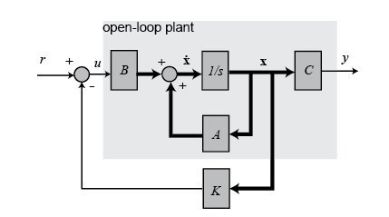

optimal control

differential dynamic programming
## mpc

## lqr

lqr 只看下一时刻， 而mpc关注接下来多个时刻

#### 最优控制角度：


全状态反馈控制系统图:



对于系统$\dot{x}=A x+B u$, 要设计一个状态反馈控制器$u=-Kx$, 则$\dot{x}=(A-BK)x$. 因此需要设计K使得能满足要求。

LQR定义了一个能量函数：

$$J=\frac{1}{2} \int_{0}^{\infty} x^{T} Q x+u^{T} R u d t$$

$Q, R$都是半正定矩阵，表示权重参数。这里的x可以看作目标差值，因此最优的时候这个差值是为0的。所以能量函数的两项一个代表了最后的系统稳定，误差为零，第二项代表使用较少的动作。

把$u=-Kx$带入能量函数:

$$J=\frac{1}{2} \int_{0}^{\infty} x^{T}\left(Q+K^{T} R K\right) x d t$$

假设存在一个常量矩阵P使得：$\frac{d}{d t}\left(x^{T} P x\right)=-x^{T}\left(Q+K^{T} R K\right) x$, 则可得(这里假设闭环系统稳定，即$x(t)_{t\rightarrow \inf}\rightarrow$0)：

$$J=-\frac{1}{2} \int_{0}^{x} \frac{d}{d t}\left(x^{T} P x\right) d t=\frac{1}{2} x^{T}(0) P x(0)   \\
\begin{aligned}
&\dot{x}^{T} P x+x^{T} P \dot{x}+x^{T} Q x+x^{T} K^{T} R K x=0 \\
&x^{T} A_{c}^{T} P x+x^{T} P A_{c} x+x^{T} Q x+x^{T} K^{T} R K x=0 \\
&x^{T}\left(A_{c}^{T} P+P A_{c}+Q+K^{T} R K\right) x=0
\end{aligned}$$

若等于0恒成立，则括号内应为0:

$$\begin{aligned}
&(A-B K)^{T} P+P(A-B K)+Q+K^{T} R K=0 \\
&A^{T} P+P A+Q+K^{T} R K-K^{T} B^{T} P-P B K=0
\end{aligned}$$

若选取$K=R^{-1} B^{T} P$得Riccati方程：

$$A^TP+PA+Q-PBR^{-1}B^TP=0$$

则根据Riccati方程求出P，在求出K，从而可以得出下一步的控制量。


[LQR from wikipedia](https://en.wikipedia.org/wiki/Linear%E2%80%93quadratic_regulator)

- 无穷时域连续时间 Finite-horizon， continuous-time
- 有穷时域连续时间 Finite-horizon, continuous-time
- 无穷时域离散时间 Finite-horizon， continuous-time
- 有穷时域离散时间 Finite-horizon, continuous-time

$$u[k]=-K[k]X[k]    \\
$$

离散时间序列上通过动态规划的方式，从后向前递推控制量。

## iLQR / DDP

LQR中的A和B是常量，适用于现行系统，但是对于非线性系统，A和B是一个变化的量。iLQR就是针对非线性系统在局部进行线性化。先采取初始的控制量走一遍得到初始轨迹。在初始轨迹上作为参考点进行线性化，在采用LQR的方法求出最优控制量。


给定一条轨迹， DDP在此基础上的出更优的策略和轨迹


```python
# Riccati differential equation solver

import scipy.linalg as sp_linalg
sp_linalg.solve_continuous_are(A, B, Q, R)
sp_linalg.solve_discrete_are(A, B, Q, R)
```

## 贝尔曼原理

动态规划： 多阶段决策。对环境完全已知，即知道状态转移概率和reward

principle of optimality: 最优性原则

预测问题

控制问题

## LQR的动态规划角度
[ref cs294](https://inst.eecs.berkeley.edu/~cs294-40/fa08/scribes/lecture6.pdf)
有限时域

假设状态方程：

$$x_{t+1}=A_tx_t+B_tu_t$$

二次代价函数

$$J= \sum _ {t=0}^ {H-1}  (  x_ {t}^ {r}  Q_ {t}  x_ {t}  +  u_ {t}^ {r}  R_ {t}  u_ {t}  )+  x_ {H}^ {r}  P_ {H}  x_ {H} 
$$

优化目标：

$$
\begin{aligned}
   & \min_{u_0 ... u_{H-1}} J \\
&= \min_{u_0 ... u_{H-1}} \sum_{t=0}^{H-1}
    (x_t^T Q_t x_t + u_t^T R_t u_t) + x_H^T P_H x_H \\
    &= \min_{u_0 ... u_{H-2}} \sum_{t=0}^{H-2} (x_t^T Q_t x_t + u_t^T R_t u_t) + x_{H-1}^T Q_{H-1} x_{H-1} + \min_{u_{H-1}} u_{H-1}^T R_{H-1} u_{H-1} + x_H^T Q_H x_H
  \end{aligned}
$$

首先考虑优化$u_{H-1}$, 并根据状态方程替换条$x_H$:

$$\begin{aligned}& u_{H-1}^T R_{H-1} u_{H-1} + x_H^T Q_H x_H \\
&= u_{H-1}^T R_{H-1} u_{H-1} \\
& + (A_{H-1} x_{H-1} + B_{H-1} u_{H-1})^T Q_H (A_{H-1} x_{H-1} + B_{H-1} u_{H-1})\end{aligned}$$

上式是关于$u_{H-1}$的凸二次函数，令其导数为0可以找到最小值：

$$\begin{aligned}
\nabla_{u_{H-1}}(\cdot) &= 0 \\
&= 2 R_{H-1} u_{H-1} + 2 B_{H-1}^T Q_H A_{H-1} x_{H-1} + 2 B_{H-1}^T Q_H B_{H-1} u_{H-1} \\
u_{H-1} & = -(R_{H-1} + B_{H-1}^T Q_H B_{H-1})^{-1} B_{H-1}^T Q_H A_{H-1} x_{H-1} \\
    & = K_{H-1} x_{H-1} \\
K_{H-1} &= -(R_{H-1} + B_{H-1}^T Q_H B_{H-1})^{-1} B_{H-1}^T Q_H A_{H-1}
\end{aligned}
$$

把$u_{H-1}$的最优值带入原方程消去$u_{H-1}, x_{H}$得：

$$ \begin{aligned}
& \min_{u_0 ... u_{H-1}} J \\
&= \min_{u_0 ... u_{H-1}} \sum_{t=0}^{H-1}
(x_t^T Q_t x_t + u_t^T R_t u_t) + x_H^T P_H x_H\\
&= \min_{u_0 ... u_{H-2}} \sum_{t=0}^{H-2} (x_t^T Q_t x_t + u_t^T R_t u_t) + x_{H-1}^T P_{H-1} x_{H-1}  \\
P_{H-1} &= Q_{H-1} + K_{H-1}^T R_{H-1} K_{H-1} + (A_{H-1} + B_{H-1} K_{H-1})^T Q_H (A_{H-1} + B_{H-1} K_{H-1})
\end{aligned}$$

可以看出这并没有改变原来的问题形式，因此可以通过动态规划的方式递归解决(类似 value i胎儿啊提哦你)：

$$
  \begin{aligned}
& \text{for } t = H-1 \text{ to } 0 \\
& \qquad K_t \leftarrow -(R_t + B_t^T P_{t+1} B_t)^{-1} B_t^T P_{t+1} A_t \\
& \qquad P_t \leftarrow Q_t + K_t^T R_t K_t + (A_t + B_t K_t)^T P_{t+1} (A_t + B_t K_t) \\
& \qquad u_t = K_tx_t    \\
& \text{next } t \\
\end{aligned}$$

总代价： $J(x)=x^TP_0x$. 这一代价也可以看作从初始状态出发，在最优策略下的将要产生的最小代价。


## DDP的动态规划角度

更一般的角度/MDP的角度：状态， 动作, $\mu_t: S \rightarrow A$

$$min_{\mu_\cdots\mu_{H-1}}\sum_{t=0}^{H-1}g_t(x_t, u_t)+g_H(x_t)   \\
x_{t+1}=f(x_t, u_t) \\
u_t=\mu_t(x_t)$$

DDP solution:

- Set $i = 0$
- Run $\pi^{i}$, record state and input sequence $x_{0}^{i}, u_{0}^{i}, ...$
- Compute $A_{t},B_{t},a_{t}$ $\forall t$ linearization about $x_{t}^{i}, u_{t}^{i}$
  
  ie. $x_{t+1} = A_t x_t + B_t u_t + a_t$
	(Aside: linearization is a big assumption!)

- Compute $Q_{t},q_{t},R_{t},r_{t}$ by quadratic approximation about $x_{t}^{i}, u_{t}^{i}$
	

    $$ \min_{\mu_1 ... \mu_H} \sum(x_t^{\top} Q_t x_t + aq_{t}^{T} P_H x_t + u_t^{\top} R_t u_t) $$

  
- Run LQR, which gives us $\pi^{i+1} : \mu^i_t(x) = K_t(x)+ k_t$

分析：

0. 所谓$\pi^0$就是指初始参考轨迹，也可称为动作策略， 即怎么选择控制量
1. LQR最优的前提是现行系统，二次损失
2. 在线性点的误差肯那个很大
3. 如果Q，R非正定，把负的特征值设为0
4. 避免线性化（自动微分？）
5. 线性化点不要偏离初始轨迹太远
6. 实操中关于更新：$x_{t+1}=\alpha x_t +(1-\alpha) f(x_t, u_t)$

滚动时域DDP（Receding horizon DDP）: 在无限时域上求积分是不现实的，实际中可以设定一定步长变为有限离散个数。


## applications

#### affine system

affine system: nonlinear system that are linear in the  input


## ref

- book
    - [Dynamic Programming and Optimal Control](http://athenasc.com/dpcontents.html)
    - [REINFORCEMENT LEARNING AND OPTIMAL CONTROL ](http://www.mit.edu/~dimitrib/RLbook.html)
- blog
    - [Differential Dynamic Programing (DDP)](https://inst.eecs.berkeley.edu/~cs294-40/fa08/scribes/lecture7.pdf)
- course
    - [Learning for robotics and control](https://inst.eecs.berkeley.edu/~cs294-40/fa08/#lectures)
    - [CS 287: Advanced Robotics, Fall 2019](https://people.eecs.berkeley.edu/~pabbeel/cs287-fa19/)
    - [Topics in AI: Dynamic Programming](https://www.cs.ubc.ca/~mitchell/Class/CS532M.2007W2/)
- project
    - [ilqr](https://hub.fastgit.org/anassinator/ilqr)
    - [pylqr](https://hub.fastgit.org/navigator8972/pylqr)
    - [trajopt](https://hub.fastgit.org/hanyas/trajopt)
    - [matlab-DDP with Nonlinear Constraints](https://github.com/ggory15/CDDP)


