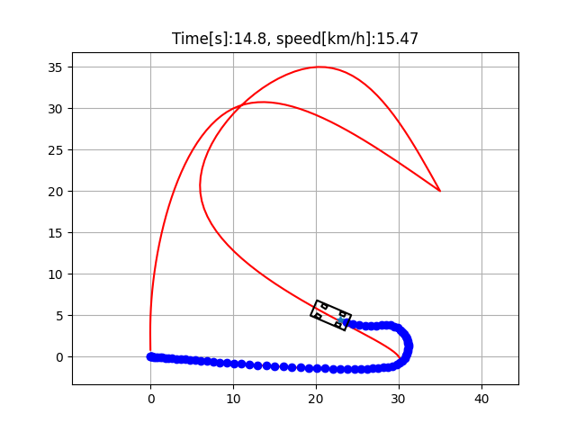
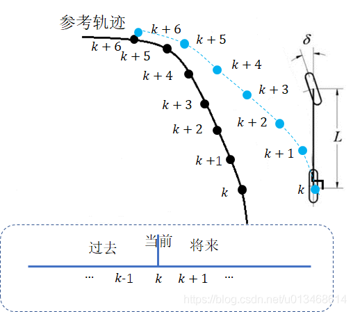

| 轨迹跟踪

对于一条连续带有动力学参数的轨迹而言，由于对于车的控制信号只能是每个周期时间内的离散信号，所以车的真实轨迹与目标轨迹会有偏差。而轨迹跟踪就是通过控制优化的方法，根据目标轨迹和自车当前的状态以及相关的动力学参数输出最优的控制量。对于车辆模型，常见的两个控制量是油门和转向角，其中油门用更加数学上的表述即是加速度。

行驶轨迹与实际轨迹并没有完全重合：

## mpc

问题: 给定一条轨迹和当前位置，下一步怎么运动，运动的目标是尽可能沿着轨迹走

- ref:
    - [轨迹跟踪模型预测控制(MPC)原理](https://blog.csdn.net/u013468614/article/details/103519721)
    - [osqp](https://osqp.org/docs/examples/mpc.html)
- project
    - [cppAD-model-predictive-control](https://github.com/DhruvaKumar/model-predictive-control)
- course
    - [Model Predictive Control](http://cse.lab.imtlucca.it/~bemporad/mpc_course.html)