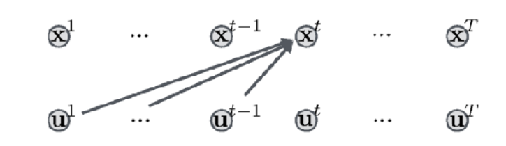
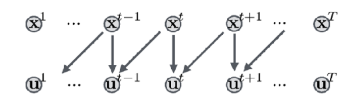

Optimal Control :

- direct methods: transform into Nonlinear Program
    - single shooting: discretized controls
    - collocation: discretized controls and states
    - multiple shooting: controls and node start values
- Indirect methods, Pontryagin: Solve Boundary Value Problem
- Hamilton-Jacobi-BellmanEquation: Tabulation in State Space

- locally optimal control
    - shooting
    - collocation
- forward dynamics models and shooting
    - lqr
    - ddp

ODE(Ordinary differential equation): 常微分方程

||Indirect method|Direct method|
|:--|:--|:--|
|Solution Scheme|First optimize, then discretize(e.g. Pontryagin (PMP))|First discretize, then optimize (transfer the infinite problem into finite- imensional Nonlinear Programming problem (NLP), and solve NLP)|
|Pros|1. Boundary value problem with only 2n_x ODE 2. can treat large scale systems|1. can use state-of-the-art methods for NLP solution 2. can treat inequality constraints and multipoint constraints much easier|
|Cons|1. only necessary conditions for local optimality2. Need explicit expression for control u*(t), singular arcs difficult to treat3. ODE is strongly nonlinear and unstable4. inequalities lead to ODE with state-dependent switches|1. obtain only suboptimal/approximate solution|
|Applications|optimal control e.g. in satellite orbit planning at CNES|most commonly used nowadays due to their easy applicability and robustness|

## optimal control problem in ODE

$$\min_{x, u} \int_0^T ;(x(t), u(t))dt +E(x(t))$$

## shooting

$$\min_{u^0,\cdots,u^T}\sum_t C^t(x^t), x^{t+1}=f(x^t, u^t)$$

对定步长时间序列，通过选择基函数作为参数方程对控制变量参数化： $u(t,q)$

$$u(t,q)=q_k \quad \text{for} \quad t\in[t_K, t_{k+1}]$$

$x(t)$则被视为因变量，通过对状态方程积分得到。因此有可以被写为$x(t,q)$. 如此转化为关于q的最优化问题。根据积分后与最终目标的误差得到关于参数的梯度，从而通过不断调整参数改变控制量使得能`射中`目标。这里的参数方程可以是一个常数值，也可以是一条曲线。

shooting方法中的开环控制:

$$\min_{u_),u_1,\cdots,u_H}c(x_0, u_0)+c(f(x_0, u_0), u_1)+c(f(f(x_0, u_0), u_1), u_2), \cdots$$

## multiple shooting

- breaks down the system integration into short time intervals
- originally developed for PMP two-point BVPs

## collocation

shooting方法是把控制量当作参数，根据动力学约束方程推导x，再根据目标函数求梯度。而collocation是随机初始化控制量和状态量，而把状态方程只是当作约束。

inverse dynamic function:

$$\min_{x^0,\cdots,x^T}\sum_t C^t(x^t)  \\
s.t.\quad u^{t}=f^{-1}(x^t, x^{t+1})$$

直接法的首要问题是如何解构动力学方程。最优化问题一般都是把变量离散化进行处理。如果把控制量当作优化变量，把状态变量当作临时变量，临时变量通过状态方程由控制变量得出，并只在乎最后状态是否达到了目标，则这就是shooting方法。如果把控制量和状态变量都当作优化变量，状态方程作为约束方程，则这就是collocation方法。一般，如果只把状态变量作为优化变量，控制量由逆状态方程得出，也被成为collocation方法。直接法的第二大问题就是如何离散状态方程，一般有牛顿积分法，荣格-库塔积分，辛普什积分等等。

最优控制的路径约束

## ref

- course
    - [Numerical Optimal Control](https://www.syscop.de/teaching/ss2020/numerical-optimal-control-online)
    - [NUMERICAL METHODS FOR OPTIMAL CONTROL](https://mariozanon.wordpress.com/numerical-methods-for-optimal-control/)
    - [Direct Single and Direct Multiple Shooting](https://www.imtek.de/professuren/systemtheorie/events/dateien/directshootingmethods)
- blog
    - [shooting](https://zhuanlan.zhihu.com/p/396020054)
- project
    - [python-casadi example](https://github.com/casadi/casadi/tree/master/docs/examples/python)
        - [doc](http://casadi.sourceforge.net/v3.2.3/users_guide/html/node8.html)
    - [Trajectory Methods for dynamic system](https://github.com/p-ruediger/Trajectory-Methods)
    - [ilar](https://github.com/anassinator/ilqr)
    - [IterativeLQR/DDP code written in python](https://github.com/ADVRHumanoids/ilqr)
