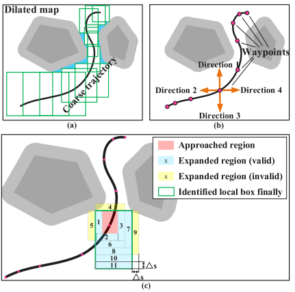

## TDR-OBCA

## H-OBCA

## 2022 FTHA && Iterative NLP

1. 通过hybrid A* 寻找相对较优的轨迹, 避免搜索失败
2. 圆形代替车身; 基于圆形的二维C空间; 构建方形corridor
3. 罚函数代替边界约束条件; 多次求解, 根据当前最优轨迹重新构建corridor

ref

- [Optimization-based trajectory planning for autonomous parking with irregularly placed obstacles: A lightweight iterative framework]()
- [github](https://github.com/libai1943/ParkingMotionPlanningTITS21)
- [bilibili](https://www.bilibili.com/video/BV1n7411q7iv/)

Abstract

- focused on optimization base parking
- within-corridor collision constraints: scale is small and independent from environment complexity
- reconstructs the corridor in an iterative framework

Intro

- samping / seach based
- optimization based

contributions:

1. a fault-tolerant variant of the hybrid A∗ algorithm is proposed
2. an iterative framework that incorporates a corridor construction procedure and a lightweight NLP solution procedure

Problem formulation

bicycle kinematic model:

$$\mathbf{Z}(t)~=~[x(t),y(t),\theta(t),v(t),\phi(t)] \\
{\mathbf{u}}(t)\equiv[a(t)_{\ast}\omega(t)]{\mathbf{i}} $$

为了避免$\theta \in [0, \pi]$的不连续,边界条件以三角函数约束代替值约束:

$$\theta(t) = \theta_t \rightarrow \left\{ \begin{aligned}\sin \theta(t) = \sin \theta_t \\ \cos \theta(t) = \cos \theta_t\end{aligned}\right.$$

Collision avoidance

根据三角形面积构造不等式

Corridor Construction

对于给定的初始路径,可以只考虑该初始值的"附近空间结构",而不需要考虑环境中所有的障碍物,这样就避免过多的障碍物导致的复杂计算.

Generation of a Guiding Route

fault-tolerant hybrid A∗ (FTHA): 

1. 如果算法失败,就选择当前为止最优的结点,通过A*与终点连接
2. 添加简单的速度信息生成初解

construction of corridors

沿着四个方向按固定步长逐渐增长,若失败或者达到最大长度则停止扩大

Within-Corridor Constraint Formulation

障碍物约束改写为圆在`corridor` 里面:

$P_{\mathrm{f}}(t)$ stays inkth local box for $P_{\mathrm{f}}.$ 

$P_{\mathrm{r}}(t)$ stays inkth local box for $P_{\mathrm{r}},$, $t = T/N_{FE}·k,k =1,\cdots,N_{FE}$

$$
\begin{array}{l l}{{x_{\mathrm{r}}(t)}}{{\in\left[x\mathrm{r}_{\mathrm{min}}^{k},\,{\bf x}\mathrm{nax}\right],}} ~ {{y_{\mathrm{r}}(t)\in\left[y\mathrm{r}_{\mathrm{min}}^{k},\,{\bf y}\mathrm{r}_{\mathrm{max}}^{k}\right],}}\\ {{t=T/{\bf N}_{\mathrm{FE}}\cdot k,}} ~ {{k=1,\cdot\cdot\cdot.....\,,{\bf N}_{\mathrm{FE}}.}}\end{array} 
$$

LIGHTWEIGHT ITERATIVE OPTIMIZATION
FRAMEWORK

penalty function to merge boundary constraints

iteratively solve the ocp problem and generate corridors based on the optimal trajectory util the infeasibility is reduced to tiny

##  2021 tiny passage

Ref

- [Autonomous Parking Trajectory Planning With Tiny Passages A Combination of Multistage Hybrid A-Star Algorithm and Numerical Optimal Control]()

freespace规划

1. A* 发现窄通道
2. 混合A* 连接窄通道
3. 基于优化方案进行后处理

后处理的碰撞检测使用within-STC constraints

## Ref