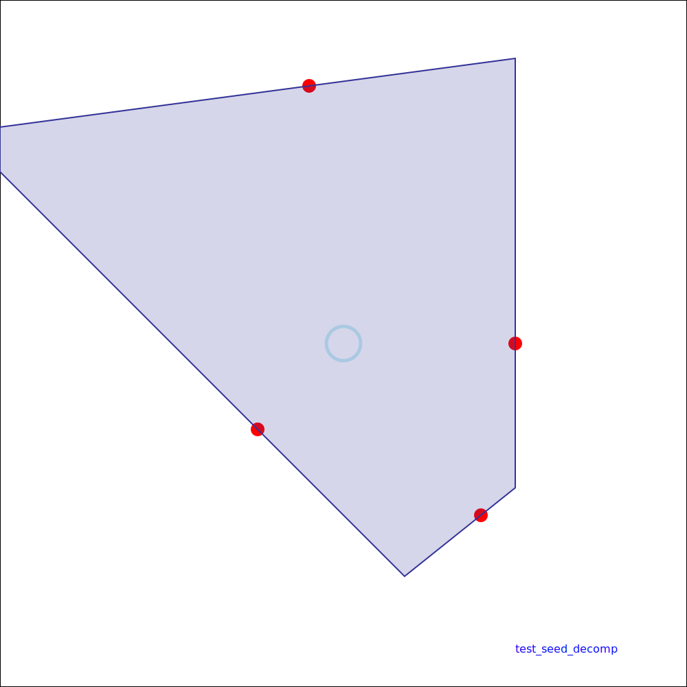
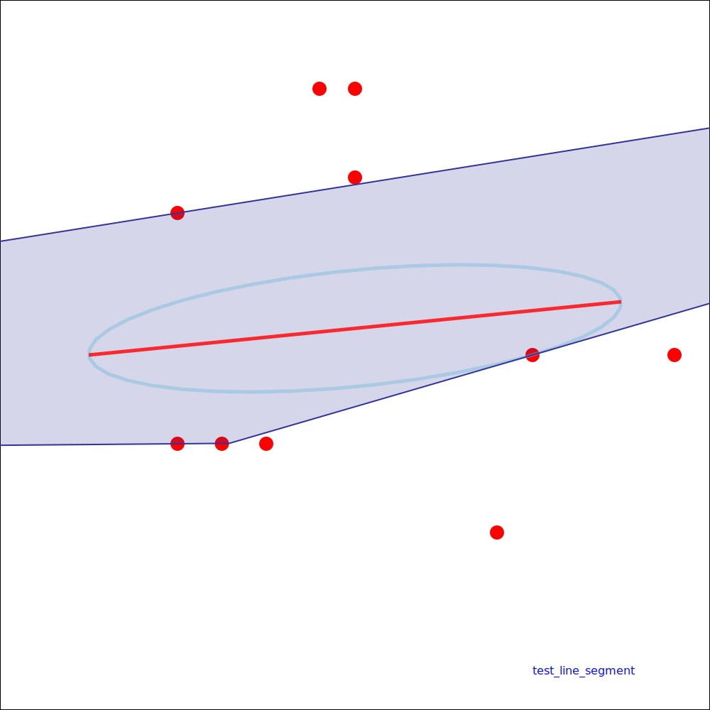
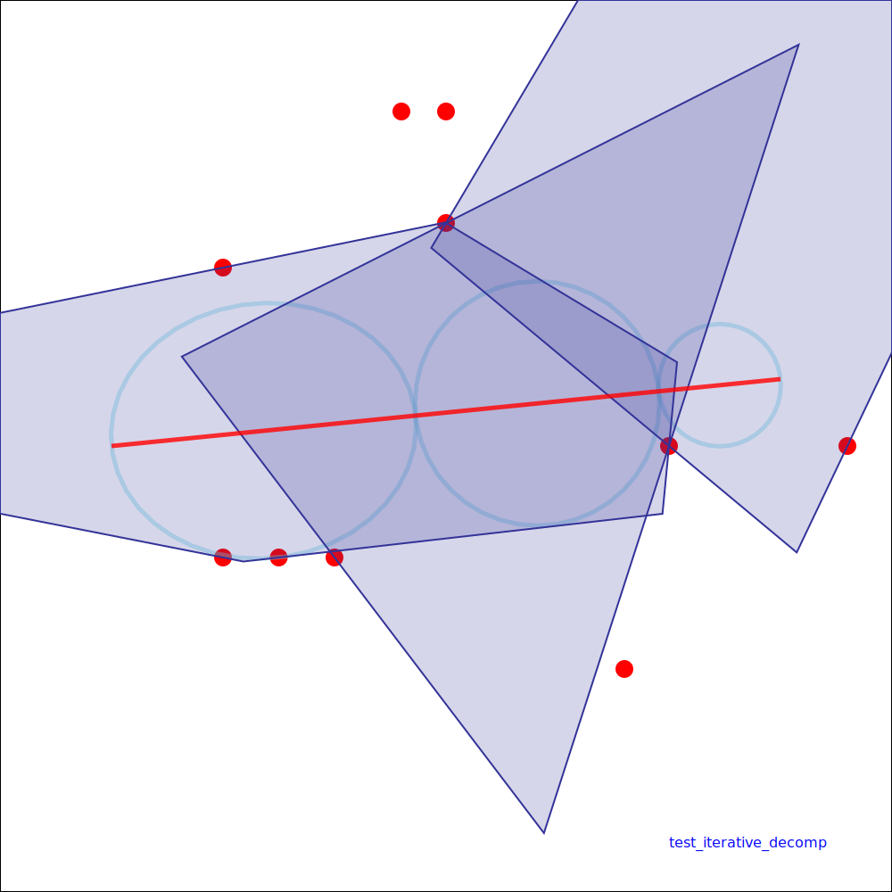
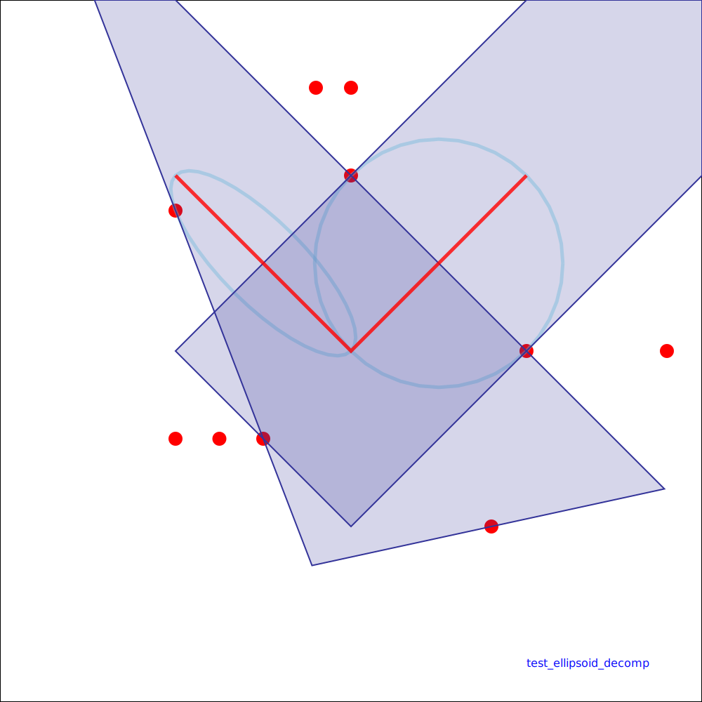
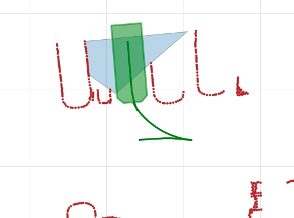
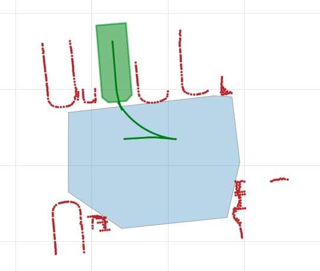

JPS jump point search

运动规划 motion planning 方法motion planning

### SFC: Safe Flight Corridor

Ref

- [2017 Planning Dynamically Feasible Trajectories for Quadrotors using Safe Flight Corridors in 3-D Complex Environments]()
- [code](https://github.com/sikang/DecompUtil/blob/master/test/test_seed_decomp.cpp)

| seed decomp                   | line segment                  | iterative decomp                   | ellipsoid decomp                   |
| ----------------------------- | ----------------------------- | ---------------------------------- | ---------------------------------- |
|  |  |  |  |

### GALAXY

Ref

- [2020 Generating large convex polytopes directly on point clouds](https://arxiv.org/abs/2010.08744)
- [code](https://github.com/StarryN/Galaxy)
- [code 2](https://github.com/ZJU-FAST-Lab/Dftpav/blob/1808107b7fb6fe459f38154e355010a854e4575f/src/Plan/traj_planner/include/plan_utils/CorridorBuilder2d.hpp#L12)

| narrow space                              | hollow space               |
| ----------------------------------------- | -------------------------- |
| 狭窄环境的多边形边角突出,难以覆盖整个车形 | 空旷环境下效果较好         |
|              |  |

依赖障碍物信息， 因此若障碍物分布不好，则找到的空旷区域会比较尖锐。