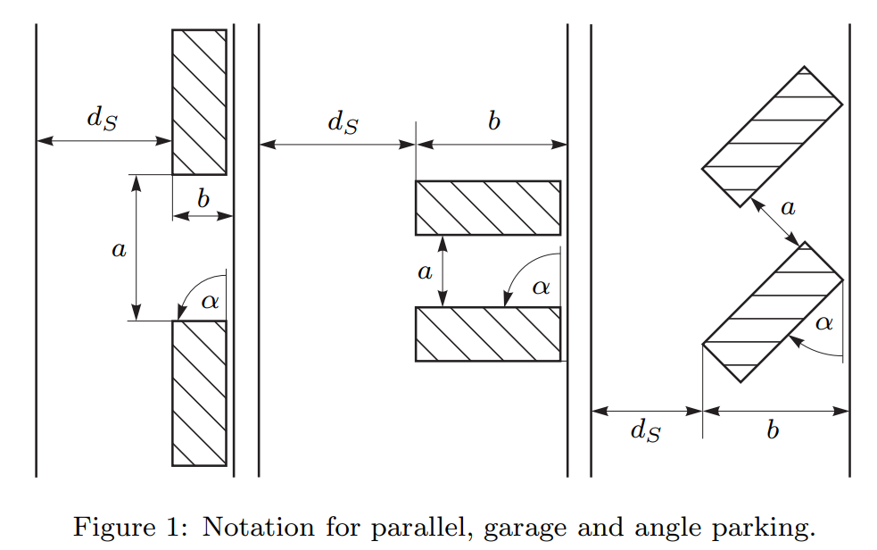
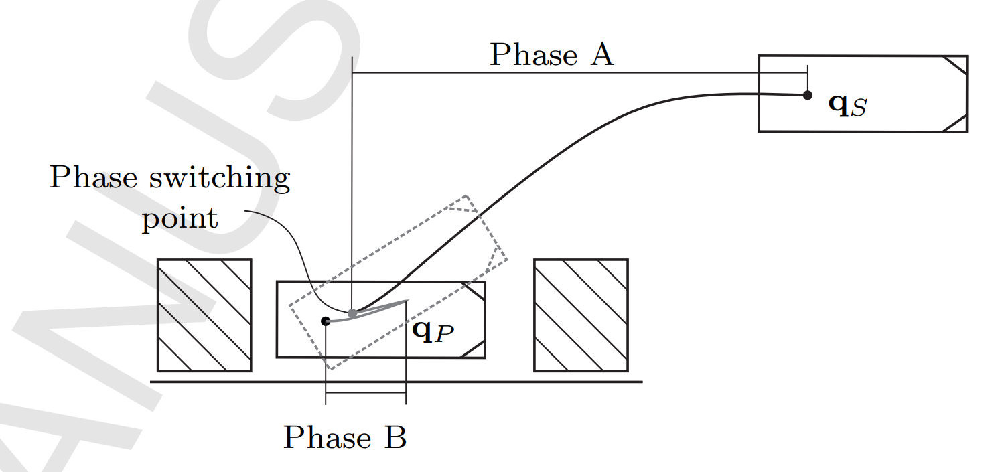
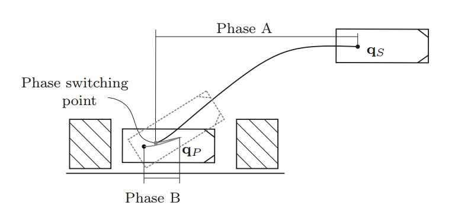
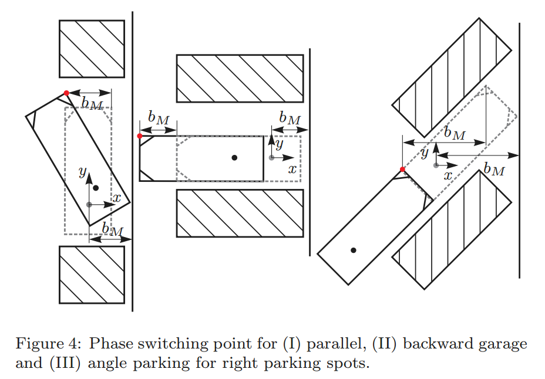
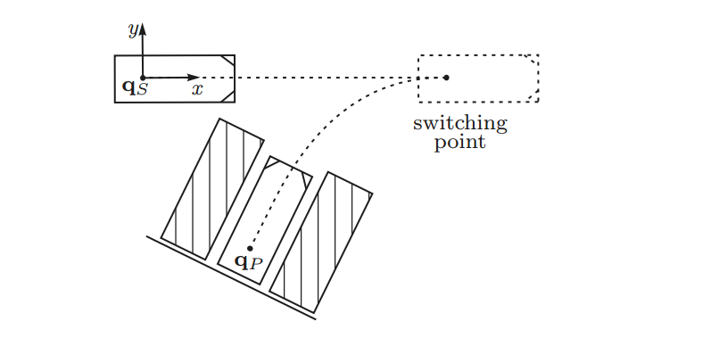
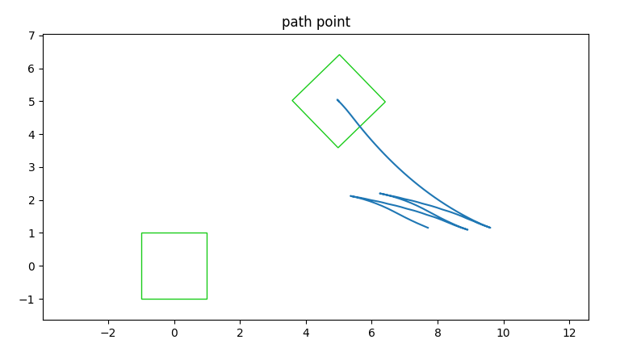

## methods

- 分形搜索 Fractal Search
- NMPC 碰撞检测
- CBF: Control Barrier Functions

- within-STC constraints
- [Collision Detection Accelerated:An Optimization Perspective](https://arxiv.org/pdf/2205.09663.pdf)

## geometry path pattern
A new geometry-based secondary path planning for automatic parking

## minkowski sum

实质则是构型空间？如何转化为优化问题

- [2020-Closed-Form Minkowski Sum Approximations for Efficient Optimization-Based Collision Avoidance](https://arxiv.org/abs/2203.15977)
- [2015-Efficient Configuration Space Construction and Optimization for Motion Planning](https://cdr.lib.unc.edu/downloads/6682xd766)
- [A Simple Method for Computing Minkowski Sum Boundary in 3D Using Collision Detection](https://cs.gmu.edu/~jmlien/lib/exe/fetch.php?media=lien_wafr08.pdf)
- [Exact and Efficient Construction of Planar Minkowski Sums using the Convolution Method](http://www.cs.jhu.edu/~misha/Spring20/Wein06.pdf)
- [2019 Efficient Exact Collision Detection between Ellipsoids and Superquadrics via Closed-form Minkowski Sums]()
- [Real-time Reciprocal Collision Avoidance with Elliptical Agents]()
- [2011 Fast and robust 2D Minkowski sum using reduced convolution](http://masc.cs.gmu.edu/wiki/uploads/ReducedConvolution/iros11-mksum2d.pdf)
- [Polygonal Minkowski Sums via Convolution:Theory and Practice]()

Reciprocal Velocity Obstacles (RVO)

- [Optimal Reciprocal Collision Avoidance](https://gamma.cs.unc.edu/ORCA/)
- projects
    - [RVO2 Library: Reciprocal Collision Avoidance for Real-Time Multi-Agent Simulation](https://gamma.cs.unc.edu/RVO2/)

碰撞检测
GJK，全称Gilbert–Johnson–Keerthi distance algorithm  

- [box2d: b2_distance.h](https://github.com/erincatto/Box2D)
- [Separating Axis Theorem](http://www.metanetsoftware.com/technique/tutorialA.html)

## An Optimization-Based Motion Planner for Car-like Logistics Robots on Narrow Roads

结合TED进行窄通道的freespace规划

Narrow-Roads-Timed-Elastic-Band

## 2021_Autonomous_Parking_Trajectory_Planning_With_Tiny_Passages_A_Combination_of_Multistage_Hybrid_A-Star_Algorithm_and_Numerical_Optimal_Control

freespace规划

1. A* 发现窄通道
2. 混合A* 连接窄通道
3. 基于优化方案进行后处理

后处理的碰撞检测使用within-STC constraints

## 2022 Continuous-Curvature Target Tree Algorithm for Path Planning in Complex Parking Environments

1. 根据直线长度,采样多条出库路径,然后计算cost最小的出库长度以及target-tree
2. 采用rrt* 进行连接(?怎么连接的)

泊车路径
rrt*

连续曲率轨迹 

## 2016 Optimisation based path planning for car parking in narrow environments

1. phase A and phase B 的规划
2. 对于狭窄空间,guide-tree 进行换挡采样

- [courses/ko/parking:对以上算法的实践](https://cw.fel.cvut.cz/b202/_media/courses/ko/parking.pdf)

#### abstract

-  a static optimization problem is formated while considering
    1. distance to obstacles
    2. longer driving distances
- in narrow scenarios, a tree-based guidance for the local planner is introduced

#### 1. introduction

- build roadmap
- rrt with kinematic constraints, Integrating the differential equations of the robot for a specified distance 
    1. randomised inputs[^1]
    2. inputs based on the analytic solution[^2]
- geometry
    - Dubins
    - Reeds and Shepp
    - β-spline [14, 15], Bezi´er [16] or polynomial [17] curves.
- hybrid a-star
- non-holonomic characteristics
    - small-time-controllable
    - chained-form systemand sinusoidal inputs
    - Dubins curves
    - clothoid curves
- optimal control problem

以上方法可能对某些场景或者单一泊车场景有效果，但是对于更加泛化和多元化的，以及狭窄空间下的停车场景也许无法计算出有效轨迹。因此本文提出了一种基于优化方法的泊车规划器，能够以较低的计算代价实现狭窄场景下的实时规划。

#### 2. problem statement
本文首先讨论了普通场景下的三种车位的规划方法，即

- parallel slot: 水平车位， 侧方位停车
- garage slot： 垂直车位，倒车入库
- angle slot：斜列车位

后面又更深入扩展了规划器再狭窄场景下和比较杂乱的停车场(parking deck)下的规划方法

根据自行车模型，把状态量对时间求导，可列出小车的动力学方程：

$$\left\{\begin{align}
 \dot{x} &=v\cdot cos(\theta)  \\
 \dot{y} &=v\cdot sin(\theta)  \\
 \dot{\theta} &=\frac{v \cdot tan(\phi)}{L}  \\
 \dot{v} &= a \\
 \dot{\phi} &= \zeta\
\end{align}\right.$$

而在本文中，只考虑轨迹，不考虑时间上的速度和加速度。把状态量对时间求导改为对轨迹长度求导。

对于任一变量 a:
$$\frac{da}{ds} = \frac{da}{dt} \frac{dt}{ds} = \frac{1}{v}\frac{da}{dt}$$

则状态方程转化为：

$$\left\{ \begin{align}
 \dot{x} &= cos(\theta)  \\
 \dot{y} &=sin(\theta)  \\
 \dot{\theta} &=\frac{tan(\phi)}{L} 
\end{align}
\right.$$

其中注意到$\frac{tan(\phi)}{L}$实际就是由于方向盘转弯而导致的曲率,对于自行车模型.曲率和方向盘转角是一一对应的,因此运动学模型也可以写为:

$$\left\{\begin{align}
 \dot{x} &= cos(\theta)  \\
 \dot{y} &=sin(\theta)  \\
 \dot{\theta} &=u_l
\end{align}\right.$$

这样就得到文中的方程式：

$$\mathbf{q}^{\prime}=\left(\begin{array}{c}
x^{\prime} \\
y^{\prime} \\
\theta^{\prime}
\end{array}\right)=\left(\begin{array}{c}
D \cos (\theta) \\
D \sin (\theta) \\
D u_l
\end{array}\right)=\mathbf{f}_s\left(\mathbf{q}, u_l, D\right)$$

其中$D\in\{-1, 1\}$指示车行驶的方向，1代表向前，-1代表向后。

#### 3. Path Planning for Car Parking

对于上述非线性方程，根据路径s进行二阶离散。注意这里步长$\eta_i\in[\eta_{min}, \eta_{max}]$也是一个变量。得到如下表达式：

$$\begin{aligned}
\mathbf{q}_{i+1} & =\left(\begin{array}{l}
x_{i+1} \\
y_{i+1} \\
\theta_{i+1}
\end{array}\right)=\left(\begin{array}{c}
x_i+D \eta_i \cos \left(\theta_i+D \frac{\eta_i u_{l_i}}{2}\right) \\
y_i+D \eta_i \sin \left(\theta_i+D \frac{\eta_i u_{l_i}}{2}\right) \\
\theta_i+D \eta_i u_{l_i}
\end{array}\right) \\
& =\mathbf{f}\left(\mathbf{q}_i, \mathbf{u}_i, D\right) .
\end{aligned}$$

上式中，$D$作为指示方向的变量可以忽略。除去状态变量$[x, y, \theta]$之外，还有两个变量，即$u=[u_l, \eta]$, 表示方向盘转角(实际为曲率)和步长，作为优化变量。

文中的优化问题**并不是一次优化完整条轨迹，而是每次走一步，循环迭代直到判断需要换挡的位置**。该优化问题定义为：

$$
\begin{array}{ll}
\min _{\mathbf{u}_i} & l_{O_i}\left(\mathbf{q}_{i+1}\right) \\
\text { s.t. } & \mathbf{q}_{i+1}=\mathbf{f}\left(\mathbf{q}_i, \mathbf{u}_i, D\right) \\
& \mathbf{h}_P\left(\mathbf{q}_{i+1}\right) \leq \mathbf{0} \\
& \mathbf{u}_{\min } \leq \mathbf{u}_i \leq \mathbf{u}_{\max },
\end{array}
$$

其中损失函数：
$$\begin{aligned}
l_{O_i}\left(\mathbf{q}_{i+1}\right)&=r_\theta e_{\theta_{i+1}}^2+\mathbf{e}_{P_{i+1}}^{\mathrm{T}} \mathbf{R e}_{P_{i+1}}+r_u \Delta u_i^2  \\
e_{p_i}&=[x_i-x_E, y_i-y_E]^T  &\text{目标点的位置偏差} \\
e_{\theta_i}&=\theta_i-\theta_O & \text{预定义目标的航向偏差} \\
\Delta u_i &=u_i-u_{i-1} & \text{方向盘转角变化}    \\
r_\theta,& R, r_u & 权重系数
\end{aligned} 
$$

约束函数中，第一项为状态方程，第二项为碰撞检测，第三项为控制参数变化范围。

文中没有对碰撞检测做更加详细的说明，只提到使用了Minkowski sum[^3].

在规划的具体实施上，文中提出了分两步走的策略，其中定义了一个方便脱困的中间转换点(Phase switching point)$q_P$.整个规划是倒着从库内到库外规划，因此两步规划分别为：
1. phase B: $q_E\rightarrow q_P$,从终点到转换点
2. phase A: $q_P\rightarrow q_S$,从转换点到起点

在phase B状态,规划器尽量找到能使自车到达一个方便脱困的位置的轨迹.在垂直和斜列车位,只需要保持航向不变,前进或后退到某个点. 而对于水平车位车需要摆过一定的角度才方便从库位内脱困出来(如下图水平车位的Phase switching point).

因此在phase B的规划阶段,目标航向的变化在垂直和斜列场景设为0,而在水平场景设置为$\frac{\pi}{2}$:
$$
\theta_O = \theta_P + \gamma \\
\gamma= \begin{cases}+ \frac{\pi}{2} & \text { for parallel parking from left }\\ -\frac{\pi}{2} & \text { for parallel parking from right} \\ 0 & \text { else }\end{cases}
$$

同时在权重系数设置上,对于航向误差设置较大的参数,位置误差设置为0,使得优化器能尽快摆到脱困的航向位姿.(水平的目标航向不设置为$q_P$的航向,猜测$q_P$不是个定点,因此才把目标航向设置的比较大,让优化器尽力朝着脱困的航向优化)

在phase A:$q_P\rightarrow q_S$阶段,起点$q_S$被当作目标点. 坐标系设置为以$q_S$为原点,x为纵向,y为横向.目标点航向为0. 在该阶段, y方向和航向误差的参数设置的比较大,而在行驶方向--即x方向上的参数比较小. 

**switching point的计算**

文中把转换点分为两类,一类是上文提到的`phase switching point`, 另一类是`driving switching point`, 是指在同一phase的轨迹规划内的前进和倒退的换档点.

1. `phase switching point`的计算: 在垂直和斜列车位场景是让车沿直线开出一定距离,而水平是当左前角点突出一定距离之后认为是可以脱困的点.

2. `driving switching point`的计算, rule1:当遇到障碍物没有足够的行驶空间的时候就是换档的时期. 这一条规则在phase B和phase A都适用.在phase B中,主要存在于水平车位场景,即当水平车位较窄时,可能需要在库内多次换档.在这一阶段的优化中,当遇到障碍物没有足够的行驶空间的时候就换档,如此循环直到满足脱困条件.

3. `driving switching point`的计算, rule2:当最优解的损失函数开始增大的时候($l^*_{O_i}>l^*_{O_{i-1}}$)标志着需要换档了.主要针对phase A场景.文中以下图解释如此操作的原因.下图从$q_P$到switching point的过程中,y方向和航向与目标点的偏差逐渐缩小,因此这两方面的损失也迅速减小.而x方向的误差逐渐增大,损失函数也逐渐增大,总的损失函数趋近减小. 当y方向和航向趋近于0的时候,$q_P$和switching point基本在一条直线上,这也是较好的换档位置.同时由于y方向和航向的权重参数比较大,在这一位置,如果再往前则总的损失函数趋近增大,因此可以通过$l^*_{O_i}>l^*_{O_{i-1}}$来判断是否是比较好的换挡位置.

[实际案例 附图+评论]
到这里,文中已经完整描述了一个完整的针对泊车的基于优化的轨迹规划的方法.优化的方法一般需要比较好的初始值才能很好得收敛到最优解.这种优化方法是一次性优化整条路径.但是本文不使用初始轨迹,而是每次优化只往前迭代一步,通过cost function引导路径走向终点.全局路径的优化方法难以处理换档点,而本文提出的方法可以在迭代过程中根据当前的状态判断是否需要换档.

- 全局优化
    - 优化整条轨迹
    - 需要初始值
    - 无法处理换档点
- 本文的分步优化
    - 优化当前的一步
    - 不需要初始值
    - 能处理换档点

但是正因为每次只向前走一步,因此无法把握全局的环境信息,路径不一定最优. 对换档点的判断处理过于简单,会导致非常多的换档点.下图是一个简单场景下求解失败的例子.当从起点走到P点,y和theta误差都在迅速下降,cost减小. 但是y和theta误差可能不是同步到达最小值,因此会由于cost的增加而提前换档,这个时候继续往前会很快又到达换档点,因此会无故增加很多次换档.

| var   | tiny | large |
| ----- | ---- | ----- |
| y     | 小   | 大    |
| theta | 大   | 小    |
| x     | 最小 | 最小  |

正因为如此,文中又提出了在狭窄场景下的引导树构建方法.

占位符
- 不同车型可视化适配
- topic缺省保护， 如果有一个空bag，脚本能否正常运行
- 如何更方便的添加一个新的图层 ➜ 架构设计
- 如何更方便添加文本图层
- 添加更多的topic信息展示（planning/info, mff指令， ODO中tline ...）

## 2017 Autonomous Path Planning for Road Vehicles in Narrow Environments: An Efficient Continuous Curvature Approach

TTS-RTR planner : 基于运动学的采样方法

## 0130

- [2016 Spatio-temporal decomposition: a knowledge-based initialization strategy for parallel parking motion optimization]()
- [2017 Hybrid curvature steer: A novel extend function for sampling-based nonholonomic motion planning in tight environments]()
- [2022 Parallel Parking: Optimal Entry and Minimum Slot Dimensions](https://arxiv.org/abs/2205.02523)
- [2016 Time-Optimal Maneuver Planning in Automatic Parallel Parking Using a Simultaneous Dynamic Optimization Approach]()

## 0203

- [Trajectory optimization for Car-Like Vehicles in Structured and Semi-Structured Environments](https://ieeexplore.ieee.org/document/8500373)
- [Efficient_Collision_Detection_between_2D_Polygons](https://www.researchgate.net/publication/221546279_Efficient_Collision_Detection_between_2D_Polygons)

## ref

- paper
    - [2016 Optimisation based path planning for car parking in narrow environments]()
    - [2013 A fast motion planning algorithm for car parking based on static optimization]()
    - [Practical motion planning for car-parking control in narrow environment]()
    - [A new geometry-based secondary path planning for automatic parking](https://journals.sagepub.com/doi/full/10.1177/1729881420930575)
    - [2022 Continuous-Curvature Target Tree Algorithm for Path Planning in Complex Parking Environments](https://arxiv.org/pdf/2201.03163.pdf)
    - [ALTRO: A Fast Solver for Constrained Trajectory Optimization](https://www.ri.cmu.edu/publications/altro-a-fast-solver-for-constrained-trajectory-optimization/)
    - [Solving Constrained Trajectory Planning Problems Using Biased Particle Swarm Optimization](https://dspace.lib.cranfield.ac.uk/bitstream/handle/1826/16453/Solving_Constrained_Trajectory_Planning_problems-2021.pdf?sequence=4)
    - [2020-An Optimization-Based Receding Horizon Trajectory Planning Algorithm](https://www.sciencedirect.com/science/article/pii/S2405896320330810)
- paper(NN)
    - [Time-Optimized Online Planning For Parallel Parking With Nonlinear Optimization and Improved Monte Carlo Tree Search](https://www.semanticscholar.org/paper/Time-Optimized-Online-Planning-For-Parallel-Parking-Song-Chen/9ace2c192aea884f16ceac206ec278007139651d)
- course
    - [EECS C106B](https://pages.github.berkeley.edu/EECS-106/sp22-site/resources/)
    - [Path-Planning-for-a-Simple-Car](https://jckantor.github.io/CBE30338/07.06-Path-Planning-for-a-Simple-Car.html)
- tool / library
    - [2017_PYROBOCOP: Python-based Robotic Control & Optimization Package for Manipulation and Collision Avoidance]()
    - [nmpc by casadi](https://github.com/devsonni/MPC-Implementation/tree/main/Python%20Implementation)

## cites

[^1]:[2000-Randomized kinodynamic motion planning with moving obstacles](http://ai.stanford.edu/~latombe/papers/IJRR-kino/final.pdf)
[^2]:1991-A fast path planner for a car-like indoor mobile robot
[^3]: [Spatial planning: A configuration space approach,” IEEE Trans. Comput., vol. C-32, no. 2, pp. 108–120, 1983.](https://dspace.mit.edu/handle/1721.1/5684)