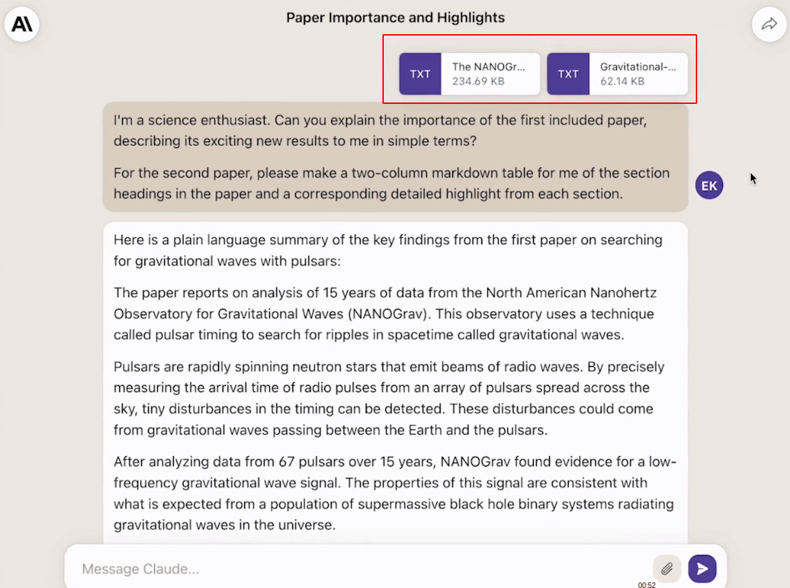
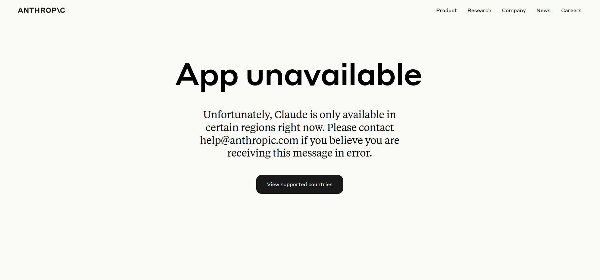
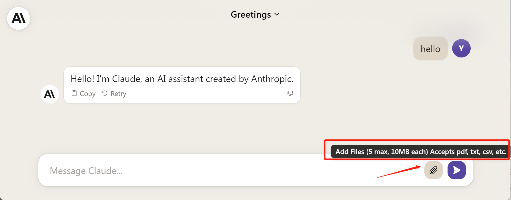
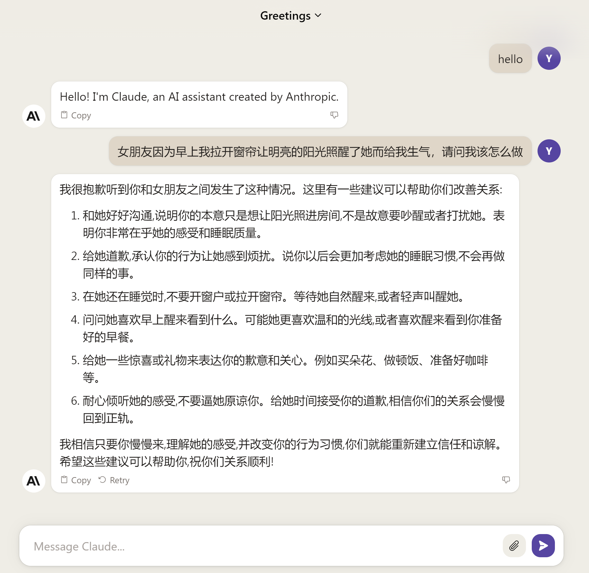
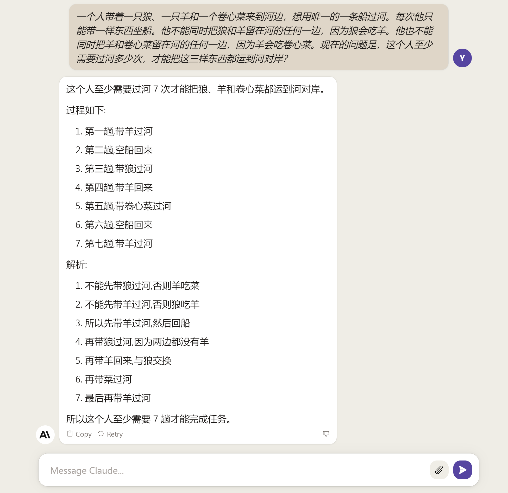

## Claude 2

比ChatGPT注册更简单，用户界面更丰富的 Claude 2 发布！

OpenAI 前员工创立的 Anthropic 近期发布了第二代大语言模型 [Claude 2](https://www.anthropic.com/index/claude-2)，其声称比第一代有更强大的推理表现以及能处理更长的文本内容，同时为了树立品牌形象，推出了新的网址域名 [claude.ai](https://claude.ai/)。

Claude 2 支持长达10万的语料输入，这意味着它的处理对象可以不仅仅是对话，还可以是文本文件。在官网给出的例子中，用户可以直接在聊天框里拖入需要分析的文件，并提示 Claude 2 进行类如提取摘要，整理数据，列出表格等处理。相比ChatGPT的插件加持，Claude 2免费体验版本原生即可支持对大批量文本进行总结。用户不需要第三方插件或者对API进行二次包装的其它工具，在Claude的聊天框里拖动一下就可以提取文件中的关键信息。

在代码能力上， Claude 2 在 [Codex HumanEval](https://github.com/openai/human-eval) 测试集中的的得分相比前一代从 56.0% 提高到71.2%。根据官网给出的例子，Claude 2 不仅仅限于根据提示指令写代码这一基本操作，还可以在原始代码上根据提示添加合适的针对数据对象的交互操作，说明它不仅理解了代码，还能理解代码所处理的数据对象属性。

## 注册

**添加注册页面**

Claude 2 的注册流程非常简单，点击 [claude.ai](https://claude.ai/) 根据提示输入邮箱和验证码即可，或者直接使用google账号登入，不需要手机号码验证。但是中国依然不在 Claude 2 支持的地区列表内，国内想注册体验的朋友可能需要一些神奇的操作，在此不再过多叙述。

## 体验

注册完就可以愉快地开启新的对话了。输入框右侧有两个按钮，其中一个是发送键，另一个回形针样的图标是添加附件的按钮，鼠标悬浮会看到提示，支持最多上传5个文件，每个最大10M。支持常见的pdf, csv, txt等文本文件。

首先看下中文理解能力, 回答有条不紊。

用中文做一下逻辑测试，回答完全正确，同时还带有解析。但是解析的第二步和第三步有矛盾，所以这道题看上去更像网上出题人太多了统计出来的结果，而不是推理出来的结果。

以上的测试在前两年还可以看作语言模型智能的体现，但是在今天已经是大模型的标配了。这些测试在实际生活只能略做消遣，接下来我们进行一些工作生活中可能会用到的能力——阅读文本。

有一篇比较长的论文，我不想完整的读完，于是扔给它，让它总结一下：

文件摘要提取

中文

即时网页访问

图片  不支持

代码  
