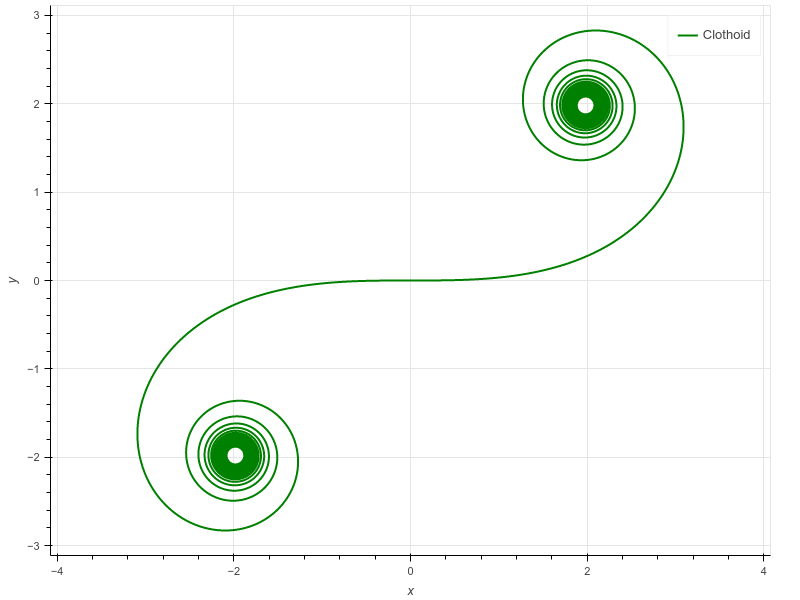
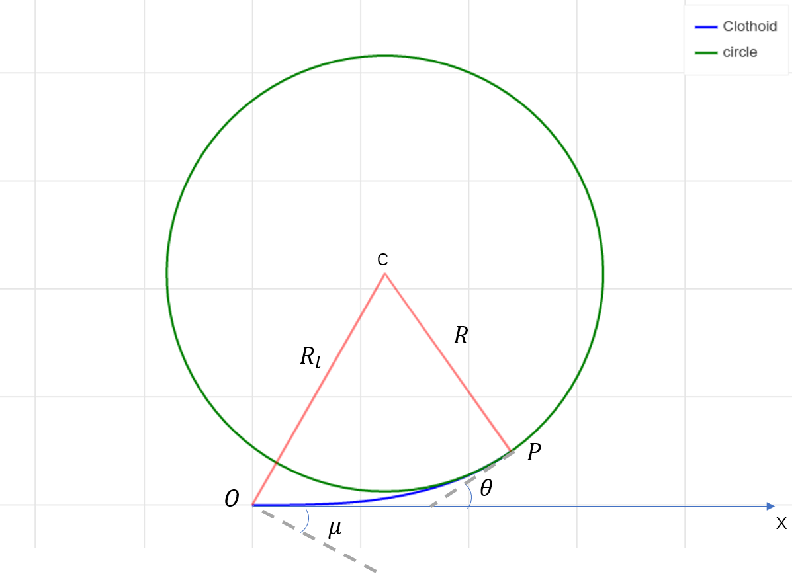
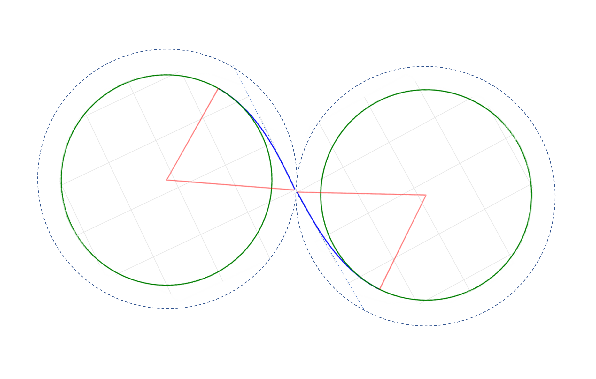

螺旋线有很多种，这里讨论的是“曲率随长度线性变化的螺旋线”, 即回旋螺线，又被称为**欧拉螺线(Euler Spiral)**，或者**羊角螺线(clothoid)**。在现实环境中经常需要曲线的曲率是连续变化的，因此欧拉螺线被广泛用于曲线拟合以及路径规划中。

回旋螺线的参数方程可以写为:

$$\begin{aligned}\kappa &= \alpha s + \kappa_0 \\
\kappa_0 & \rightarrow \text{curvature at init point}\\
\kappa & \rightarrow \text{curvature}\\
\kappa & \rightarrow \text{sharpness, curvature ratio}\\
s & \rightarrow \text{curve length} \end{aligned}
$$

为了计算方便，一般把$\kappa_0$ 设为0,则本文主要讨论的曲线参数方程为:
$$\kappa = \alpha s$$

## parametrical clothoid（参数螺旋线）

$$\kappa(s)=\kappa_{0}+\alpha s \\
\theta(s)=\int_{0}^{s} \kappa(u) d u \\
x(s)=\int_{0}^{s} \cos \theta(u) d u \\
y(s)=\int_{0}^{s} \sin \theta(u) d u$$

- $\alpha$: sharpness, rate of curvature
- curvature
- deflection
- length

if $\kappa_0 = 0$, then at end:

$$\kappa=\sqrt{2 \delta \alpha}, \delta=\frac{\kappa^{2}}{2 \alpha}, s=\sqrt{\frac{2 \delta}{\alpha}} \\
\delta = \frac{1}{2}\alpha s^2  \\
\theta_{lim} = \alpha s^2$$

at middle:

$$q = \left\{
    \begin{aligned} x&=\sqrt{\frac{\pi}{\alpha}}C_f(\sqrt{\frac{\kappa^2}{\alpha \pi}}) \\
    y&=\sqrt{\frac{\pi}{\alpha}}S_f(\sqrt{\frac{\kappa^2}{\alpha \pi}}) \\
    \kappa & = \kappa \\
    \theta &= \frac{1}{2}\alpha s^2
    \end{aligned}
\right.$$

$$\sqrt{\frac{\kappa^2}{\alpha \pi}} = s\sqrt{\frac{\alpha}{\pi}}$$

Fresnel integrals:

$$C_{f}(x)=\int_{0}^{x} \cos \frac{\pi}{2} u^{2} d u \\
S_{f}(x)=\int_{0}^{x} \sin \frac{\pi}{2} u^{2} d u$$

## 螺旋线与圆相切

螺旋线与圆相切实际上就是直线过渡到圆的螺旋线路径。

在表达式中$\kappa(s)=\alpha s$，曲率变化率$\alpha$确定之后，则可以通过转弯半径$R$计算出一段从直线过度到圆的螺旋线$C_{OP}$.圆心$c$通过端点$P$的位置以及$\theta$确定。

$$P = \begin{aligned} \kappa_p &= \frac{1}{R}\\
x_{p}&=\sqrt{\frac{\pi}{\alpha}}C_f(\sqrt{\frac{\kappa_p^2}{\alpha \pi}}) \\
y_{p}&=\sqrt{\frac{\pi}{\alpha}}S_f(\sqrt{\frac{\kappa^2}{\alpha \pi}}) \\
s_p &= \frac{1}{R\alpha} \\
\theta_{p} &= \frac{1}{2}\alpha s^2 = \frac{1}{2}k_ps_p \end{aligned}$$

连接圆心$c$和起点$O$可以得到一个更大的半径$R_l$，螺旋线$C_{OP}$就在这个更大的圆内，并且起点$O$与大圆在$O$点的切线夹角记为$\mu$. 可以看出螺旋线$\vec{OP}$的终点斜率和大圆在X轴处的斜率保持一致。

## 两圆相切的过渡曲线 CPSPC

由上一节可知螺旋线的出圈点在大圆的弦上，弦和切线的夹角为$\mu$。

