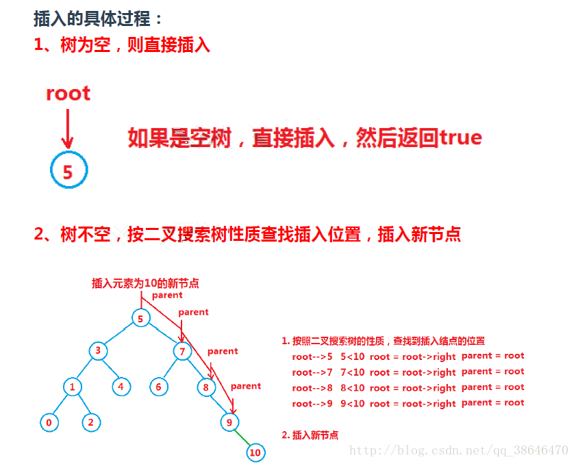

## linked list

```c++
//definition
 struct ListNode {
    int val;
    ListNode *next;
    ListNode(int x) : val(x), next(NULL) {}
 };

//删除链表中的节点, 不是末端点
void deleteNode(ListNode* node){
    //m1
    node->val=node->next->val;
    node->next=node->next->next;

    //m2
    *node=*(node->next);
}


//remove nth node
ListNode* removeNthFromEnd(ListNode* head, int n) {
    ListNode *p1=head;
    while(n--)
    {
        p1=p1->next;
    }
    if(p1==NULL) return head->next;
    ListNode *p2=head;
    while(p1->next)
    {
        p1=p1->next;
        p2=p2->next;
    }
    ListNode* tmp = p2->next;
    p2->next=tmp->next;
    delete tmp;
    return head;
}

```

**reverse list**
```c++
//迭代
class Solution {
public:
    ListNode* reverseList(ListNode* head) {
        if(head==NULL){
            return head;
        }
        ListNode* pre,*cur,*last;
        last=head;
        pre=head->next;
        while(pre!=NULL){
            cur=pre->next;
            pre->next=head;
            head=pre;
            pre=cur;
        }
        last->next=NULL;
        return head;
        
    }
};


//递归
class Solution {
public:
    ListNode* reverseList(ListNode* head) {
        if(head==NULL || head->next==NULL){
            return head;
        }
        else{
            ListNode* newhead=reverseList(head->next);
            head->next->next=head;
            head->next=NULL;
            return newhead;
            
        }
        
    }
};
```

**环形链表判断**
```c++
/*
快行指针
当快行和慢行指针都落在环形内时，由于快行每次比慢行指针多走一个节点，故快行指针一定会遇到慢行指针。
*/

bool hasCycle(ListNode *head) {
    if(head ==NULL || head->next==NULL){
        return false;
    }
    
    ListNode* quick=head;
    ListNode* slow=head;
    while(quick){
        slow=slow->next;
        quick=quick->next;
        if(quick){
            quick=quick->next;
        }
        if(quick==slow){
            return true;
        }
    }
    return false;
}

/*
recursion
把每一个节点的下一个都指向自己，则在遇到环形节点的时候会发现该节点的下一个已经指向自己。
*/
bool hasCycle(ListNode *head) {
    if(head ==NULL || head->next==NULL){
        return false;
    }
    ListNode* nex=head->next;
    
    if(nex==head){
        return true;
    }
    head->next=head;
    
    return hasCycle(nex);
}
```

## Tree

**遍历**
```c++
//遍历的非递归方式

//前序遍历

//中序遍历
```

**最大深度**

```c++
//recursion
int maxDepth(TreeNode* root) {
    if(!root){
        return 0;
    }
    
    int le,ri;
    le=1+maxDepth(root->left);
    ri=1+maxDepth(root->right);
    if(le<ri){
        le=ri;
    }
    return le;
}

//traverse,非递归的方式，可以处理补丁子节点的树
int maxDepth(Node* root) {
    if (root == NULL)
        return 0;
    queue<Node*> tree;
    int ret = 0;
    tree.push(root);
    while (!tree.empty())
    {
        int n = tree.size();
        int j = 0;
        for (; j < n; j++)
        {
            Node* now = tree.front();
            tree.pop();
            int i = 0;
            int length = now->children.size();
            while (i < length)
            {
                tree.push(now->children[i]);
                i++;
            }
        }
        ret++;
    }
    return ret;
}
```

**验证二叉搜索树(BST)**

```c++
//recursion
//以指针来代替数值，避免了int型数值越界
bool isValidBST(TreeNode* root) {
    if(!root){
        return true;
    }
    
    return isValid(root);
    
}

bool isValid(TreeNode* root,TreeNode* left=NULL,TreeNode* right=NULL){
    if(!root){
        return true;
    }
    
        if(left && left->val>=root->val){
            return false;
        }
    
    if(right && right->val<=root->val){
        return false;
    }
    
    return isValid(root->left,left,root) && isValid(root->right,root,right);
}

//traverse
//二分搜索树的中序遍历是一个有序数组
//需要考虑越界
```

**有序数组转化为二叉搜索树**
```c++
TreeNode* sortedArrayToBST(vector<int>& nums) {
    return sortHelper(nums,0,nums.size()-1);
    
    
}

TreeNode* sortHelper(vector<int>& nums,int start,int end){
    if(start>end){
        return NULL;
    }
    int index=start+(end-start)/2;
    TreeNode * root=new TreeNode(nums[index]);
    root->left=sortHelper(nums,start,index-1);
    root->right=sortHelper(nums,index+1,end);
    return root;
}

```

**二叉搜索树的插入**

```c++
//rescursive
int BSTreeNodeInsertR(BSTreeNode **tree,DataType x) //搜索树的插入
{
    if(*tree == NULL)
    {
        *tree = BuyTreeNode(x);
        return 0;
    }

    if ((*tree)->_data > x)
        return BSTreeNodeInsertR(&(*tree)->_left,x);
    else if ((*tree)->_data < x)
        return BSTreeNodeInsertR(&(*tree)->_right,x);
    else
        return -1;
}

//non rescursive
int BSTreeNodeInsert(BSTreeNode **pptree,DataType x) //搜索树的插入
{
    BSTreeNode *parent = NULL;
    BSTreeNode *cur = *pptree;
    if (*pptree == NULL)
    {
        *pptree = BuyTreeNode(x);
        return 0;
    }
    while (cur)
    {
      parent = cur;
      if (cur->_data > x)
          cur = cur->_left;
      else if (cur->_data < x)
          cur = cur->_right;
      else
          return -1;
    }

    if (parent->_data > x)
        parent->_left = BuyTreeNode(x);
    else 
        parent->_right = BuyTreeNode(x);

    return 0;
}

```

**二叉搜索树的删除**
1. 要删除的结点无孩子结点
2. 要删除的结点只有左孩子结点
3. 要删除的结点只有右孩子结点
4. 要删除的结点有左、右孩子结点

情况1可以归类到2或者3,对于上述情况，相应的删除方法如下：

1. 直接删除该结点
2. 删除该结点且使被删除节点的双亲结点指向被删除节点的左孩子结点
3. 删除该结点且使被删除节点的双亲结点指向被删除结点的右孩子结点
4. 在它的右子树中寻找中序下的第一个结点(关键码最小,遍历左子树)，用它当作当前节点

```c++
int BSTreeNodeDel(BSTreeNode **tree,DataType x) //删除
{

    BSTreeNode *cur = *tree;
    BSTreeNode *parent = *tree;
    BSTreeNode *del = NULL;

    while (cur)
    {
        if (cur->_data > x)
        {
            parent = cur;
            cur = cur->_left;
        }
        else if (cur->_data < x)
        {
            parent = cur;
            cur = cur->_right;
        }
        else
        {
            del = cur;

            if (cur->_left == NULL) //1、左孩子为空
            {   
                /* *cur =*(cur->left) */
                if (parent->_left == cur)
                    parent->_left = cur->_right;
                else if (parent->_right == cur)
                    parent->_right = cur->_right;
                else if (parent == cur) //没有父亲节点时
                   *tree = parent->_right;
            }
            else if (cur->_right == NULL) //2、右孩子为空
            {
                if (parent->_left == cur)
                    parent->_left = cur->_left;
                else if (parent->_right == cur)
                    parent->_right = cur->_left;
                else if (parent == cur) //没有父亲节点时
                    *tree = parent->_left;
            }
            else//3、左右孩子都不为空
            {
                BSTreeNode *sub = cur->_right;
                while (sub->_left)
                {
                    parent = sub;
                    sub = sub->_left;
                }

                del = sub;
                cur->_data = sub->_data;

                if (parent->_left == sub)
                    parent->_left = sub->_right;
                else 
                    parent->_right = sub->_right;
            }

            free(del);
            del = NULL;
            return 0;

        }
    }

    return -1;
}
```

- 遍历的非递归通过队列来保存
- 而查找，插入的非递归不需要保存序列
