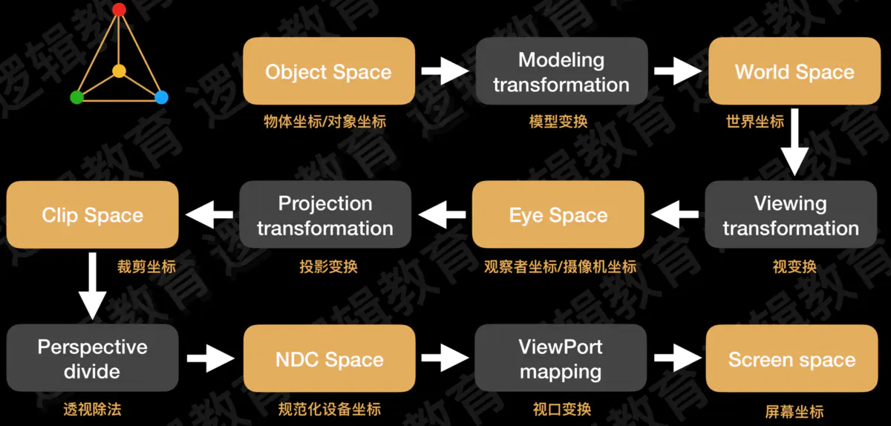
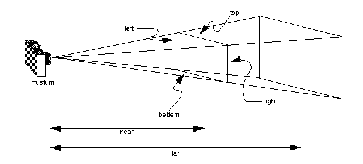
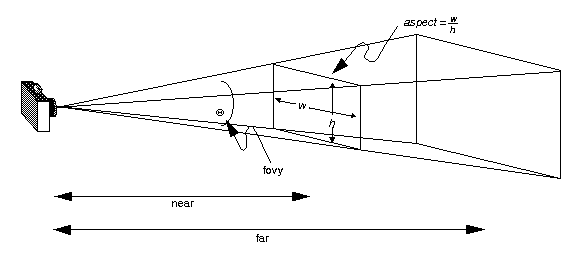

g++ opengl_demo.cpp -o opengl_demo -lGL -lglut -lGLU


数据

全局：
- 位置
- 大小
- 背景色
- look at
- perspective

局部个体

- 颜色
- 数据

图元类型

线段
多边形
四边形

1. 全局静态变量实现opengl回调到类内部
2. 每一个功能包装成函数对象，存储到列表里
3. 链表存储函数对象，集合根据名称快速定位是否存在

## glDrawElements, glDrawArrays

定点数组

```cpp
//指定需要启动的数组(GL_VERTEX_ARRAY,GL_COLOR_ARRAY,GL_INDEX_ARRAY等8个可用数组)
void glEnableClientState(GLenum array);

void drawCube()
{
    // enable and specify pointers to vertex arrays
    //指定需要启动的数组(GL_VERTEX_ARRAY,GL_COLOR_ARRAY,GL_INDEX_ARRAY等8个可用数组)
    glEnableClientState(GL_NORMAL_ARRAY);
    glEnableClientState(GL_COLOR_ARRAY);
    glEnableClientState(GL_VERTEX_ARRAY);

    // 指定数组数据
    glNormalPointer(GL_FLOAT, 0, normals);
    glColorPointer(3, GL_FLOAT, 0, colors);
    glVertexPointer(3, GL_FLOAT, 0, vertices);

    glDrawElements(GL_TRIANGLES, 36, GL_UNSIGNED_BYTE, indices);

    glDisableClientState(GL_VERTEX_ARRAY);  // disable vertex arrays
    glDisableClientState(GL_COLOR_ARRAY);
    glDisableClientState(GL_NORMAL_ARRAY);
}


//获取当前所哟启用的数组第ith个顶点数据（从0开始算）
void glArrayElement(GLint ith);

//mode指定要创建图元的类型（和glBegin参数相同），count为顶点数量，type为顶点数据类型，indices表示索引数组首地址
//glDrawElements的作用相当于多条glArrayElement(indices[i])
void glDrawElements(GLenum mode,GLsize count,GLenum type,const GLvoid* indices);
//相当于primcount条glDrawElements(mode,count[i],type,indices[i])语句
void glMultiDrawElements(GLenum mode,GLsize* count,GLenum type,const GLvoid** indices,GLsizei primcount);
//相当于有范围的glDrawElements，范围为[start,end]
void glDrawRangeElements(GLenum mode,GLuint start,GLuint end,GLsize count,GLenum type,const GLvoid* indices);
 
//创建一个图元序列，从每个被启用的数组，范围为[first,first + count - 1]
void glDrawArrays(GLenum mode,GLint first,GLsizei count);
//相当于primcount条glDrawArrays(mode,first[i],count[i])
void glMultiDrawArrays(GLenum mode,GLint* first,GLsizei* count,GLsizei primcount);
```

## 光照和材质

```cpp
// set light
void glLightfv (GLenum light, GLenum pname, const GLfloat *params);

// 位置在(0,0,0)，没有环境光，镜面反射光和漫反射光都为白光的光源
GLfloat light_position[] = { 0.0, 0.0, 0.0, 0.0 }; 
GLfloat light_ambient [] = { 0.0, 0.0, 0.0, 1.0 };
GLfloat light_diffuse [] = { 1.0, 1.0, 1.0, 1.0 };
GLfloat light_specular[] = { 1.0, 1.0, 1.0, 1.0 }; 
glLightfv(GL_LIGHT0, GL_POSITION, light_position); 
glLightfv(GL_LIGHT0, GL_AMBIENT , light_ambient );
glLightfv(GL_LIGHT0, GL_DIFFUSE , light_diffuse ); 
glLightfv(GL_LIGHT0, GL_SPECULAR, light_specular);

// open light
glEnable(GL_LIGHTING)
glEnable(GL_LIGHTX)

// depth

display: glClear(GL_COLOR_BUFFER_BIT | GL_DEPTH_BUFFER_BIT);
init: glEnable(GL_DEPTH_TEST);
	glutInitDisplayMode(GLUT_DOUBLE | GLUT_RGBA | GLUT_DEPTH);
```

```cpp
// set material
void  glMaterialfv (GLenum face, GLenum pname, const GLfloat *params);
```
## 坐标系

```sh
右手坐标系
    ^ y
    |
    |
    |
    -------------> x
   /
  /
 /
z
``` 

```c++

void ViewerManager::getGlobalTrans(){
	Eigen::Vector3f gtrans={x_trans_, y_trans_,z_trans_};
	Eigen::Isometry3f t_n =Eigen::Isometry3f::Identity();
	t_n.pretranslate(gtrans);

	model_view_ = cam_view_ * t_n.inverse() * cam_view_.inverse() * model_view_;

}

void ViewerManager::getGlobalRot(){
	Eigen::Vector3f axis={ -y_angle_,x_angle_,0};
	float scale = axis.norm();
	Eigen::Vector3f axis_n=axis.normalized();
	Eigen::Vector3f gtrans={x_trans_, y_trans_,z_trans_};

	std::cout<<"gangle:\n"<<axis.transpose()<<std::endl;
	std::cout<<"gtrans:\n"<<gtrans.transpose()<<std::endl;

	Eigen::Matrix3f rot;
	rot=Eigen::AngleAxisf(scale, axis_n);

	Eigen::Isometry3f t_n =Eigen::Isometry3f::Identity();
	t_n.prerotate(rot);
	t_n.pretranslate(gtrans);
	// 按照屏幕坐标旋转，容易转过视野
	// model_view_ = cam_view_ * t_n.inverse() * cam_view_.inverse() * model_view_;

	// 按照视觉中心点旋转
	// model_view_ =  model_view_ *t_n; 

	// 按照自身坐标系旋转
	// model_view_ = t_n * model_view_;


	// 按照视觉中心点的位置和屏幕坐标的方向
	Eigen::Isometry3f c_c=cam_view_;
	c_c(0,3) = 0;
	c_c(1,3) = 0;
	c_c(2,3) = 0;

	Eigen::Vector3f axis_origin=c_c * axis_n;

	Eigen::Matrix3f rot2;
	rot2=Eigen::AngleAxisf(scale, axis_origin);

	Eigen::Isometry3f t_n2 =Eigen::Isometry3f::Identity();
	t_n2.prerotate(rot2);
	model_view_ = t_n2 * model_view_;

}


```

观察矩阵变换关系

- $T_c$: camera transformation relative to world
- $T_m$: model global transformation relative to world
- $T_n$: new camera transformation

$$T_n^{-1}\cdot T_c^{-1} \cdot T_m = T_c^{-1} \cdot T_{m-new}   \\
 T_{m-new}= T_c \cdot T_n^{-1}\cdot T_c^{-1} \cdot T_m $$


鼠标与观察矩阵变换关系：

```sh
# 鼠标屏幕坐标              opengl 画面坐标
----------->  x            |   y
|                          |
|                          |
| y                        ------------> x

鼠标右移  mx增大  相机相反  相机x减小  dx = - （x -last_x）  rot_y =(x-last_x)
鼠标上移  my减小  画面y增大 相机y减小  dy =  （y -last_y）   rot_x = (y-last_y)


```



- model transformation(model matrix): 物体在世界坐标中的位置变换
- view transformation(view matrix): 视图变换,观察者从哪个视角观察
- projection transformation: 投影变换，观察的结果以那种投影方式呈现
- viewport: 视口变换，对观察空间的裁剪

视图变换必须出现在模型变换之前，但可以在绘图之前的任何时候执行投影变换和视口变换。

```c++
// 对矩阵进行选择
glMatrixMode(mode);
/* 
 mode: GL_MODELVIEW, GL_PROJECTION, and GL_TEXTURE
模型视图变换（GL_MODELVIEW）：从“相对移动”的观点来看，改变观察点的位置与方向和改变物体本身的位置与方向具有等效性。

透视投影变换（GL_PROJECTION）：定义一个可视空间，可视空间以外的物体不会被绘制到屏幕上。

视图变换（glViewPort）：通常情况下，程序默认像素填充整个窗口，通过视口变换设置像素在窗口上的填充情况。

视口变换（glViewPort）：通常情况下，程序默认像素填充整个窗口，通过视口变换设置像素在窗口上的填充情况。
 */

 void glPushMatrix(void);
void glPopMatrix(void);

/**
每一次push都把当前变换矩阵存入栈中，接下来操作都在当前矩阵上改变。因此push可以看作是一次镜像拷贝。当前矩阵操作完成之后，调用pop，移出栈，矩阵回退到矩阵拷贝之前的状态。
**/
```

## 变换方式

```c++
/*************** 视图变换 ****************/
//  默认 照相机位于原点，指向z轴负方向，朝上向量为(0,1,0)
// creates a viewing matrix
void gluLookAt(	
    GLdouble eyeX, GLdouble eyeY, GLdouble eyeZ,    // position of the eye point
    GLdouble centerX, GLdouble centerY,     GLdouble centerZ,   // position to look at
    GLdouble upX, GLdouble upY, GLdouble upZ    // the up vector
    );

/*************** 视口变换 ****************/
// set the viewport
// 设定图像最终显示在屏幕哪个区域，默认为整个屏幕
void glViewport(	GLint x,
 	GLint y,
 	GLsizei width,
 	GLsizei height);

/*************** 空间变换 ****************/
glMatrixMode(GL_MODELVIEW);
// 以某一向量进行旋转
void glRotatef(	GLfloat  	angle,
                GLfloat  	x,
                GLfloat  	y,
                GLfloat  	z);
void glTranslatef(	GLfloat  	x,
                    GLfloat  	y,
                    GLfloat  	z);

void glScalef(	GLfloat  	x,
                GLfloat  	y,
                GLfloat  	z);


/*************** 投影变换 ****************/

// 0. prepare
glMatrixMode(GL_PROJECTION);    // declare a  projection matrix
glLoadIdentity(); // set it ot identity

// 1. 正投影变换
glOrtho(左，右，下，上，近，远);
void gluOrtho2D(	GLdouble left,
 	GLdouble right,
 	GLdouble bottom,
 	GLdouble top);

// 2. 透视投影
// glFrustum — multiply the current matrix by a perspective matrix
void glFrustum(	GLdouble left,
 	GLdouble right,
 	GLdouble bottom,
 	GLdouble top,
 	GLdouble nearVal,
 	GLdouble farVal);
```


```c++
// 3. 透视投影的另一种方式
// gluPerspective — set up a perspective projection matrix
/*
fovy
Specifies the field of view angle, in degrees, in the y direction.

aspect
Specifies the aspect ratio that determines the field of view in the x direction. The aspect ratio is the ratio of x (width) to y (height).

zNear
Specifies the distance from the viewer to the near clipping plane (always positive).

zFar
Specifies the distance from the viewer to the far clipping plane (always positive).
*/
void gluPerspective(	GLdouble fovy,
 	GLdouble aspect,
 	GLdouble zNear,
 	GLdouble zFar);
```



## 几何图元

#### 2D
GL_POINTS、GL_LINES、GL_LINE_STRIP、GL_LINE_LOOP、GL_TRIANGLES、GL_TRIANGLE_STRIP、GL_TRIANGLE_FAN、GL_QUADS、GL_QUAD_STRIP和GL_POLYGON

#### 3D

```c++
glutWireCube(1); // 正方体线框
glutSolidSphere(re(GLdouble radius, GLint slices, GLint stacks);


// ref: https://www.opengl.org/resources/libraries/glut/spec3/node80.html#SECTION000120000000000000000
11.1 glutSolidSphere, glutWireSphere
11.2 glutSolidCube, glutWireCube
11.3 glutSolidCone, glutWireCone
11.4 glutSolidTorus, glutWireTorus
11.5 glutSolidDodecahedron, glutWireDodecahedron
11.6 glutSolidOctahedron, glutWireOctahedron
11.7 glutSolidTetrahedron, glutWireTetrahedron
11.8 glutSolidIcosahedron, glutWireIcosahedron
11.9 glutSolidTeapot, glutWireTeapot
```

## 鼠标旋转平移缩放

```c++
// 方案1 改变视图

// 方案2 改变全局物体变换（常用）

glRotatef(x_angle, 0.0f, 1.0f, 0.0f);   // 旋转 x
glRotatef(y_angle, 1.0f, 0.0f, 0.0f);   // 旋转 y
glTranslatef(x_trans,y_trans, m_scale); // 平移 + 缩放 (缩放通过z轴移动来实现)
```


## 2d demo

```c++
#include <GL/glut.h>
#include <stdio.h>

void displayCB(void){
    glClear(GL_COLOR_BUFFER_BIT);		/* clear the display */
    glColor3f(0.5, 0.8, 0.5);		/* set current color to white */

    glBegin(GL_POLYGON);			/* draw filled triangle */
        glVertex2i(200,125);			/* specify each vertex of triangle */
        glVertex2i(100,375);
        glVertex2i(300,375);
    glEnd();				/* OpenGL draws the filled triangle */

    glFlush();				/* Complete any pending operations */

}

void keyCB(unsigned char key, int x , int y){
    if(key == 'q' || key =='Q') exit(0);
}

int main(int argc, char ** argv){
    glutInit(&argc, argv);
    glutInitDisplayMode(GLUT_RGB);
    glutInitWindowPosition(400,300);
    glutInitWindowSize(640,480);
    glutCreateWindow("simple 2d");

    glClearColor(1.0,1.0,1.0, 1.0);  // set background to black
    gluOrtho2D(0, 400, 0, 500); // set display range: x~[0-400], y~[0-500]
    glutDisplayFunc(displayCB);
    glutKeyboardFunc(keyCB);

    glutMainLoop();

    return 0;
}
```

## ref

- blog
    - [docs.gl](http://docs.gl/gl3/glMatrixMode)
    - [glut api](https://www.opengl.org/resources/libraries/glut/spec3/spec3.html)
    - [OpenGL® 2.1, GLX, and GLU Reference Pages](https://www.khronos.org/registry/OpenGL-Refpages/gl2.1/)
    - [不定参数函数模板](https://blog.csdn.net/ttomqq/article/details/78263733)
- code
- project
    - [OpenGL Matrix Class](http://www.songho.ca/opengl/gl_matrix.html)
    - [Quaternion to Rotation Matrix](http://www.songho.ca/opengl/gl_quaternion.html)
    - [3dmaths](https://github.com/ljcduo/3dmaths)
    - [opengl tutorial](http://www.songho.ca/opengl/index.html)
    - [libigl - A simple C++ geometry processing library](https://libigl.github.io/):可参考许多的io写法
    - [opengl based gui tutorial](http://openglgui.sourceforge.net/tutorials.html)
    - [OPENGL EXAMPLES](https://cs.lmu.edu/~ray/notes/openglexamples/)
    - [opengl examples](https://web.media.mit.edu/~gordonw/OpenGL/)
    - [nanogui](https://github.com/wjakob/nanogui)
- paper