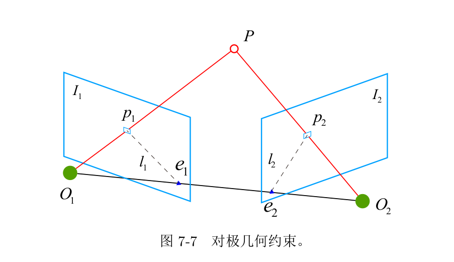

## 对极几何（Epipolar Geometry）

下图表示在两帧图像$I_1,I_2$中，点$P$投影到两张图像中为$p_1,p_2$。两个相机中心分别$O_1,O_2$，假设第一帧到第二帧的运动为$[R,t]$.

- 极平面(Epipolar plane): $O_1O_2P$三点组成的平面
- 极点(Epipolar): $e_1,e_2$
- 基线: $O_1O_2$连线
- 极线: $l_1,l_2$

设点$P$在世界坐标系下表示为:

$P=[X,Y,Z]^T$

为方便计算，以$O_1$为世界坐标系，$O_2$在$O_1$坐标系下的运动为$[R,t]$，则$P$在$O_1$和$O_2$坐标系下分别表示为：

$P_1=[X_1,Y_1,Z_1]^T=P\\
P_2=[X_2,Y_2,Z_2]=RP_1+t=RP+t$

跟拒相机模型：

$$Z_1p_1=KP    \\
Z_2p_2=kP_2=K(RP+t)$$

通过转换可以推导出：

$$p_2^TK^{-T}[T_\times]RK^{-1}p_1=0$$

这被称为对极约束.事实上这个公式的几何意义是$O_1,P, O_2$三点共面。

令$E=[T_\times]R, F=K^{-T}[T_\times]RK^{-1}$,分别记为本质矩阵(Essential Matrix) $E$和基础矩阵(Fundamental Matrix) $F$.

根据对极约束求解相机姿态：

1. 根据匹配点求出基础矩阵或本质矩阵
2. 根据基础矩阵或本质矩阵求解旋转矩阵和平移向量

## 本质矩阵

1. 由于对极约束是等市为0的约束，乘以任意常量等市一人成立，这被称为$E$在不同尺度的等价性。
2. 根据$E=[T_\times]R$，本质矩阵奇异值必定是$[\sigma,\sigma,0]^T$的形式，这被称为本质矩阵的内在性质。
3. 平移和旋转各有三个自由度，加起来为6个。又由于尺度等价性，本质矩阵的实际自由度为5个

本质矩阵常用经典的八点法(Eight-point-algorithm)进行求解。

令$x_1=K^{-1}p_1, x_2=K^{-1}p_2$, 则$x_2^TEx_1=0$.

根据$x_1, x_2$的归一化坐标和对极约束：

$$\left(u_{2}, v_{2}, 1\right)\left(\begin{array}{lll}
e_{1} & e_{2} & e_{3} \\
e_{4} & e_{5} & e_{6} \\
e_{7} & e_{8} & e_{9}
\end{array}\right)\left(\begin{array}{l}
u_{1} \\
v_{1} \\
1
\end{array}\right)=0    \\
\text{(这里$x_1,x_2$的坐标并不是指真实的像素坐标$p_1,p_2$,而是经过相机外参矩阵变换过后的归一化坐标)}$$

写成向量形式：

$$e=\left[e_{1}, e_{2}, e_{3}, e_{4}, e_{5}, e_{6}, e_{7}, e_{8}, e_{9}\right]^{\mathrm{T}}\\
\Downarrow \\
\left[u_{2} u_{1}, u_{2} v_{1}, u_{2}, v_{2} u_{1}, v_{2} v_{1}, v_{2}, u_{1}, v_{1}, 1\right] \cdot e=0    \\
\Downarrow \\
\left(\begin{array}{ccccccccc}
u_{2}^{1} u_{1}^{1} & u_{2}^{1} v_{1}^{1} & u_{2}^{1} & v_{2}^{1} u_{1}^{1} & v_{2}^{1} v_{1}^{1} & v_{2}^{1} & u_{1}^{1} & v_{1}^{1} & 1 \\
u_{2}^{2} u_{1}^{2} & u_{2}^{2} v_{1}^{2} & u_{2}^{2} & v_{2}^{2} u_{1}^{2} & v_{2}^{2} v_{1}^{2} & v_{2}^{2} & u_{1}^{2} & v_{1}^{2} & 1 \\
\vdots & \vdots & \vdots & \vdots & \vdots & \vdots & \vdots & \vdots & \\
u_{2}^{8} u_{1}^{8} & u_{2}^{8} v_{1}^{8} & u_{2}^{8} & v_{2}^{8} u_{1}^{8} & v_{2}^{8} v_{1}^{8} & v_{2}^{8} & u_{1}^{8} & v_{1}^{8} & 1
\end{array}\right)\left(\begin{array}{c}
e_{1} \\
e_{2} \\
e_{3} \\
e_{4} \\
e_{5} \\
e_{6} \\
e_{7} \\
e_{8} \\
e_{9}
\end{array}\right)=0$$

这就转化为一个齐次线性方程求解的问题。

$$Ae=0$$

一般采用SVD和最小二乘法进行求解。解空间为A矩阵的零空间。而零空间即是V矩阵的列向量。为了约束e的二范数最小，一般取最小特征值对应的列向量作为解。

$$\eta=arg min_{||\eta||=1} ||A\eta||=v_9   \\
A=U_{A} \Sigma_{A} V_{A}^{T}$$

**本质矩阵分解相机运动**

$$
\begin{aligned}
&\begin{array}{c}
\boldsymbol{E}=\boldsymbol{U} \Sigma \boldsymbol{V}^{T}, \boldsymbol{\Sigma}=\operatorname{diag}(\sigma, \quad \sigma, \quad 0) \\
t_{1}=U(:, 2) \quad R_{1}=U R_{Z}\left(\frac{\pi}{2}\right) V^{T} \\
\boldsymbol{t}_{2}=-\boldsymbol{U}(:, \mathbf{2}) \quad \boldsymbol{R}_{2}=\boldsymbol{U} \boldsymbol{R}_{\mathrm{Z}}^{T}\left(\frac{\pi}{2}\right) \boldsymbol{V}^{T} \\
\boldsymbol{R}_{z}\left(\frac{\pi}{2}\right)=\left(\begin{array}{ccc}
0, & -1, & 0 \\
1, & 0, & 0 \\
0, & 0, & 1
\end{array}\right), \boldsymbol{R}_{z}^{T}\left(\frac{\pi}{2}\right)=\left(\begin{array}{cll}
0, & 1, & 0 \\
-1, & 0, & 0 \\
0, & 0, & 1
\end{array}\right)
\end{array}\\
&\text { 共有4种情况 }\left(\boldsymbol{R}_{1}, \boldsymbol{t}_{1}\right),\left(\boldsymbol{R}_{1}, \boldsymbol{t}_{2}\right),\left(\boldsymbol{R}_{2}, \boldsymbol{t}_{1}\right),\left(\boldsymbol{R}_{2}, \boldsymbol{t}_{2}\right)
\end{aligned}
$$

1. 解的判断。任取一点对四个解进行验证，只有在两个相机下都具有正的深度的是合理的解。
2. 根据SVD分解出的特征值可能不是$[\sigma,\sigma,0]^T$的形式。若$\Sigma=[\sigma_1,\sigma_2,\sigma_3]^T, (\sigma1\geq\sigma_2\geq\sigma_3)$,则可以取$\Sigma=[\frac{\sigma_1+\sigma_2}{2},\frac{\sigma_1+\sigma_2}{2},0]^T$或直接取$\Sigma=[1,1,0]^T$。由于尺度不变性，这样取也是合理的。

## 单应矩阵

H: homography.

单应矩阵通常描述处于共同平面的一些点在两张图像之间的变换关系。所以单应矩阵多适用于平面场景中的姿态估计。

## ref

- blog
    - [SLAM算法＆技术](https://zhuanlan.zhihu.com/slamTech)
- code
    - [homography-decomp](https://github.com/syilma/homography-decomp/tree/master/src)
    - [homography.py](https://github.com/hughesj919/HomographyEstimation/blob/master/Homography.py)
    - [homography_estimation c++](https://github.com/nyakasko/homography_estimation/blob/main/homography_estimation.cpp)
    - [decompose essential matrix](https://github.com/MasteringOpenCV/code/blob/master/Chapter4_StructureFromMotion/FindCameraMatrices.cpp)
- project
    - [Mastering OpenCV with Practical Computer Vision Projects](https://github.com/MasteringOpenCV/code)
    - [MVG_Algorithm](https://github.com/ydsf16/MVG_Algorithm)

