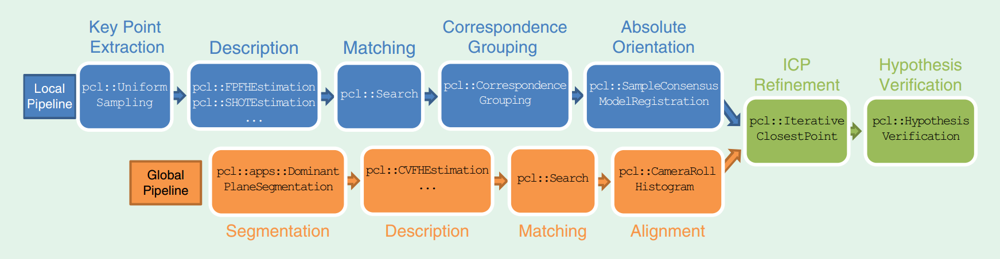

- [6自由度位姿估计的传统方法](https://www.zhihu.com/question/63159179)
- [surface matching in opencv](https://docs.opencv.org/3.0-beta/modules/surface_matching/doc/surface_matching.html)
- [6D pose estimation 知乎专栏](https://zhuanlan.zhihu.com/6d-pose)
- [meiqua-github](https://github.com/meiqua/6DPose)
- [ork-ros package](http://wg-perception.github.io/object_recognition_core/install.html#install)
- [a tutorial on the revelent things](http://www.sci.utah.edu/~shireen/tutorials.html)

---

Coarse to fine registration:

1. coarse registration
	- 模板匹配
		- linemode
		> Hinterstoisser S, Holzer S, Cagniart C, et al. Multimodaltemplates for real-time detection of texture-less objects in heavily clutteredscenes[C]// International Conference on Computer Vision. IEEE Computer Society,2011:858-865.
		> [ref1](https://blog.csdn.net/zmdsjtu/article/details/79933822)
		> [ref2](https://blog.csdn.net/haithink/article/details/88396670)
		> [code: shape_based_matching](https://github.com/meiqua/shape_based_matching)
	- 基于点对
		- ppf
	- 基于描述子
	- 霍夫森林(vote based)
		> Recovering 6D Object Pose and Predicting Next-Best-View in the Crowd
	- end to end
2. refine registration
	- ICP
	- NDT
		> 1. [NDT 配准方法介绍](https://www.cnblogs.com/li-yao7758258/p/10705228.html)
		> 2003: The normal distributions transform: a new approach to laser scan matching
		> 2012: MSKM-NDT Scan registration with multi-scale k-means normal distributions transform
		> 2013: SGC-NDT 3D scan registration using the Normal Distributions Transform with ground segmentation and point cloud clustering

## prepare a model

1. .stl(solidworks) -->  .obj(meshlab)  --> ply --> pcd
2. .stl(solidworks)  --> .obj()	--> (sample).pcd

## Association Implementation Optimization

1. KD-tree: The association solver deals with the Nearest Neighbor (NN) problem, which typically has a complexity of O(nm) where n and m are respectively the number of elements in the reading and in the reference. This stage is generally the most time-consuming and a lot of papers present variations of NN search to reduce its complexity. Then KD-tree is used to reduce the search complexity to $O(n\log m)$ after a $O(m \log m)$ building phase. KD-trees provide very little acceleration for high dimension vectors like the ones used for image based descriptors.

2. Cascade systems:
	- compute ICP several times while varying the resolution from coarse to fine.

##4pcs

- [4pcs official website](http://graphics.stanford.edu/~niloy/research/fpcs/fpcs_sig_08.html)
- [Super4PCS Library: Not maitained ](http://nmellado.github.io/Super4PCS/)
- [OpenGR: replace the initial Super4PCS](https://storm-irit.github.io/OpenGR/index.html)

#### ref

- [CSDN-点云配准算法之super-4pcs](https://blog.csdn.net/peach_blossom/article/details/80955343)
- [4PCS阅读笔记](https://blog.csdn.net/Ha_ku/article/details/79480613)

#### 4pcs

- Ransac:
	> 分别在点集PP和点集QQ中任意选取三个点来组成一个基础关联对
	> 计算这个关联对的旋转矩阵TiTi
	> 计算点集PP中处在点集QQ中的点δδ距离内的点的个数kiki
	> 如果kiki足够大，则认为kiki是个好结果，否则重读以上步骤
	> 这个过程将被重复LL次，选取最高的kiki作为最后的结果
- Randomized Alignment
	> 在点集P中随机选取一个base,计算在点集Q中所有有可能的bases，得到旋转矩阵.
	> 验证配准: 先验证部分点集重合, 验证剩余点
	> 本算法中提出基于4PCS的base：planar congruent 4-points sets
- congruent 4-points: 在一定误差允许范围内可以通过刚体变换配准
- affine-invariant 4-points: 仿射不变，因此属于congruent 4-points

ANN: approximate nearest neighbor
	- [benchmark](https://github.com/erikbern/ann-benchmarks)
	> http://ann-benchmarks.com/
	- [ref1-zhihu](https://zhuanlan.zhihu.com/p/37381294)
	- [ref2-hnsw学习笔记](https://www.ryanligod.com/2018/11/27/2018-11-27%20HNSW%20%E4%BB%8B%E7%BB%8D/)
	- [ann library](http://www.cs.umd.edu/~mount/ANN/)
	- [search example](https://thomasdelteil.github.io/VisualSearch_MXNet/)

## 3D object recognition and 6D pose estimation based on descriptor

> Point Cloud Library: Three-Dimensional Object Recognition and 6 DoF Pose Estimation
> A Comprehensive Performance Evaluation of 3D Local Feature Descriptors

#### local descriptor

- SHOT: Signature of Histograms of Orientation
	- pcl::SHOTEstimation< ... > shot;
- FPFH: Fast Point Feature Histogram
	- geometry based descriptors: PFH/VFH/FPFH
	- pcl::FPFHEstimation< ... > shot;
- SC: 3D shape context
	- pcl::ShapeContext3DEstimation< ...>dsc;
- USC: unique shape context
	- pcl::UniqueShapeContext< ... > dsc;
- RSD: Radius based Surface Descriptor
	- pcl::RSDEstimation< ... > dsc;
- SI: Spin IMages

#### global descriptor

- PFH: POint Feature Histogram
	- pcl::PFHEstimation< ... > pfh;
- VFH: Viewpoint Feature Histogram
	- pcl::VFHEstimation< ... > vfh;
- CVFH: Clustered Viewpoint Feature Histogram
	- pcl::CVFHEstimation< ... > cvfh;
 - ESF: Ensemble of Shape Functions
	- pcl::ESFEstimation< ... > esf;
- GRSD: Global RSD

####  recognition pipelines

