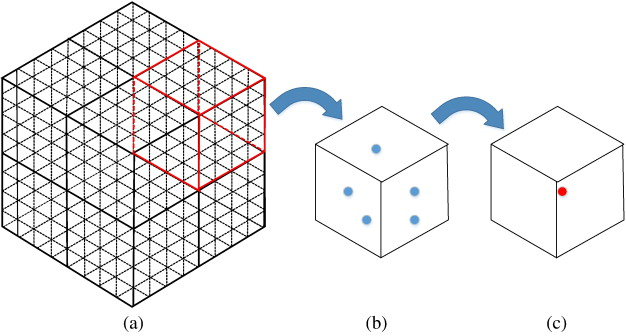

## filter

- [pcl中的滤波1](http://adastaybrave.com/pcl%E4%B8%8E%E7%82%B9%E4%BA%91%E4%B8%87%E8%B1%A1/2018/11/10/PCL%E4%B8%AD%E7%9A%84%E6%BB%A4%E6%B3%A2-1-%E5%B8%A6%E6%9C%89%E9%87%87%E6%A0%B7%E6%80%A7%E8%B4%A8%E7%9A%84%E6%BB%A4%E6%B3%A2/)
- [pcl中的滤波2](http://adastaybrave.com/pcl%E4%B8%8E%E7%82%B9%E4%BA%91%E4%B8%87%E8%B1%A1/2018/11/26/PCL%E4%B8%AD%E7%9A%84%E6%BB%A4%E6%B3%A2-2-%E6%9C%89%E7%9A%84%E6%94%BE%E7%9F%A2%E7%9A%84%E6%BB%A4%E6%B3%A2/)


#### pass through

```c++
pcl::PassThrough<pcl::PointXYZ> pass;
pass.setInputCloud (cloud);
pass.setFilterFieldName ("z");
pass.setFilterLimits (0.0, 1.0);
//pass.setFilterLimitsNegative (true);
pass.filter (*cloud_filtered);
```

#### VoxelGrid filter: 体素化网格采样



```c++
pcl::VoxelGrid<pcl::PCLPointCloud2> sor;
sor.setInputCloud (cloud);
sor.setLeafSize (0.01f, 0.01f, 0.01f);// 单位：m
sor.filter (*cloud_filtered);
```

#### uniformsampleing: 均匀采样

原理和体素滤波是很相似的，但是体素采用单位立方体，而均匀采样取一定半径 r 的球体内的点保留质心。


#### 球半径滤波器

参数主要是半径 d 的设定与候选点 n。原理是以点云中的点为中心，确定一个半径为d的球体。计算该球体内含有的点的数量，数量大于n时候，这个点被保留，反之就被剔除。

- pcl::RadiusOutlierRemoval

#### 统计滤波器 

- pcl::StatisticalOutlierRemoval 

去除明显离群点


#### 双边滤波去噪

#### 滑动最小二乘

pcl::MovingLeastSquares


## keypoint

[pcl关键点提取](https://blog.csdn.net/suyunzzz/article/details/99314844)

```c++
// narf
pcl::RangeImageBorderExtractor range_image_border_extractor;//创建深度图像边界提取对象
pcl::NarfKeypoint narf_keypoint_detector(&range_image_border_extractor);//创建Narf关键点提取器，输入为深度图像边缘提取器
narf_keypoint_detector.setRangeImage(&range_image);//关键点提取设置输入深度图像
narf_keypoint_detector.getParameters().support_size=support_size;//关键点提取的参数：搜索空间球体的半径

//sift
pcl::SIFTKeypoint<pcl::PointXYZ, pcl::PointWithScale> sift;//创建sift关键点检测对象
pcl::PointCloud<pcl::PointWithScale> result;//SIFT关键点提取结果
sift.setInputCloud(cloud_xyz);//设置输入点云
pcl::search::KdTree<pcl::PointXYZ>::Ptr tree(new pcl::search::KdTree<pcl::PointXYZ> ());
sift.setSearchMethod(tree);//创建一个空的kd树对象tree，并把它传递给sift检测对象
sift.setScales(min_scale, n_octaves, n_scales_per_octave);//指定搜索关键点的尺度范围
sift.setMinimumContrast(min_contrast);//设置限制关键点检测的阈值
sift.compute(result);//执行sift关键点检测，保存结果在result


//harris
pcl::PointCloud<pcl::PointXYZI>::Ptr Harris_keypoints (new pcl::PointCloud<pcl::PointXYZI> ());//存放最后的特征点提取结果
//实例化一个Harris特征检测对象harris_detector
pcl::HarrisKeypoint3D<pcl::PointXYZ,pcl::PointXYZI,pcl::Normal>* harris_detector = new pcl::HarrisKeypoint3D<pcl::PointXYZ,pcl::PointXYZI,pcl::Normal> ;

//harris_detector->setNonMaxSupression(true);
harris_detector->setRadius(r_normal);//设置法向量估计的半径
harris_detector->setRadiusSearch(r_keypoint);//设置关键点估计的近邻搜索半径
harris_detector->setInputCloud (input_cloud);//设置输入点云
//harris_detector->setNormals(normal_source);
//harris_detector->setMethod(pcl::HarrisKeypoint3D<pcl::PointXYZRGB,pcl::PointXYZI>::LOWE);
harris_detector->compute (*Harris_keypoints);//结果存放在Harris_keypoints
cout<<"Harris_keypoints number: "<<Harris_keypoints->size()<<endl;
```


