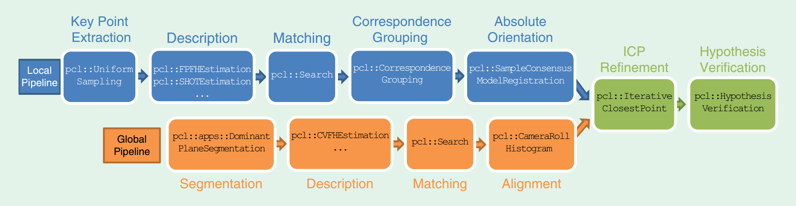

- [6自由度位姿估计的传统方法](https://www.zhihu.com/question/63159179)
- [surface matching in opencv](https://docs.opencv.org/3.0-beta/modules/surface_matching/doc/surface_matching.html)
- [6D pose estimation 知乎专栏](https://zhuanlan.zhihu.com/6d-pose)
- [meiqua-github](https://github.com/meiqua/6DPose)
- [ork-ros package](http://wg-perception.github.io/object_recognition_core/install.html#install)

- 模板匹配
	- linemode
- 基于点对
	- ppf
- 基于描述子
- 霍夫森林(vote based)
- end to end

## prepare a model

1. .stl(solidworks) -->  .obj(meshlab)  --> ply --> pcd
2. .stl(solidworks)  --> .obj()	--> (sample).pcd

## correspondence grouping

In pcl tutorial, the Correspondence Grouping for 3D object recognition. It uses the 3D Hough voting method by default or the geometric consistency clustering algorith:

	- Hough: F. Tombari and L. Di Stefano: “Object recognition in 3D scenes with occlusions and clutter by Hough voting”, 4th Pacific-Rim Symposium on Image and Video Technology, 2010.
	- GC: H. Chen and B. Bhanu: “3D free-form object recognition in range images using local surface patches”, Pattern Recognition Letters, vol. 28, no. 10, pp. 1252-1262, 2007

## implicit shape model

	Knopp J , Prasad M , Willems G , et al. Hough Transform and 3D SURF for Robust Three Dimensional Classification[J]. 2010.

## 3D object recognition and 6D pose estimation

> Point Cloud Library: Three-Dimensional Object Recognition and 6 DoF Pose Estimation

#### local descriptor

- SHOT: Signature of Histograms of Orientation
	- pcl::SHOTEstimation< ... > shot;
- FPFH: Fast Point Feature Histogram
	- geometry based descriptors: PFH/VFH/FPFH
	- pcl::FPFHEstimation< ... > shot;
- SC: 3D shape context
	- pcl::ShapeContext3DEstimation< ...>dsc;
- USC: unique shape context
	- pcl::UniqueShapeContext< ... > dsc;
- RSD: Radius based Surface Descriptor
	- pcl::RSDEstimation< ... > dsc;
- SI: Spin IMages

#### global descriptor

- PFH: POint Feature Histogram
	- pcl::PFHEstimation< ... > pfh;
- VFH: Viewpoint Feature Histogram
	- pcl::VFHEstimation< ... > vfh;
- CVFH: Clustered Viewpoint Feature Histogram
	- pcl::CVFHEstimation< ... > cvfh;
 - ESF: Ensemble of Shape Functions
	- pcl::ESFEstimation< ... > esf;
- GRSD: Global RSD

####  recognition pipelines

