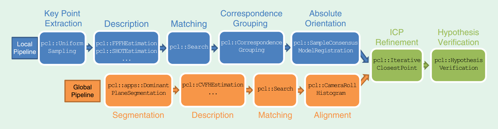

- [6自由度位姿估计的传统方法](https://www.zhihu.com/question/63159179)
- [surface matching in opencv](https://docs.opencv.org/3.0-beta/modules/surface_matching/doc/surface_matching.html)
- [6D pose estimation 知乎专栏](https://zhuanlan.zhihu.com/6d-pose)
- [meiqua-github](https://github.com/meiqua/6DPose)
- [ork-ros package](http://wg-perception.github.io/object_recognition_core/install.html#install)
- [a tutorial on the revelent things](http://www.sci.utah.edu/~shireen/tutorials.html)

---

Coarse to fine registration:

1. coarse registration
	- 模板匹配
		- linemode
	- 基于点对
		- ppf
	- 基于描述子
	- 霍夫森林(vote based)
		> Recovering 6D Object Pose and Predicting Next-Best-View in the Crowd
	- end to end
2. refine registration
	- ICP
	- NDT

## prepare a model

1. .stl(solidworks) -->  .obj(meshlab)  --> ply --> pcd
2. .stl(solidworks)  --> .obj()	--> (sample).pcd

## 3D object recognition and 6D pose estimation based on descriptor

> Point Cloud Library: Three-Dimensional Object Recognition and 6 DoF Pose Estimation
> A Comprehensive Performance Evaluation of 3D Local Feature Descriptors

#### local descriptor

- SHOT: Signature of Histograms of Orientation
	- pcl::SHOTEstimation< ... > shot;
- FPFH: Fast Point Feature Histogram
	- geometry based descriptors: PFH/VFH/FPFH
	- pcl::FPFHEstimation< ... > shot;
- SC: 3D shape context
	- pcl::ShapeContext3DEstimation< ...>dsc;
- USC: unique shape context
	- pcl::UniqueShapeContext< ... > dsc;
- RSD: Radius based Surface Descriptor
	- pcl::RSDEstimation< ... > dsc;
- SI: Spin IMages

#### global descriptor

- PFH: POint Feature Histogram
	- pcl::PFHEstimation< ... > pfh;
- VFH: Viewpoint Feature Histogram
	- pcl::VFHEstimation< ... > vfh;
- CVFH: Clustered Viewpoint Feature Histogram
	- pcl::CVFHEstimation< ... > cvfh;
 - ESF: Ensemble of Shape Functions
	- pcl::ESFEstimation< ... > esf;
- GRSD: Global RSD

####  recognition pipelines

