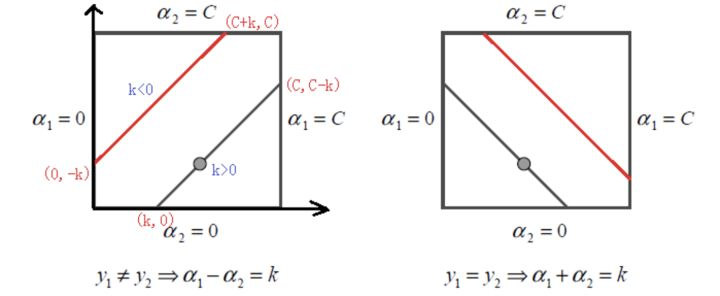

**linear classifier**

一个线性分类器就是要在$n$维空间中找到一个超平面(hyper plane), 使得不同的两类($y=1/-1$)分布在超平面两边：
$$w^Tx+b=0$$

For a feasible classifier, we will pick the one with the largest margin(distance/confidence). Then how to define the margin and how to derive the largest margin.

**functional margin and geometrical margin**

对于超平面$f(x)=w^Tx+b=0$, $|f(x)|=|w^Tx+b|$表示x距离超平面的远近，而与$y[-/+]$的符号是否一致可判断分类是否正确，因此定义函数间隔(functional margin)来表示分类的正确性以及置信程度(confidence):
$$\hat{\gamma}=yf(x)$$
超平面关于所有样本点的函数间隔最小值定义为超平面$(w,b)$关于训练数据集的函数间隔：
$$\hat{\gamma}=min\hat{\gamma}^i$$

但是若等比例改变$w,b$的值，$\gamma$就不能独立反映间隔的远近特性。（为何w值会改变）由此引出几何间隔(geometrical margin)的概念。
$$x=x_0+\gamma\frac{w}{||w||} \quad \longrightarrow  \quad \gamma=\frac{w^T+b}{||w||}=\frac{f(x)}{||w||}$$
再乘以对应的类别：
$$\hat{\gamma}=y\gamma=\frac{yf(x)}{||w||}$$
而$yf(x)$事实上等于$||f(x)||$,$\frac{||f(x)||}{||w||}$ 由于消去倍数因子的影响，是能表征其距离的特有的度量。

**maximum margin classifier**

由于函数间隔可以任意大，故取1，则目标函数转化为：

$$max\frac{1}{||w||},\quad s.t.\quad y^i(w^Tx^i+b)\geqslant 1, i=1\cdots n$$

- support vector

**对偶解法**

由于$$max\frac{1}{||w||}\approx \frac{1}{2}min||w||^2$$ 故目标函数：
$$\frac{1}{2}min||w||^2,\quad s.t.\quad y^i(w^Tx^i+b)\geqslant 1, i=1\cdots n$$
这是一个凸二次规划问题，可以用$QP(quadratic programming)$进行求解。

根据拉格朗日对偶性(lagrange duality),通过求解与原问题等价的对偶问题(dual problem)得到原始问题的最优解。定义拉格朗日函数：
$$\mathcal{L}(w,b,a)=\frac{1}{2}min||w||^2-\sum_{i=1}^{n}\alpha^i(y^i(w^Tx^i+b)-1)$$
定义：
$$\theta(w) = \max_{\alpha^i\geq 0}\mathcal{L}(w,b,\alpha)$$
则目标函数：
$$\min_{w,b}\;\theta(w) = \min_{w,b}\; \max_{\alpha^i\geq 0}\; \mathcal{L}(w,b,\alpha) = p^*$$
这里$p^*$和最初问题的最优解等价。交换最小和最大顺序：
$$\max_{\alpha^i\geq 0}\min_{w,b}\mathcal{L}(w,b,\alpha)=d^*$$
$d^*$是$p^*$的一个下界，在满足某些条件(KKT条件)的情况下，两者相等。

求解$d^*$：
$$\begin{align} 
\frac{\partial \mathcal{L}}{\partial w}=0 &\Rightarrow w=\sum_{i=1}^n \alpha^i y^i x^i \\ 
\frac{\partial \mathcal{L}}{\partial b} = 0 &\Rightarrow \sum_{i=1}^n \alpha^i y^i = 0 
\end{align}$$
带回原式：
$$\begin{align} 
\mathcal{L}(w,b,\alpha) &= \frac{1}{2}\sum_{i,j=1}^n\alpha^i\alpha_jy^iy^jx^{iT}x^j-\sum_{i,j=1}^n\alpha^i\alpha_jy^iy^jx^{iT}x^j – b\sum_{i=1}^n\alpha^iy^i + \sum_{i=1}^n\alpha^i \\ 
&= \sum_{i=1}^n\alpha^i – \frac{1}{2}\sum_{i,j=1}^n\alpha^i\alpha_jy^iy^jx^{iT}x^j 
\end{align}$$
从而得到关于$\alpha$的优化问题：
$$\begin{align} 
\max_{\alpha} &\sum_{i=1}^n\alpha^i – \frac{1}{2}\sum_{i,j=1}^n\alpha^i\alpha_jy^iy^jx^{iT}x^j \\ 
s.t., &\alpha^i\geq 0, i=1,\ldots,n \\ 
&\sum_{i=1}^n\alpha^iy^i = 0 
\end{align}$$
然后根据$\alpha$求出w,b:
$$\begin{align}
w&=\sum_{i=1}{m}\alpha^iy^ix^i \\
b^*&=-\frac{\max_{y^i=-1}w^{*T}x^i+\min_{y^i=1}w^{*T}x^i}{2}
\end{align}$$

根据w的表达式分类函数对新点的预测：
$$\begin{align} 
f(x)&=\left(\sum_{i=1}^n\alpha^i y^i x^i\right)^Tx+b \\ 
 &= \sum_{i=1}^n\alpha^i y^i \langle x^i, x\rangle + b 
\end{align}$$
即只需要计算**新数据点与训练数据点的内积**即可。 事实上，由对偶互补条件，所有非supporting vector 所对应的系数$\alpha$都是0，因此对于新点的内积计算实际上只要针对少量的support vector进行计算。

**nonlinear**

对于非线性的数据，可选择一个核函数$\kappa(.,.)$,通过将数据映射到高维空间，解决线性不可分的问题。事实上高阶函数就是向高维空间的映射。而核函数就是定义了一个高阶函数（粗浅理解）。。。原始数据通过核函数映射到高维空间之后可以通过超平面进行线性分割，而反过来核函数在原始维度里定义了一个高阶曲线对数据进行非线性分割。满足条件：[Mercer's condition](http://www.svms.org/mercer/).

定义一个高阶映射($2\to 5$)：
$$\phi(x)=[x_1\quad x_1^2\quad x_2\quad x_2^2\quad x_1x_2]$$

核函数相当于把原来的分类函数:
 $$f(x)= \sum_{i=1}^n\alpha^i y^i \langle x^i, x\rangle + b$$
映射成：
$$f(x)= \sum_{i=1}^n\alpha^i y^i \langle \phi(x^i), \phi(x)\rangle + b$$
而其中的$\alpha$可以通过求解如下问题得到：
$$\begin{align} 
\max_\alpha &\sum_{i=1}^n\alpha^i – \frac{1}{2}\sum_{i,j=1}^n\alpha^i\alpha_jy^iy^j\langle \phi(x^i), \phi(x^j)\rangle \\ 
s.t., &\alpha^i\geq 0, i=1,\ldots,n \\ 
&\sum_{i=1}^n\alpha^iy^i = 0 
\end{align}$$
但是**映射到高维空间的高阶内积的复杂度呈爆炸性增长**。 设两个向量 $x^1 = (\eta_1,\eta_2)^T$ 和 $x^2=(\xi_1,\xi_2)^T$ 考虑映射后的内积：
$$\langle \phi(x^1),\phi(x^2)\rangle = \eta_1\xi_1 + \eta_1^2\xi_1^2 + \eta_2\xi_2 + \eta_2^2\xi_2^2+\eta_1\eta_2\xi_1\xi_2$$
另外注意到：
$$\left(\langle x_1, x_2\rangle + 1\right)^2 = 2\eta_1\xi_1 + \eta_1^2\xi_1^2 + 2\eta_2\xi_2 + \eta_2^2\xi_2^2 + 2\eta_1\eta_2\xi_1\xi_2 + 1$$
可以看出两者的维度是一样的只是由线性缩放关系。事实上，上面的式子与映射：
$$\phi(x)=[\sqrt{2}x_1\quad x_1^2\quad \sqrt{2}x_2\quad x_2^2\quad \sqrt{2}x_1x_2,1]^T$$
之后的内积$<\phi(x_1),\phi(x-2)>$是相等的。而前者是映射到高维再计算内积，后者是再低维度直接计算后再进行映射，计算量将大大降低。核函数计算向量映射的内积，这里的核函数可以写成：
$$\kappa(x^1,x^2)=\left(\langle x^1, x^2\rangle + 1\right)^2$$
即核函数能简化映射空间的内积运算，而在SVM计算里总是要进行内积的运算，因此核函数应用在SVM里避开了高维空间的计算又能达到非线性分类的效果。

"最理想的情况下，我们希望知道数据的具体形状和分布，从而得到一个刚好可以将数据映射成线性可分的 $\phi(.)$ ，然后通过这个 $\phi(.)$ 得出对应的 $\kappa(.,.)$ 进行内积计算。然而，第二步通常是非常困难甚至完全没法做的。不过，由于第一步也是几乎无法做到，因为对于任意的数据分析其形状找到合适的映射本身就不是什么容易的事情，所以，人们通常都是“胡乱”选择映射的，所以，根本没有必要精确地找出对应于映射的那个核函数，而只需要“胡乱”选择一个核函数即可——我们知道它对应了某个映射，虽然我们不知道这个映射具体是什么。由于我们的计算只需要核函数即可，**所以我们也并不关心也没有必要求出所对应的映射的具体形式**。"

- polynomial； $\kappa (x_1,x_2)=(<x_1,x_2>+R)^d$
- Gaussian kernel: $\kappa (x_1,x_2)=exp(-\frac{||x_1-x_2||^2}{2\sigma^2})$

**noise**

个别数据点造成超平面扭曲或者不可分（找不到合适的超平面将其分开）。因此引入松弛变量(slack variable)$\xi^i$, tradeoff C:
$$min\frac{1}{2}||w||^2+C\sum_{i=1}^n\xi^i,\quad s.t.\quad y^i(w^Tx^i+b)\geqslant 1-\xi^i,\xi^i\geqslant0,i=1\cdots n$$
则目标函数：
$$\mathcal{L}(w,b,\xi,\alpha,r)=\frac{1}{2}\|w\|^2 + C\sum_{i=1}^n\xi_i – \sum_{i=1}^n\alpha^i \left(y^i(w^Tx^i+b)-1+\xi_i\right) – \sum_{i=1}^n r_i\xi_i$$
其中C是已知常量，$\xi$是需要优化的变量。
求导：
$$\begin{align} 
\frac{\partial \mathcal{L}}{\partial w}=0 &\Rightarrow w=\sum_{i=1}^n \alpha^i y^i x^i \\ 
\frac{\partial \mathcal{L}}{\partial b} = 0 &\Rightarrow \sum_{i=1}^n \alpha^i y^i = 0 \\ 
\frac{\partial \mathcal{L}}{\partial \xi_i} = 0 &\Rightarrow C-\alpha^i-r_i=0, \quad i=1,\ldots,n 
\end{align}$$
则最终求解形式：
$$\begin{align} 
\max_\alpha &\sum_{i=1}^n\alpha^i – \frac{1}{2}\sum_{i,j=1}^n\alpha^i\alpha^jy^iy^j\kappa\langle x^i,x^j\rangle \\ 
s.t., &0\leq \alpha^i\leq C, i=1,\ldots,n \\ 
&\sum_{i=1}^n\alpha^iy^i = 0 
\end{align}$$
可以看到求解形式里面已经没有$\xi$, 而 $\alpha^i$ 多了一个约束条件C：$0\leq \alpha^i\leq C$.

**SMO(sequential minimal optimization)**

> quadratic/gradient descent/coordinate descent

*以上上标表示第i个样本，以下括号内上标表示样本标识，非括号内表示阶数。*

为了求解这些乘子$\alpha^i$, 每次从中选取两个乘子$\alpha^1,\alpha^2$作为自变量,不断迭代求解子问题，最终达到求解原问题的目的。其中$\alpha_i$取值的含义：
$$\begin{align}
\alpha_i=0&\iff y^if(x^i)\geq 1\quad\Longrightarrow inside \\
0<\alpha_i<C&\iff y^if(x^i)= 1 \quad\Longrightarrow on\quad boundary\\
\alpha_i=C&\iff y^if(x^i)\leq 1\quad\Longrightarrow outside
\end{align}$$

设选取两个参数$\alpha^{(1)},\alpha^{(2)}$,则优化函数：
$$\begin{align}
W(\alpha^{(1)},\alpha^{2})&=\alpha^{(1)}+\alpha^{(2)}+\mathcal{C}_{constant}  \\
&-\frac{1}{2}K_{1,1}y^{2(1)}\alpha^{2(1)}
-\frac{1}{2}K_{2,2}y^{2(2)}\alpha^{2(2)}
-K_{1,2}y^{(1)}y^{(2)}\alpha^{(1)}\alpha^{(2)}\\
&-y^{(1)}\alpha^{(1)}\sum_{i=3}^n\alpha^{(i)}y^{(i)}K_{i,1}
-y^{(2)}\alpha^{(2)}\sum_{i=3}^n\alpha^{(i)}y^{(i)}K_{i,2}
\end{align}$$
变成一个二元函数的优化：$arg\max_{\alpha_1,\alpha_2}W(\alpha_1,\alpha_2)$

根据约束条件$\sum_{i=1}^n\alpha^{(i)}y^{(i)}=0$可以得到:
$$\alpha^{(1)}y^{(1)}+\alpha^{(2)}y^{(2)}=-\sum_{i=3}^n\alpha^{(i)}y^{(i)}=\zeta$$
两边同时乘上$y^{(1)}$,由$y^{(i)}y^{(i)}=1$得到：
$$\alpha^{(1)}=\zeta y^{(1)}-\alpha^{(2)}y^{(1)}y^{(2)}$$
令$\upsilon_1=\sum_{i=3}^n\alpha^{(i)}y^{(i)}K_{i,1},\quad \upsilon_2=\sum_{i=3}^n\alpha^{(i)}y^{(i)}K_{i,2} $, 消去$\alpha^{(1)}$代入$W(\alpha^{(2)})$得：
$$\begin{align}
W(\alpha^{2})&=\zeta y^{(1)}-\alpha^{(2)}y^{(1)}y^{(2)}+\alpha^{(2)}+\mathcal{C}_{constant}  \\
&-\frac{1}{2}K_{1,1}(\zeta-\alpha^{(2)}y^{(2)})^2
-\frac{1}{2}K_{2,2}y^{2(2)}\alpha^{2(2)}
-K_{1,2}y^{(2)}(\zeta-\alpha^{(2)}y^{(2)})\alpha^{(2)}\\
&-\upsilon_1(\zeta-\alpha^{(2)}y^{(2)})
-\upsilon_2 y^{(2)}\alpha^{(2)}
\end{align}$$
这时候只有变量$\alpha^{(2)}$, 对该一元函数求导：
$$\begin{align}
\frac{\partial W(\alpha^{(2)})}{\partial\alpha^{(2)}}=&-(K_{1,1}+K_{2,2}-2K_{1,2})\alpha^{(2)}                \\
&+K_{1,1}\zeta y^{(2)}-K_{1,2}\zeta y^{(2)}+\upsilon_1 y^{(2)}-\upsilon_2 y^{(2)}-y^{(1)}y^{(2)}+y^{2(2)}          \\
&=0
\end{align}$$
下面通过对表达式变形，使得$\alpha_{new}^{(2)}$能够用更新前得$\alpha_{old}^{(2)}$表示。思路是将上式中出现的待求的$\alpha^{(2)}$标志为$\alpha_{new}^{(2)}$，而将移项后右边表达式转换后出现的$\alpha^{(2)}$标志为$\alpha_{old}^{(2)}$.

从SVM对数据点的预测表达式：$f(x)= \sum_{i=1}^n\alpha^i y^i \kappa\langle x^i, x\rangle + b$ 导出：
$$\begin{align}
\upsilon_1=&\sum_{i=3}^n\alpha^{(i)}y^{(i)}K_{i,1}=f(x^{(1)})-\alpha_{(1)}y_{(1)}K_{1,1}-\alpha_{(2)}y_{(2)}K_{1,2}-b \\
 \upsilon_2&=\sum_{i=3}^n\alpha^{(i)}y^{(i)}K_{i,2}=f(x^{(2)})-\alpha_{(1)}y_{(1)}K_{1,2}-\alpha_{(2)}y_{(2)}K_{2,2}-b
\end{align}$$
由$\alpha^{(1)}=\zeta y^{(1)}-\alpha^{(2)}y^{(1)}y^{(2)}$
$$\begin{align}
\upsilon_1-\upsilon_2=&f(x^{(1)})-f(x^{(2)})-K_{1,1}\zeta+K_{1,2}\zeta+(K_{1,1}+K_{2,2}-2K_{1,2})\alpha^{(2)}y^{(2)}   \\
\frac{\partial W(\alpha^{(2)})}{\partial\alpha^{(2)}}=&-(K_{1,1}+K_{2,2}-2K_{1,2})\alpha_{new}^{(2)}+(K_{1,1}+K_{2,2}-2K_{1,2})\alpha_{old}^{(2)}    \\
&+y^{2(2)}[y^{(2)}-y^{(1)}+f(x^{(1)})-f(x^{(2)})]
\end{align}$$
记预测值与真实值的误差：$E^{(i)}=f(x^{(i)})-y^{(i)}$, 令$\eta=K_{1,1}+K_{2,2}-2K_{1,2}$

$$\frac{\partial W(\alpha^{(2)})}{\partial\alpha^{(2)}}=-\eta\alpha_{new}^{(2)}+\eta\alpha_{old}^{(2)}+y^{(2)}(E^{(1)}-E^{(2)})    \\
\alpha_{new}=\alpha_{old}+\frac{y^{(2)}(E^{(1)}-E^{(2)})}{\eta}
$$
以上的讨论没有考虑$\alpha$的不等式约束，考虑约束条件：
$$\begin{align}
&\alpha^{(1)}+\alpha^{(2)}y^{(1)}y^{(2)}=-y^{(1)}\sum_{i=3}^Ny_i\alpha_i=k   \\
&0\leq \alpha^{(i)}\leq C
\end{align}$$
如下图所示：

其中最优值必须满足：$L\leq \alpha_{new} \leq H$：
$$\begin{align}
y^{(1)}\neq y^{(2)}\quad L&=\max(0,\alpha_{old}^{(2)}-\alpha_{old}^{(1)})  \\
                         H&=\min(C,C+\alpha_{old}^{(2)}-\alpha_{old}^{(1)})  \\
y^{(1)}= y^{(2)}\quad    L&=\max(0,\alpha_{old}^{(2)}+\alpha_{old}^{(1)}-C)  \\
                         H&=\min(C,\alpha_{old}^{(2)}+\alpha_{old}^{(1)})  
\end{align}$$

根据上下界可以得到修剪后的$\alpha_{new}^{(2)}$ :
$$\alpha_{new,clipped}^{(2)}=\begin{cases} H, & \mbox{if }\alpha_{new}^{(2)}\geq H; \\ \alpha_{new}^{(2)}, & \mbox{if }L<\alpha_{new}^{(2)}<H;\\ L, & \mbox{if }\alpha_{new}^{(2)}\leq L.\end{cases}$$

根据：$\alpha_{old}^{(1)}y^{(1)}+\alpha_{old}^{(2)}y^{(2)}=\alpha_{new}^{(1)}y^{(1)}+\alpha_{new}^{(2)}y^{(2)}$ 
$$\alpha_{new}^{(1)}=\alpha_{old}^{(1)}+y^{(1)}y^{(2)}(\alpha_{old}^{(2)}-\alpha_{new}^{(2)})$$

若$0<\alpha_{new}^{(1)}<C$, 根据KKT条件知相应数据点为支持向量，满足$y^{(1)}(w^T+b)=1$，通过转化得到阈值$b_{new}^{(1)}$的更新公式：
$$b_{new}^{(1)}=b_{old}-E^{(1)}-y^{(1)}K_{1,1}(\alpha_{new}^{(1)}-\alpha_{old}^{(1)}-y^{(2)}K_{2,1}(\alpha_{new,clipped}^{(2)}-\alpha_{old}^{(2)})$$
同理，若$0<\alpha_{new}^{(2)}<C$，则：
$$b_{new}^{(2)}=b_{old}-E^{(2)}-y^{(1)}K_{1,2}(\alpha_{new}^{(1)}-\alpha_{old}^{(1)}-y^{(2)}K_{2,2}(\alpha_{new,clipped}^{(2)}-\alpha_{old}^{(2)})$$
若$\alpha_{new}^{(i)}=0/C,i=1/2$, 则$b_1,b_2$之间的值都满足KKT条件，都可以作为b的更新值。

综上：
$$b_{new}=\begin{cases} b_{new}^{(1)}, & \mbox{if }0<\alpha_{new}^{(1)}<C; \\ b_{new}^{(2)}, & \mbox{if }0<\alpha_{new,clipped}^{(2)}<C;\\ (b_{new}^{(1)}+b_{new}^{(2)})/2, & \mbox{otherwise}.\end{cases}$$

**Reference**

1. [支持向量机系列-pluskid](http://blog.pluskid.org/?p=632)
2. [理解SVM的三层境界-july](https://blog.csdn.net/v_july_v/article/details/7624837)
3. [SVM中的SMO算法-邵正将](https://zhuanlan.zhihu.com/p/29212107)
4. [SVM之序列最小最优化算法-bitjoy](http://bitjoy.net/2016/05/02/svm-smo-algorithm/)
5. [rhttp://www.svms.org/](http://www.svms.org/)
6. [SVM实战](https://blog.csdn.net/csqazwsxedc/article/details/71513197)

