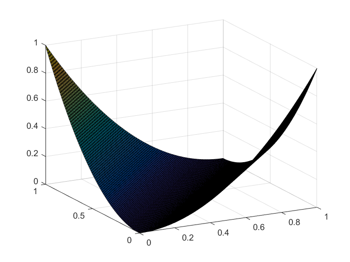
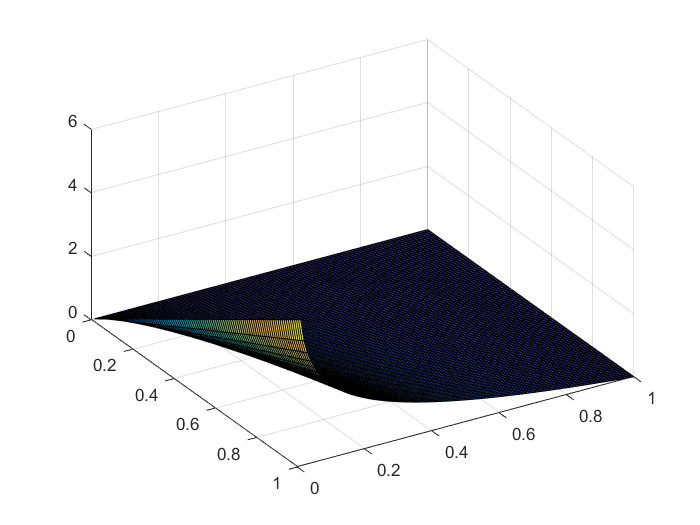

cross entropy loss:
$$H:=-\sum_iy_i'log(y_i)$$

本质是用来衡量预测值$y_i$与真实值$y_i'$之间地距离。当然差地平方和也可以用来作为距离，但是交叉熵在某些问题上更有优势。

```matlab
%matlab
x=0:0.01:1;
y=0:0.01:1;
[xx,yy]=[xx,yy]=meshgrid(x,y);
zz1=-xx.*log(yy)        %cross entropy
zz2=(xx-yy).^2          %
```
平方和：



交叉熵：



[cs231 in stanford](http://cs231n.github.io/)

$$\bigtriangledown f(x)=f(x)\bigtriangledown \log f(x)$$
