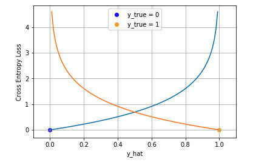
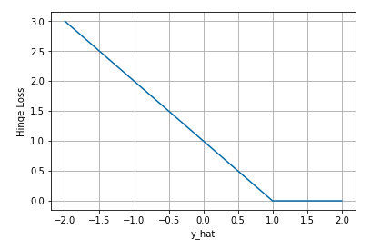

- regression loss function
    - [MSE](#MSE)
    - [MAE](#MAE)
    - [Huber](#Huber)
    - [Quantile](#Quantile)
    - [MSE](#MSE)

- classification loss function
    - [Cross Entropy](#Cross_Entropy)
    - [Hinge](#Hinge_Loss)

## introduction

关于损失函数(loss function)，代价函数(cost function)和目标函数(Objective function)之间的区别和联系：
- 损失函数 Loss Function 通常是针对单个训练样本而言，给定一个模型输出$\hat{y}$ 和一个真实$y$ ，损失函数输出一个实值损失$L=f(y_i,\hat{y_i})$
- 代价函数 Cost Function 通常是针对整个训练集（或者在使用 mini-batch gradient descent 时一个 mini-batch）的总损失 $J=\sum f(y_i,\hat{y_i})$
- 目标函数 Objective Function 是一个更通用的术语，表示任意希望被优化的函数，用于机器学习领域和非机器学习领域（比如运筹优化）

[python code for loss function](https://nbviewer.jupyter.org/github/groverpr/Machine-Learning/blob/master/notebooks/05_Loss_Functions.ipynb)

## MSE

均方差损失(MSE, Mean Squared Error Loss)也称为L2 Loss. 基本形式：
$$J_{MSE}=\frac{1}{N}\sum^N_{i=1}(y_i-\hat{y}_i)^2$$

在模型输出与真实值的误差服从高斯分布的假设下，最小化均方差损失函数与极大似然估计本质上是一致的，即均方差损失函数可以由最大似然估计推倒出来。因此在这个假设能被满足的场景中（比如回归），均方差损失是一个很好的损失函数选择；当这个假设没能被满足的场景中（比如分类），均方差损失不是一个好的选择。

## MAE

平均绝对误差损失(MAE, Mean Absolute Error Loss)也称为L1 Loss. 基本形式：
$$J_{MSE}=\frac{1}{N}\sum^N_{i=1}|y_i-\hat{y}_i|$$

假设模型预测与真实值之间的误差服从拉普拉斯分布(Laplace distribution)($\mu=0,b=1$)，则给定一个$x_i$模型输出真实值$y_i$的概率为
$$p\left(y_{i} | x_{i}\right)=\frac{1}{2} \exp \left(-\left|y_{i}-\hat{y}_{i}\right|\right)$$
与上面推导 MSE 时类似，我们可以得到的负对数似然实际上就是 MAE 损失的形式
$$\begin{aligned}
L(x, y) &=\prod_{i=1}^{N} \frac{1}{2} \exp \left(-\left|y_{i}-\hat{y}_{i}\right|\right) \\
L L(x, y) &=-\frac{N}{2}-\sum_{i=1}^{N}\left|y_{i}-\hat{y}_{i}\right| \\
N L L(x, y) &=\sum_{i=1}^{N}\left|y_{i}-\hat{y}_{i}\right|
\end{aligned}$$

## MAE vs. MSE

- MSE 损失相比 MAE 通常可以更快地收敛
- MAE 损失对于 outlier 更加健壮，即更加不易受到 outlier 影响

## Huber

取MSE和MAE各自的优点，也被称为Smooth Mean Absolute Error Loss.在误差接近 0 时使用 MSE，误差较大时使用 MAE.
$$J_{\sigma}=\left\{  
        \begin{array}{**lr**}  
             \frac{1}{2}(y_i-\hat{y}_i)^2,& if |y_i-\hat{y}_i|\leq\sigma  \\  
             \sigma|y_i-\hat{y}_i|-\frac{1}{2}\sigma^2, & otherwise
             \end{array}  
\right. 
$$


结合了 MSE 和 MAE 损失，在误差接近 0 时使用 MSE，使损失函数可导并且梯度更加稳定；在误差较大时使用 MAE 可以降低 outlier 的影响，使训练对 outlier 更加健壮。缺点是需要额外地设置一个 $\sigma$超参数

## Quantile

分位数损失

$$J_{quant}=\frac{1}{N} \sum_{i=1}^{N} \mathbb{I}_{\hat{y}_{i} \geq y_{i}}(1-r)\left|y_{i}-\hat{y}_{i}\right|+\mathbb{I}_{\hat{y}_{i}<y_{i}} r\left|y_{i}-\hat{y}_{i}\right|$$
 


通常的回归算法是拟合目标值的期望或者中位数，而分位数回归可以通过给定不同的分位点，拟合目标值的不同分位数。当$r=0.5$时，分位数损失退化为 MAE 损失，从这里可以看出 MAE 损失实际上是分位数损失的一个特例 — 中位数回归.

## Cross Entropy

#### 二分类

在二分类中我们通常使用 Sigmoid 函数将模型的输出压缩到 (0, 1) 区间内$\hat{y}_i\in (0,1)$ ，用来代表给定输入$x_i$后模型判断为正类的概率。在该类问题中通过最大似然估计得到交叉熵函数为：
$$N L L(x, y)=J_{C E}=-\sum_{i=1}^{N} y_{i} \log \left(\hat{y}_{i}\right)+\left(1-y_{i}\right) \log \left(1-\hat{y}_{i}\right)$$


从图中可以看出越接近目标值损失越小。

#### 多分类

在多分类的任务中，交叉熵损失函数的推导思路和二分类是一样的，变化的地方是真实值$y_i$现在是一个 One-hot 向量，同时模型输出的压缩由原来的 Sigmoid 函数换成 Softmax 函数。Softmax 函数将每个维度的输出范围都限定在(0,1)之间，同时所有维度的输出和为 1，用于表示一个概率分布。

$$p\left(y_{i} | x_{i}\right)=\prod_{k=1}^{K}\left(y_{i}^{k}\right)^{y_{i}^{k}}$$

则可以得到负对数似然函数为：

$$N L L(x, y)=J_{C E}=-\sum_{i=1}^{N} \sum_{k=1}^{K} y_{i}^{k} \log \left(\hat{y}_{i}^{k}\right)$$

由于$y_i$是一个 one-hot 向量，除了目标类为 1 之外其他类别上的输出都为 0，因此上式也可以写为:
$$J_{C E}=-\sum_{i=1}^{N} y_{i}^{c_{i}} \log (y_{i}^{\hat{\imath}_{i}})$$

通常这个应用于多分类的交叉熵损失函数也被称为 Softmax Loss 或者 Categorical Cross Entropy Loss.

相对熵，也叫KL(Kullback–Leibler Divergence)散度，给定分布p，q，则两者的散度公式：
$$K L(p, q)=\sum_{k=1}^{K} p \log (p)-\sum_{k=1}^{K} p \log (q)$$
该公式衡量了两个分布之间的差异性，若p=q则散度为0.在分类问题中我们的目的是要学习到真实的分布，因此要最小化真实值和预测值分布的散度，而在散度公式中第一项完全由真实值分布确定，故优化目标函数变为$p\log{q}$，这与通过最大似然估计得到的交叉熵公式一致。


本质是用来衡量预测值$y_i$与真实值$y_i'$之间地距离。当然差地平方和也可以用来作为距离，但是交叉熵在某些问题上更有优势。从下图中的分布图可以看出，当真实值越大（接近于1）时，相同的误差$|y_i-\hat{y}_i|$产生的交叉熵越大，即在优化时所占比重越大。

```matlab
%matlab
x=0:0.01:1;
y=0:0.01:1;
[xx,yy]=[xx,yy]=meshgrid(x,y);
zz1=-xx.*log(yy)        %cross entropy
zz2=(xx-yy).^2          %
```
平方和：


交叉熵：


## Hinge Loss
合页损失
$$J_{h i n g e}=\sum_{i=1}^{N} \max \left(0,1-\operatorname{sgn}\left(y_{i}\right) \hat{y}_{i}\right)$$

下图是$y$为正类， 即$sgn(y)=1$时，不同输出的合页损失示意图


可以看到当$y$为正类时，模型输出负值会有较大的惩罚，当模型输出为正值且在(0,1)区间时还会有一个较小的惩罚。即合页损失不仅惩罚预测错的，并且对于预测对了但是置信度不高的也会给一个惩罚，只有置信度高的才会有零损失。使用合页损失直觉上理解是要找到一个决策边界，使得所有数据点被这个边界正确地、高置信地被分类。

## Ref

- [机器学习常用损失函数小结](https://zhuanlan.zhihu.com/p/77686118)
- [5 Regression Loss Functions All Machine Learners Should Know](https://heartbeat.fritz.ai/5-regression-loss-functions-all-machine-learners-should-know-4fb140e9d4b0)

