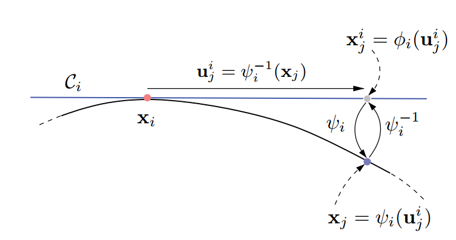

## atlasRRT



- $x_i$: a point on the manifold
- $C_i$: tangent space in $xi$
- $\Phi_i$: orthonormal basis for the tangent space
- $u^i_j$: local coordinates in the tangent space

exponential map: from the parameter space($x_j=\psi_i(u^i_j)$) to manifold,the inverse is referred as the logarithmic map. The exponential map includes two steps. Firstly compute the mapping $\phi_i$ form parameters in the tangent sapce to coordinates int he joint ambient space:
        $$x^i_j=\phi_i(u^i_j)=x_i+\Phi_iu_j^i$$
Then project the configuration to the manifold, which should satisfy:
$$\left\{\begin{align}F(x_j)&=0 \\
\Phi^T_i(x_j-x^i_j)&=0 
\end{align} \right . $$


- [atlaschart](http://ompl.kavrakilab.org/classompl_1_1base_1_1AtlasChart.html)
- [atlasStateSpace](http://ompl.kavrakilab.org/classompl_1_1base_1_1AtlasStateSpace.html)

```c++
/*
IN AtlasChart(const AtlasStateSpace *atlas, const AtlasStateSpace::StateType *state);
othogonal basis for tangent space
*/
Eigen::MatrixXd j(n_ - k_, n_);
Eigen::FullPivLU<Eigen::MatrixXd> decomp = j.fullPivLu();// LU decomposition
if (!decomp.isSurjective()) // surjective:满射; injective: 单射
    throw ompl::Exception("Cannot compute full-rank tangent space.");
// Compute the null space and orthonormalize, which is a basis for the tangent space.
return decomp.kernel().householderQr().householderQ() * Eigen::MatrixXd::Identity(n_, k_);
```
