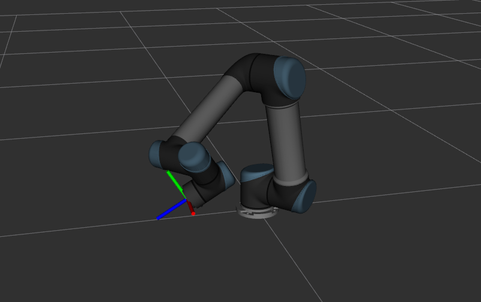
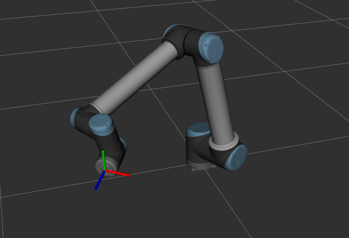

## Mathematical model

The parabolic trajectory:
        $$x=v_xt+x_0 \\
        y=-\frac{1}{2}gt^2+v_yt+y_0$$
when the flying object hit ground, let $y=0$:
        $$\text{flying time: }  t=\sqrt{\frac{2y_0}{g}+\frac{v_y^2}{g^2}}+\frac{v_y}{g}\\
        \text{flying distance: }    d=x_0+v_x \sqrt{\frac{2y_0}{g}+\frac{v_y^2}{g^2}}+\frac{v_xv_y}{g}       $$
assume $x_0=y_0=0$:
        $$y=-\frac{1}{2}\frac{g }{v_x^2}x^2+\frac{v_y}{v_x}x$$

Velocity in cartesian space transformed to joint space:
        $$\dot{q}=J^{-1}(q)v$$

Orientation constraint:
- perpendicular to the velocity vector
- follow the parabolic trajectory for a while to wait for gripper open competely

## Accurate Object Throwing by an Industrial Robot Manipulator

- 2008
- throw objects at given targets
- on kuka

path planning pipeline:
```
|---------------|           |---------------------|             |---------------|
| acceleration  |   --->    | parabola following  |     --->    | deceleration  |        
|---------------|           |---------------------|             |---------------|
                                      ___
                                     /   \
                                    /     \
                                ___/       \___
```
In acceleration, the most suitable velocity vector $\dot{q}$ in joint space can be chosen due to the first weighting criterion(**??**):
        $$j_1=min(\dot{q}^T(\beta) W \dot{q}(\beta))$$
At the end of the path planning a second weighting criterion is applied(**??**):
        $$j_2=min(\begin{bmatrix}j_1 \\ e^{-n^2}\end{bmatrix}^T G \begin{bmatrix}j_1 \\ e^{-n^2}\end{bmatrix})$$

In the experiment the following time is 12 ms. 

## Throwing motion generation using nonlinear optimization on a 6-degree-of-freedom robot manipulator

- 2009
- trajectory generated with dynamic limitations on 6-dof rigid robot
- trajectory is generated **off-line** as cubic spline using general constrained nonlinear optimization
- trajectory tracking using a discrete-time constrained optimal control technique
- on 6dof self-designed robot

In introduction:
- before handle with lower dof robot arms(2 link or 3)

planning algorithm:
- given the release position and velocity
- use cubic polynomial to generate the acceleration and deceleration trajectory in joint sapce
        $$\text{acceleration: } Q_a(t)=a_at^3+b_at^2c_at+d_a \\
        \text{deceleration: } Q_b(t)=a_bt^3+b_bt^2c_bt+d_b  \\
        Q_a(t_r)=q_r=Q_b(t_r)   \\
        \dot Q_a(t_r)=\dot q_r=\dot Q_b(t_r)    \\
        \dot Q_a(0)=0=\dot Q_b(t_e)     \\
        \ddot Q_a(t_r)=0=\ddot Q_b(t_r)$$
- then define the object function to optimize

reference to **[2008_A technique for time-jerk optimal planning of robot trajectories](../trajectory_optimization/)**.

## Flight Trajectory Simulation of Robotic Throwing Shuttlecock 

- 2018
- 1 degree of freedom

## Planning Longest Pitch Trajectories for Compliant Serial Manipulators

- 2016
- plan an optimal pitching trajectory for compliant serial manipulators
- on kuka

## Time-optimal trajectory generation for path following with bounded acceleration and velocity

- 2012
- path following
- [github](https://github.com/tobiaskunz/trajectories)

## experiment on ur

ur5



ur10


 
```
# ur5
- 
joint: 0.7201124121729614 -1.313842408349126 1.7595723112421104, 0.24912787113682036 2.1975531391698917 0.4551817753281454
cartesiaN VEL: 1.25  0  1.25  0  -0.3  0
JOINT VEL:  -2.03297 -0.0193843   -3.66577    2.40697   -1.43494   -1.79475

-
joint: 0.03363972841571032, -1.1570948663262197, 1.531941426459243, 0.27119440827586067, 1.627028593915378, 0.0423902909835748
joint v: -0.0867491    1.55845   -5.70574    3.84408 -0.0631924 -0.0603776

# ur10

joint: 0.7201124121729614 -1.313842408349126 1.7595723112421104, 0.24912787113682036 2.1975531391698917 0.4551817753281454
cartesiaN VEL: 1.25  0  1.25  0  -0.3  0
joint vel: -1.36305 -0.00115985     -2.5122      1.5458   -0.920344    -1.26516

-
joint: 0.03363972841571032, -1.1570948663262197, 1.531941426459243, 0.27119440827586067, 1.627028593915378, 0.0423902909835748
joint vel:-0.0585142    1.07089    -3.9108    2.53765 -0.0406475 -0.0433524

- 
joint: 0.4696961125055863, -1.292321774554368, 1.655893219561577, -0.0861575872871991, 1.0583137045298303, -0.24666646486363952
joint vel: -0.838175  0.756023   -3.3074   2.48649 -0.768942 -0.413232
```

相同关节姿态，相同迪卡尔空间速度下，ur10所需的关节角速度较小

