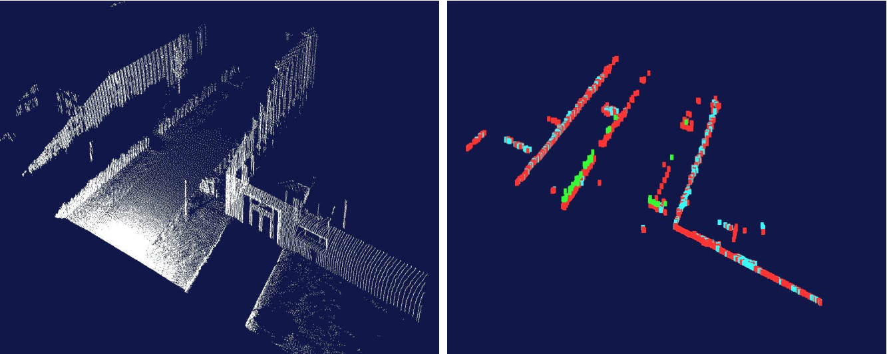

ICP: Iterative Closest Point

- icp
- ndt
- Super4PCS
- eICP
- ransac
- halcon
- [知乎-匹配定位算法](https://www.zhihu.com/question/39513724)
- [shape-based-matching](https://github.com/meiqua/shape_based_matching)

## problem summary

- given: two corresponding point sets
$$X=\{x_1,\cdots,x_n\}  \\
P=\{p_1,\cdots,p_n\}$$
- wanted: translation t and rotation R that minimizes the sum of the squared error:
$$E(R,t)=\frac{1}{N_p}\sum^{N_p}_{i=1}||x_i-Rp_i-t||^2$$
where $x_i$ and $p_i$ are coresponding points. So this problem actually contains two sub-problem: 

1. find the corresponding pairs of points; 
2. find the transformation.

## Iterative Closest Point

iterate to find alignment

Method1: iterative to find the closet point in P for point in X. This does not work so well.

## Find the transformation
 
 SVD&optimization

 If the correvt correspondences are known, the correct relative rotation/translation can be calculated in closed form by SVD.

 centering:
 $$\mu_x=\frac{1}{ N_x}\sum^{N_x}_{i=1}x_i,\quad \mu_p=\frac{1}{ P_x}\sum^{P_x}_{i=1}p_i    \\
 X'=\{x_i-\mu_x\}=\{x'_i\} \quad  P'=\{p_i-\mu_p\}=\{p'_i\}$$

 Let: $W=\sum^{N_p}_{i=1}x_i'p_i'^T$. Denote the SVD of W by:
 $$W=U \begin{bmatrix}\sigma_1 &&\\&\sigma_2&   \\ &&\sigma_3\end{bmatrix}V^T$$

 where $U,V\in R^{3\times3}$, are unitary, and $\sigma_1\geq\sigma_2\geq\sigma_3$. Then the optimal solution:
 $$\begin{align}
 R&=UV^T    \\
 T&=\mu_x-R\mu_p    \\
 E(R,t)&=\sum^{N_p}_{i=1}(||x_i'||^2+||p_i'||^2)-2(\sigma_1+\sigma_2+\sigma_3)
 \end{align}$$

## ICP variants

**1. points subsets**

selecting source points:
- use all points
- uniform sub-sampling
- random sampling
- **feature based sampling**
    - try to find “important” points
    - decrease the number of correspondences
    - higher efficiency and higher accuracy
    - requires preprocessing

- **normal-sapce sampling**
    - Ensure that samples have normals distributed as
uniformly as possible
    - Normal-space sampling better for mostly smooth areas with  sparse features

**2. weighting the correspondence**

**3. data association**
- has greatest effect on convergence and
speed
- Closest point
- Normal shooting
- Closest compatible point
- Projection
- Using kd-trees or oc-trees

**4. rejecting**

- TriICP: trimmed ICP

## HW

1. in *temp_ws*. This work uses the icp algorithm in pcl to math the monkey face.
2. **libpcl** in *temp_ws*. THis work is downloaded from github. This is a simple library for ICP implementation without any third library. 

## REF
- [pcl-icp tutorial](http://pointclouds.org/documentation/tutorials/interactive_icp.php#interactive-icp)
    - [pnpl](https://github.com/symao/PnPL)
- [libicp-github](https://github.com/symao/libicp)
- [icp_with gpu](https://github.com/michaelwillett/Iterative-Closest-Point)
- [icp-intel-search](https://github.com/1988kramer/intel_dataset)
- [Introduction to Mobile Robotics](http://ais.informatik.uni-freiburg.de/teaching/ss19/robotics/)
- [myvision](https://github.com/Ewenwan/MVision/blob/master/PCL_APP/5_%E7%82%B9%E4%BA%91%E9%85%8D%E5%87%86%20Registration.md)