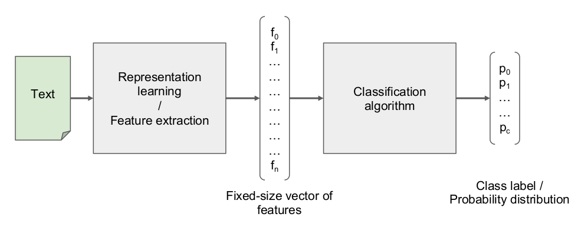

## refer

## Text classification in general

label kinds:
- Discrete labels:
    - Label is known:
        - Binary classification: spam filtering/sentiment analysis
        - Multi-class classification: categorization of goods
        - Multi-label classification: #hashtag prediction
    - Label is unknown:
i. Text clasterization: user intent search
- Continuous labels: predict a salary by CV, predict a price by a product description

Some common classification algorithms:
- Maximum Entropy Method = sklearn.linear_model.LogisticRegression
- Multinomial Naive Bayes = sklearn.naive_bayes.MultinomialNB

text representation: feature engineering

## NBOW

Instead of sparse one-hot encoding we can use pretrained word embedding, which is so-called "Neural Bag-Of-Words".