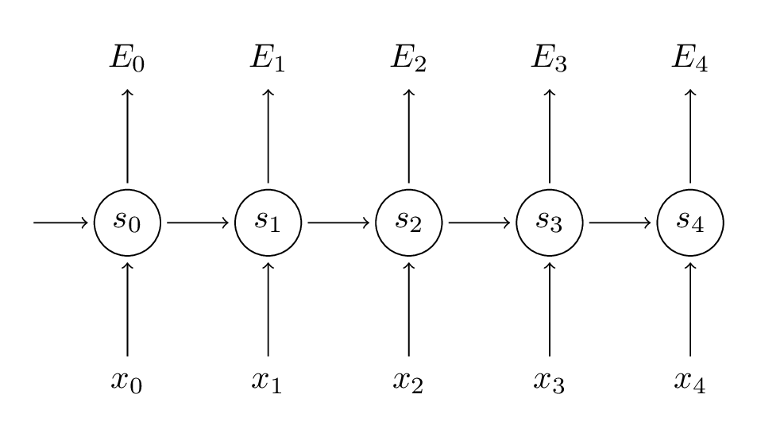
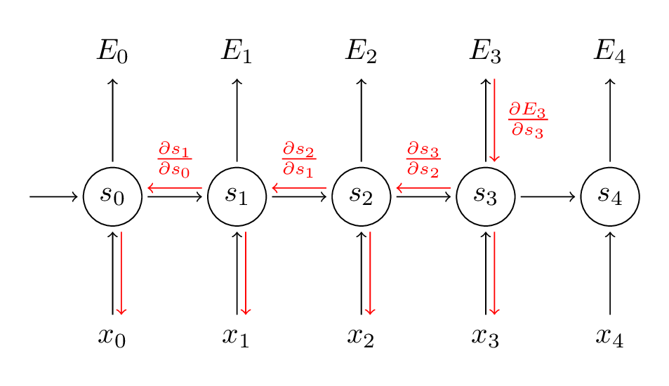

## ref

Recurrent Neural Networks Tutorial:
- [Part 1 – Introduction to RNNs](http://www.wildml.com/2015/09/recurrent-neural-networks-tutorial-part-1-introduction-to-rnns/)
- [Implementing a RNN with Python, Numpy and Theano](http://www.wildml.com/2015/09/recurrent-neural-networks-tutorial-part-2-implementing-a-language-model-rnn-with-python-numpy-and-theano/)
- [Part3- Backpropagation Through Time and Vanishing Gradients](http://www.wildml.com/2015/10/recurrent-neural-networks-tutorial-part-3-backpropagation-through-time-and-vanishing-gradients/)

Applications:
- score arbitrary sentences based on how likely they are to occur in the real world: machine translation
- generate new text

## RNN


RNN的一级层次是由上图中的t标识的，表示有多少个简单的网络进行时序连接。比如如果一个句子有5个单词，每个单词都需要输入一个简单网络，则需要五个简单网络连接构成一个完整的RNN网络。

- $x_t$: input vector for each word in a sentence 
- $s_t$: $s_{t}=f\left(U x_{t}+W s_{t-1}\right)$, $f$ usually is a nonlinearity such as tanh or ReLU.
- $o_t$: $o_t=softmax(V\cdot s_t)$ ,the output at step $t$.
- in each step, a RNN shares the same parameter ($U,V,W$)

## Backpropagation on RNN

Forward Propagation:
$$\begin{align} s_t &= f_1(U x_{t}+W s_{t-1})=tanh(U x_{t}+W s_{t-1}) \\
                \hat{y_t} &=f_2(Vs_t)=softmax(Vs_t) \\
                E_t(y,\hat{y})&=-y_t\log{\hat{y_t}} \\
                E(y,\hat{y})&=\sum_{t}E_t(y_t,\hat{y_t})  \longrightarrow \text{  loss function}\\
                            &=-\sum_{t}y_t\log{\hat{y_t}} \end{align}$$



Back Propagation:

$$$$


```latex{cmd hide}
\documentclass[tikz,border=10pt]{standalone}
\begin{document}
\begin{tikzpicture}

\node[circle,
minimum width =30pt ,
minimum height =30pt ,draw=blue] (1) at(0,2){$x_1$};
\node[circle,
minimum width =30pt ,
minimum height =30pt ,draw=blue] (2) at(0,0){$x_2$};
\node[circle,
minimum width =30pt ,
minimum height =30pt ,draw=orange] (3) at(2,-1){$a_3^{(2)}$};
\node[circle,
minimum width =30pt ,
minimum height =30pt ,draw=orange] (4) at(2,1){$a_2^{(2)}$};
\node[circle,
minimum width =30pt ,
minimum height =30pt ,draw=orange] (5) at(2,3){$a_1^{(2)}$};
\node[circle,
minimum width =30pt ,
minimum height =30pt ,draw=orange] (6) at(4,-1){$a_3^{(3)}$};
\node[circle,
minimum width =30pt ,
minimum height =30pt ,draw=orange] (7) at(4,1){$a_2^{(3)}$};
\node[circle,
minimum width =30pt ,
minimum height =30pt ,draw=orange] (8) at(4,3){$a_1^{(3)}$};
\node[circle,
minimum width =30pt ,
minimum height =30pt ,draw=purple] (9) at(6,2){$a_1^{(4)}$};
\node[circle,
minimum width =30pt ,
minimum height =30pt ,draw=purple] (10) at(6,0){$a_2^{(4)}$};
\draw[->] (1) --(3);
\draw[->] (1) --(4);
\draw[->] (1) --(5);
\draw[->] (2) --(3);
\draw[->] (2) --(4);
\draw[->] (2) --(5);
\draw[->] (3) --(6);
\draw[->] (3) --(7);
\draw[->] (3) --(8);
\draw[->] (4) --(6);
\draw[->] (4) --(7);
\draw[->] (4) --(8);
\draw[->] (5) --(6);
\draw[->] (5) --(7);
\draw[->] (5) --(8);
\draw[->] (6) --(9);
\draw[->] (6) --(10);
\draw[->] (7) --(9);
\draw[->] (7) --(10);
\draw[->] (8) --(9);
\draw[->] (8) --(10);

\end{tikzpicture}
\end{document}
```
$$\begin{aligned}
\frac{\partial E_{3}}{\partial V} &=\frac{\partial E_{3}}{\partial \hat{y}_{3}} \frac{\partial \hat{y}_{3}}{\partial V} \\
&=\frac{\partial E_{3}}{\partial \hat{y}_{3}} \frac{\partial \hat{y}_{3}}{\partial z_{3}} \frac{\partial z_{3}}{\partial V} \\
&=\left(\hat{y}_{3}-y_{3}\right) \otimes s_{3}
\end{aligned},\text{ where }z_3=Vs_3$$


由于参数共享，需要把受w影响的各个级联的单元都算上。而$\frac{\partial s_{j}}{\partial s_{k}}=\prod_{k+1}^{j} \frac{\partial h_{j}}{\partial h_{j-1}}$,在梯度求导时存在连乘项，则会产生梯度消失或梯度爆炸。由于连乘项的存在，对于较远时刻之前的信息也无法捕捉到。这也被称为long-range dependency probelm。

$$\frac{\partial E_{3}}{\partial W}=\sum_{k=0}^{3} \frac{\partial E_{3}}{\partial \hat{y}_{3}} \frac{\partial \hat{y}_{3}}{\partial s_{3}} \frac{\partial s_{3}}{\partial s_{k}} \frac{\partial s_{k}}{\partial W}$$

但在编程实践上一般不这样算。考虑到在每一级，每一个参数只输出到一个神经元，所以先算出在t时刻该神经元处反向传递过来的梯度值，再计算t时刻该参数的梯度。

$$\begin{aligned}\frac{\partial E}{\partial W}&=\frac{\partial E}{\partial s_0}\frac{\partial s_0}{\partial W} + \frac{\partial E}{\partial s_1}\frac{\partial s_1}{\partial W} +\cdots + + \frac{\partial E}{\partial s_4}\frac{\partial s_4}{\partial W} \end{aligned}$$

```latex{cmd hide}
\documentclass[tikz,border=10pt]{standalone}
\begin{document}
\begin{tikzpicture}

\node[circle,
minimum width =30pt ,
minimum height =30pt ,draw=blue] (1) at(0,0){$s_t$};
\node[circle,
minimum width =30pt ,
minimum height =30pt ,draw=blue] (2) at(0,2){$E_t$};
\node[circle,
minimum width =30pt ,
minimum height =30pt ,draw=orange] (3) at(2,0){$s_{t+1}$};
\draw[->] (1) --(2);
\draw[->] (1) --(3);

\end{tikzpicture}
\end{document}
```
在RNN网络结构中神经元$s_t$的流向有两个$E_t,s_{t+1}$,则根据链式法则：
$$\Delta s_t=\frac{\partial E}{\partial s_t} =\frac{\partial E_t}{\partial s_t} + \frac{\partial s_{t+1}}{\partial s_t}=\frac{\partial E_t}{\partial s_t} + \Delta s_{t+1} W^T \\
\Delta W^{(t)}=s_{t-1}^T \cdot (\Delta s_t \cdot \frac{d s_t}{d z_t})=s_{t-1} \otimes (\Delta s_t \odot \frac{d s_t}{d z_t})  \\
\Delta W=\sum_{t} \Delta W^{(t)}$$

$$\Delta U^{(t)}=x_t^T \cdot (\Delta s_t \cdot \frac{d s_t}{d z_t}) =x_{t-1} \otimes (\Delta s_t \odot \frac{d s_t}{d z_t}) \\
\Delta U=\sum_{t} \Delta U^{(t)}$$

这样整体的梯度传播结构就比较清晰，也遵循一般的传导经验：
1. 先计算误差在每一个神经元的梯度，同时注意有多条分支的神经元应该把每一条分支传递的梯度都加起来
2. 再计算与每一个神经元直接相连接的参数的梯度

$\otimes$,外积。对于两个向量，外积生成矩阵。

编程技巧：
- 反向计算误差($\delta$)
- 再计算梯度


cross-entropy:
    $$\frac{e^{x}-e^{-x}}{e^{x}+e^{-x}}$$

softmax:

softmax是非一对一操作，故不能简单求导

$$\frac{\partial{y}}{\partial{x}}=(1-y)y$$

- softmax和交叉熵的配合

tanh:
$$f(x)=tanh(x)=\frac{e^{x}-e^{-x}}{e^{x}+e^{-x}} \\
f'(x)=1-tanh(x)^2=1-y^2$$

## diy

- [The Unreasonable Effectiveness of Recurrent Neural Networks](http://karpathy.github.io/2015/05/21/rnn-effectiveness/)
- [Differentiable Neural Computer in Numpy](https://github.com/krocki/dnc)
- [min-char-rnn](https://gist.github.com/karpathy/d4dee566867f8291f086)

