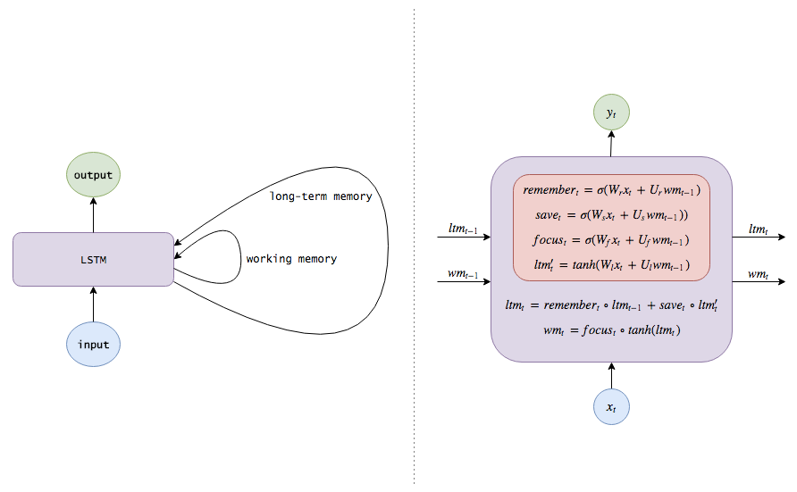
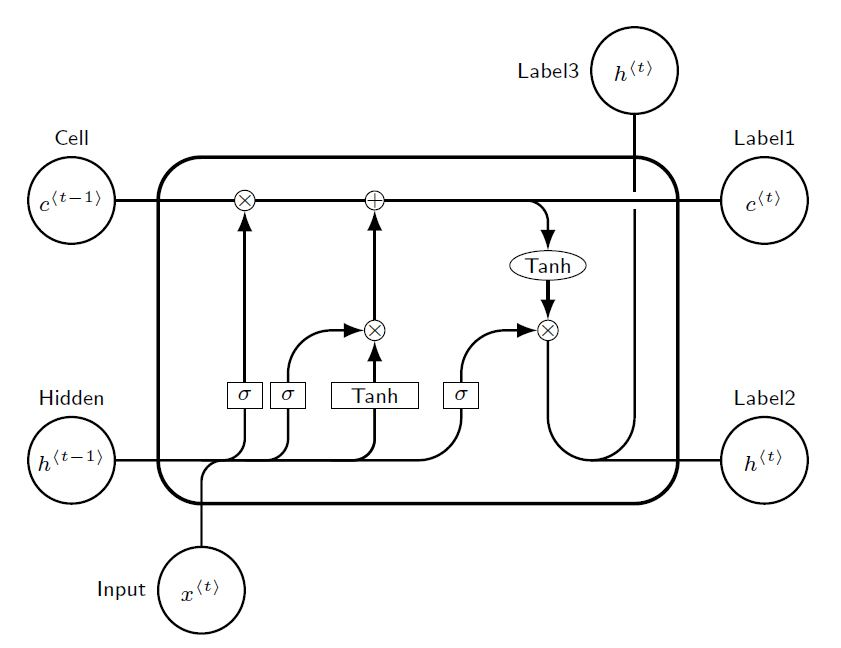
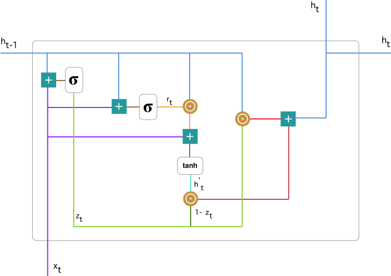
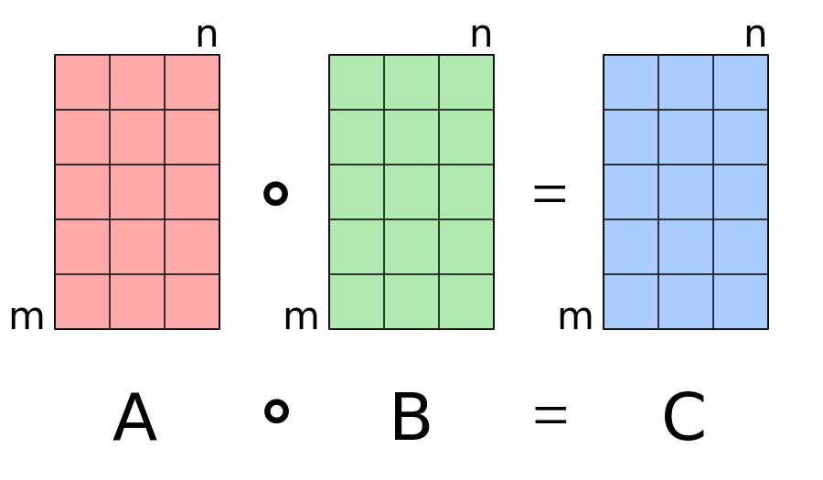

## ref 
- [机器之心-LSTM入门必读：从入门基础到工作方式详解](https://www.jiqizhixin.com/articles/2017-07-24-2)
- [medium-Understanding LSTM and its diagrams](https://medium.com/mlreview/understanding-lstm-and-its-diagrams-37e2f46f1714)
- [githubio-Understanding LSTM Networks](http://colah.github.io/posts/2015-08-Understanding-LSTMs/)

## lstm
 Long Short Term Memory


LSTM从RNN衍生而来与RNN有着一致的框架，即从之前的信息中进行学习。而为了解决RNN中梯度消失的问题，LSTM的改进主要集中在对于每一个隐藏单元内部的处理。而下面也主要先从数学表达式上理解数据是怎么转化的，再从逻辑上理解为什要这样做。

第一步LSTM的每层输入或输出有两个单元，长期记忆($ltm_t$)和工作记忆(wm_t)。这里我们可以理解为之前较长久的信息和当前使用的信息，或者类比于电脑系统上的硬盘上暂存的数据和内存上当前正在处理的数据。第二部增加了四个变量（虽然大部分被称为三个），分别为：
- 记忆向量/遗忘门：$remember_t$,$f_t$,forget gate
- 保存向量/输入门：$save_t$,$i_t$,input gate
- 注意向量/输出门：$focus_t$,$o_t$,output gate
- 候选记忆： $ltm'_t$,中间变量

其数学形式表述为：
$$\begin{aligned}\text {remember}_{t}&=\sigma\left(W_{r} x_{t}+U_{r} w m_{t-1}\right)   \\
\text {save}_{t}&=\sigma\left(W_{s} x_{t}+U_{s} w m_{t-1}\right) \\
\text {focus}_{t}&=\sigma\left(W_{f} x_{t}+U_{f} w m_{t-1}\right)\\
l t m_{t}^{\prime}&=\phi\left(W_{l} x_{t}+U_{l} w m_{t-1}\right) \\
\text{UPDATE:}\quad \quad \quad&     \\
l t m_{t}&=remember_{t} \circ ltm_{t-1}+save_{t} \circ ltm_{t}^{\prime}    \\
w m_{t}&=\text { focus }_{t} \circ \tanh \left(l t m_{t}\right)  \\
\end{aligned}$$
区中$\sigma$为激活函数，一般表示sigmoid;$\phi$一般表示tanh。可以看到通过多个表达式把上一时刻的两个变量更新为当前时刻的两个变量。



核心公式是一致的，怎么编排就可以随心所欲了。
$$\begin{aligned}
f_{t}&=\sigma\left(W_{f} \cdot\left[h_{t-1}, x_{t}\right]+b_{f}\right)\\
i_{t} &=\sigma\left(W_{i} \cdot\left[h_{t-1}, x_{t}\right]+b_{i}\right) \\
\tilde{C}_{t} &=\tanh \left(W_{C} \cdot\left[h_{t-1}, x_{t}\right]+b_{C}\right) \\
o_{t}&=\tanh \left(W_{C} \cdot\left[h_{t-1}, x_{t}\right]+b_{C}\right)\\
C_{t}&=f_{t} * C_{t-1}+i_{t} * \tilde{C}_{t}\\
h_{t} &=o_{t} * \tanh \left(C_{t}\right)
 \end{aligned}$$





```latex{cmd hide}
% By J. Leon, Beerware licence is acceptable...
\documentclass[tikz,border=10pt]{standalone}
\usepackage{tikz}
\usetikzlibrary{positioning, fit, arrows.meta, shapes}

% used to avoid putting the same thing several times...
% Command \empt{var1}{var2}
\newcommand{\empt}[2]{$#1^{\langle #2 \rangle}$}

\begin{document}

\begin{tikzpicture}[
    % GLOBAL CFG
    font=\sf \scriptsize,
    >=LaTeX,
    % Styles
    cell/.style={% For the main box
        rectangle, 
        rounded corners=5mm, 
        draw,
        very thick,
        },
    operator/.style={%For operators like +  and  x
        circle,
        draw,
        inner sep=-0.5pt,
        minimum height =.2cm,
        },
    function/.style={%For functions
        ellipse,
        draw,
        inner sep=1pt
        },
    ct/.style={% For external inputs and outputs
        circle,
        draw,
        line width = .75pt,
        minimum width=1cm,
        inner sep=1pt,
        },
    gt/.style={% For internal inputs
        rectangle,
        draw,
        minimum width=4mm,
        minimum height=3mm,
        inner sep=1pt
        },
    mylabel/.style={% something new that I have learned
        font=\scriptsize\sffamily
        },
    ArrowC1/.style={% Arrows with rounded corners
        rounded corners=.25cm,
        thick,
        },
    ArrowC2/.style={% Arrows with big rounded corners
        rounded corners=.5cm,
        thick,
        },
    ]

%Start drawing the thing...    
    % Draw the cell: 
    \node [cell, minimum height =4cm, minimum width=6cm] at (0,0){} ;

    % Draw inputs named ibox#
    \node [gt] (ibox1) at (-2,-0.75) {$\sigma$};
    \node [gt] (ibox2) at (-1.5,-0.75) {$\sigma$};
    \node [gt, minimum width=1cm] (ibox3) at (-0.5,-0.75) {Tanh};
    \node [gt] (ibox4) at (0.5,-0.75) {$\sigma$};

   % Draw opérators   named mux# , add# and func#
    \node [operator] (mux1) at (-2,1.5) {$\times$};
    \node [operator] (add1) at (-0.5,1.5) {+};
    \node [operator] (mux2) at (-0.5,0) {$\times$};
    \node [operator] (mux3) at (1.5,0) {$\times$};
    \node [function] (func1) at (1.5,0.75) {Tanh};

    % Draw External inputs? named as basis c,h,x
    \node[ct, label={[mylabel]Cell}] (c) at (-4,1.5) {\empt{c}{t-1}};
    \node[ct, label={[mylabel]Hidden}] (h) at (-4,-1.5) {\empt{h}{t-1}};
    \node[ct, label={[mylabel]left:Input}] (x) at (-2.5,-3) {\empt{x}{t}};

    % Draw External outputs? named as basis c2,h2,x2
    \node[ct, label={[mylabel]Label1}] (c2) at (4,1.5) {\empt{c}{t}};
    \node[ct, label={[mylabel]Label2}] (h2) at (4,-1.5) {\empt{h}{t}};
    \node[ct, label={[mylabel]left:Label3}] (x2) at (2.5,3) {\empt{h}{t}};

% Start connecting all.
    %Intersections and displacements are used. 
    % Drawing arrows    
    \draw [ArrowC1] (c) -- (mux1) -- (add1) -- (c2);

    % Inputs
    \draw [ArrowC2] (h) -| (ibox4);
    \draw [ArrowC1] (h -| ibox1)++(-0.5,0) -| (ibox1); 
    \draw [ArrowC1] (h -| ibox2)++(-0.5,0) -| (ibox2);
    \draw [ArrowC1] (h -| ibox3)++(-0.5,0) -| (ibox3);
    \draw [ArrowC1] (x) -- (x |- h)-| (ibox3);

    % Internal
    \draw [->, ArrowC2] (ibox1) -- (mux1);
    \draw [->, ArrowC2] (ibox2) |- (mux2);
    \draw [->, ArrowC2] (ibox3) -- (mux2);
    \draw [->, ArrowC2] (ibox4) |- (mux3);
    \draw [->, ArrowC2] (mux2) -- (add1);
    \draw [->, ArrowC1] (add1 -| func1)++(-0.5,0) -| (func1);
    \draw [->, ArrowC2] (func1) -- (mux3);

    %Outputs
    \draw [-, ArrowC2] (mux3) |- (h2);
    \draw (c2 -| x2) ++(0,-0.1) coordinate (i1);
    \draw [-, ArrowC2] (h2 -| x2)++(-0.5,0) -| (i1);
    \draw [-, ArrowC2] (i1)++(0,0.2) -- (x2);

\end{tikzpicture}
\end{document}
```

## gru

Gated Recurrent Units

GRU更新公式：

$$\begin{aligned}
z &=\sigma\left(x_{t} U^{z}+s_{t-1} W^{z}\right) \\
r &=\sigma\left(x_{t} U^{r}+s_{t-1} W^{r}\right) \\
h &=\tanh \left(x_{t} U^{h}+\left(s_{t-1} \circ r\right) W^{h}\right) \\
s_{t} &=(1-z) \circ h+z \circ s_{t-1}
\end{aligned}$$



- 重置门(reset gate), $z_t$
- 更新门(update gate), $r_t$

## symbol

$\odot, \circ$: Hadamard Product/element-wise multiplication/对应元素相乘

