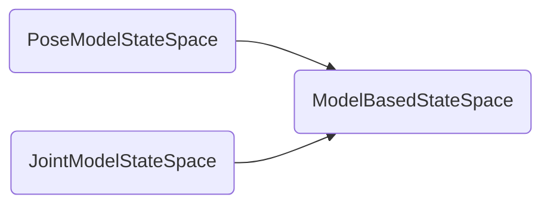

**state space**
```c++
ompl::base::StateSpacePtr so2(new ompl::base::SO2StateSpace());
ompl::base::StateSpacePtr so3(new ompl::base::SO3StateSpace());
ompl::base::StateSpacePtr compoundSpace;
compoundSpace=so2+so3;
```
**state**

The `ompl::base::ScopedState` class will do the necessary memory operations to allocate a state from the correct state space.

```c++
// create state according space
//1. state in a compound space
ompl::base::ScopedState<> state(compoundSpace);
state->as<ompl::base::SO2StateSpace::StateType>(0)->value=45;
state->as<ompl::base::SO3StateSpace::StateType>(1)->setAxisAngle(0,0,1,45);
//2 state 
state->setAxisAngle(0.7);
//3 expert method to allocate a state
ompl::base::StateSpacePtr space(new ompl::base::SO3StateSpace());
ompl::base::State *singleState=space->allocState();
singleState->as<ompl::base::SO3StateSpace::StateType>()->setAxisAngle(0,0,1,90);
//std::cout<<"so3:\n"<<singleState<<std::endl;
space->freeState(singleState);
```

**operation**

```c++
//state space
ompl::base::StateSpacePtr C1 = X + Y;
ompl::base::StateSpacePtr C4 = C2 - C1;
//state
ompl::base::ScopedState<> sX(X);
ompl::base::ScopedState<> sXY(X + Y);
ompl::base::ScopedState<> sY(Y);
ompl::base::ScopedState<> sZX(Z + X);
ompl::base::ScopedState<> sXZW(X + Z + W);
sZX << sXZW;
```

define the user sampler

define the validity checker: collision check

**generic instruction**

1. instantiating a state space
2. Instantiating a control space
3. a space information 
4. a problem definition
5. a planner
6. Or the `SimpleSetup` class could instantiate all the above classes.

## analyse

[state-header](http://ompl.kavrakilab.org/State_8h_source.html)

```c++
State *state;
state->as<StateType>()->values;//把state作为当前状态空间的状态进行操作
state->as<SO2StateSpace::StateType>(index)->value;//对于聚合空间需要index致命子空间类型

//该函数定义在State.h中
template <class T>
T *as()
{
    BOOST_CONCEPT_ASSERT((boost::Convertible<T *, State *>));
    return static_cast<T *>(this);
}

//对于组合状态
template <class T>
T *as(const unsigned int index)
{
    BOOST_CONCEPT_ASSERT((boost::Convertible<T *, State *>));

    return static_cast<T *>(components[index]);
}

//static_cast
static_cast< type-id >(expression);//强制把expression转换为type-id类型
```

- RealVectorBounds 在类的初始化时需要初始化维度
- StateSpaceSampler 必须要在`StateSpace`定义之前定义

- longestValidSegmentFraction_: 离散化的两点间最大长度占规划空间的百分比,defailt_=0.01
- longestValidSegmentCountFactor_： 两点间离散点个数合法倍数，default_=1
- longestValidSegment_： 两点间最大长度
```c++

 unsigned int validSegmentCount(const State *state1, const State *state2) const
 {
     return longestValidSegmentCountFactor_ * (unsigned int)ceil(distance(state1, state2) / longestValidSegment_);
 }
```
[magic_constants](http://ompl.kavrakilab.org/MagicConstants_8h_source.html#l00090)

```c++
 namespace ompl
 {
     namespace magic
     {
         static const double PROJECTION_DIMENSION_SPLITS = 20.0;
         static const unsigned int PROJECTION_EXTENTS_SAMPLES = 100;
         static const double PROJECTION_EXPAND_FACTOR = 0.05;
         static const double MAX_MOTION_LENGTH_AS_SPACE_EXTENT_FRACTION = 0.2;//规划器距离参数
         static const double COST_MAX_MOTION_LENGTH_AS_SPACE_EXTENT_FRACTION = 0.175;
         static const double STD_DEV_AS_SPACE_EXTENT_FRACTION = 0.1;
         static const unsigned int MAX_VALID_SAMPLE_ATTEMPTS = 100;
         static const unsigned int FIND_VALID_STATE_ATTEMPTS_WITHOUT_TERMINATION_CHECK = 2;
         static const unsigned int TEST_STATE_COUNT = 1000;
         static const unsigned int NEAREST_K_RECALL_SOLUTIONS = 10;
     }
 }
 
```
- maxDistance_

## in moveit

pg.interpolate(std::max((unsigned int)floor(0.5 + pg.length() / max_solution_segment_length_), minimum_waypoint_count_))
- max_solution_segment_length_ (0.01*maximum_extent)
- minimum_waypoint_count_(2)
- max_goal_samples_(10)
- max_state_sampling_attempts_(4) 
- max_goal_sampling_attempts_(1000)-

## state space in moveit

- [parameterization cpp](https://github.com/ros-planning/moveit/tree/melodic-devel/moveit_planners/ompl/ompl_interface/src/parameterization)
- [parameterization head](https://github.com/ros-planning/moveit/tree/melodic-devel/moveit_planners/ompl/ompl_interface/include/moveit/ompl_interface/parameterization)

[planning_context_manager](https://github.com/ros-planning/moveit/blob/melodic-devel/moveit_planners/ompl/ompl_interface/src/planning_context_manager.cpp) will choose the corresponding **state space** according to the constraints.



1. 注册默认的两类state_space存储在map映射表里。
```c++
std::map<std::string, ModelBasedStateSpaceFactoryPtr> state_space_factories_;
void registerStateSpaceFactory(const ModelBasedStateSpaceFactoryPtr& factory)
  {
    state_space_factories_[factory->getType()] = factory;
  }
```
2. **getStateSpaceFactory**选择最佳的**StateSpaceFactory**.通过循环选择之前存储的factory，调用canRepresentProblem判断优先级。事实上姿态约束问题是选择了**PoseModelStateSpace**，而没有约束的问题选择**JointModelStateSpace**,而**JointModelStateSpace**就是**ModelBasedStateSpace**,并没有对其进行拓展。

```c++
getStateSpaceFactory2(
    const std::string& group, const moveit_msgs::MotionPlanRequest& req) const;
int canRepresentProblem(const std::string& group,
                        const moveit_msgs::MotionPlanRequest& req,
                        const robot_model::RobotModelConstPtr& kmodel) const;
```
3. 由factory选择出相对应的state_space。
```c++
context_spec.state_space_ = factory->getNewStateSpace(space_spec);
```

## PoseModelStateSpace

[jointTrajectoryAction manager](https://github.com/ros-planning/moveit/blob/aac8c0de00d5f01c2c3e908b8f4028c84756a920/moveit_plugins/moveit_simple_controller_manager/include/moveit_simple_controller_manager/follow_joint_trajectory_controller_handle.h)


