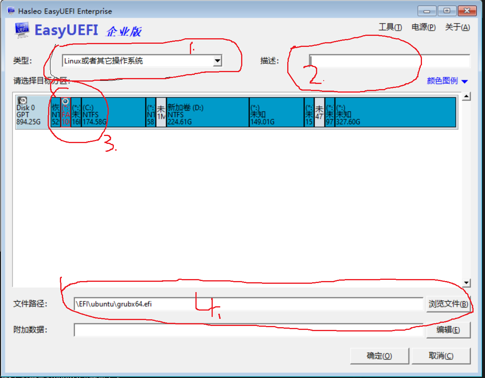

yangganggang@10.8.116.81
yee@10.8.106.60

3. 卸载不必要的自带软件: https://www.jianshu.com/p/67a86505279f
4. v2rayl: https://gitee.com/sLarson/v2rayL

```python
sudo apt install git # git
sudo apt install axel
```

5. 
5. unable to access samsung_t5: sudo apt-get install exfat-utils exfat-fuse
6. python 安装PyQt5: sudo apt-get install python3-pyqt5
7. ssh server
8. install anaconda
9. install v2ray: delete /etc/sudoers.d/myuser
10. conda install tf-gpu: conda install tensorflow-gpu keras
    - [tf install](https://blog.csdn.net/weixin_39954229/article/details/79961172)
    - []()
    - 版本兼容问题：cuda9.0/tf1.12/cudnn-7.6.5
    - conda update -n base conda/conda update --all
    - conda install opencv
    - conda install scikit-learn
    - conda install -c conda-forge opencv=4.1.0
    - conda install -c simpleitk/label/dev simpleitk
11. sudo apt-get install p7zip-full
12. install opencv
    - conda activate <python-env>
    - sudo apt-get install build-essential cmake git libgtk2.0-dev pkg-config libavcodec-dev libavformat-dev libswscale-dev python-dev python-numpy libtbb2 libtbb-dev libjpeg-dev libpng-dev libtiff-dev libjasper-dev libdc1394-22-dev libgtk-3-dev libgtkglext1-dev libgstreamer1.0-dev libavresample-dev  libgphoto2-dev libopenblas-dev libatlas-dev doxygen libgstreamer-ocaml-dev libgstreamer-plugins-bad1.0-dev libgstreamer-plugins-base0.10-dev libgstreamer-plugins-base1.0-dev libgstreamer-plugins-good1.0-dev libgstreamer0.10-dev libgstreamer1.0-dev libgstreamermm-1.0-dev tesseract-ocr-dev liblept5 libleptonica-dev liblapacke-dev python3-numpy libv4l-dev python3-numpy python3-pip python-pip libprotobuf-dev libhdf5-dev libgflags-dev
    - mkdir build
    - cmake -D CMAKE_INSTALL_PREFIX=/usr/local -D CMAKE_BUILD_TYPE=Release -D OPENCV_EXTRA_MODULES_PATH=../opencv_contrib/modules -D BUILD_opencv_python3=ON -D PYTHON3_EXECUTABLE=/home/yee/program/anaconda3/envs/tf36/bin/python3 -D PYTHON3_INCLUDE_DIR=/home/yee/program/anaconda3/envs/tf36/include/python3.6m -D PYTHON_DEFAULT_EXECUTABLE=/home/yee/program/anaconda3/envs/tf36/bin/python3 -D PYTHON3_LIBRARY=~/program/anaconda3/envs/tf36/lib/libpython3.6m.so.1.0 -D BUILD_opencv_xfeatures2d=ON  -D BUILD_TIFF=ON -D ENABLE_PRECOMPILED_HEADERS=OFF ..
    - cmake .. -D CMAKE_BUILD_TYPE=RELEASE -D OPENCV_EXTRA_MODULES_PATH=../opencv_contrib/modules -D CMAKE_INSTALL_PREFIX=/usr/local -D BUILD_opencv_python2=OFF -D BUILD_opencv_python3=OFF -D WITH_CUDA=OFF -D BUILD_opencv_xfeatures2d=ON  -D BUILD_TIFF=ON -D ENABLE_PRECOMPILED_HEADERS=OFF


    - make error:  libzstd.so.1, needed by/lib/libtiff.so.5, not found
        - cmake加入参数： -D BUILD_TIFF=ON -D ENABLE_PRECOMPILED_HEADERS=OFF 
    - cannot find .i file: build/CMakeDownloadLog.txt 有下载链接
    - no such file or directory:用绝对路径
    - sfm: include_directories(/home/yee/program/opencv-3.4.1/opencv_contrib/modules/xfeatures2d/include)
    - 找不到cuda.hpp即matchers.hpp:52:42: fatal error: opencv2/xfeatures2d/cuda.hpp: No such file or directory
    - 解决方法: opencv/modules/stitching/CMakeLists.txt文件中加入一条语句使其include opencv_contrib/modules/xfeatures2d/include，可以是绝对路径，如
13. sudo apt-get install libeigen3-dev
14. Sophus
    ```
    git clone https://github.com/strasdat/Sophus.git
    cd Sophus
    git checkout a621ff

    mkdir build
    cd build
    cmake ..     #CMake上层目录
    make         #无需安装


    #fnd_package指令查找Sophus库
    find_package( Sophus REQUIRED )
    include_directories(${Sophus_INCLUDE_DIRS})

    add_executable( useSophus useSophus.cpp)   #添加可执行文件
    target_link_libraries( useSophus ${Sophus_LIBRARIES} )      #添加链接库
    ```
15. git download
    - export ALL_PROXY=socks5://127.0.0.1:1080
    - git clone git仓库地址 --depth=1 下载最新的一个版本而不是所有版本
    - git config --global http.proxy 'socks5://127.0.0.1:1080'
        git config --global https.proxy 'socks5://127.0.0.1:1080'
16. pip 源设置
https://pypi.tuna.tsinghua.edu.cn/simple some-package

## 安装中文输入法

[fctix设置](https://www.cnblogs.com/voyagee/p/6898054.html)

## 启动项

windows-10 + ubuntu-16双系统，切换至windows之后再重启ubuntu引导项丢失:

解决方案：使用easyuefi增加引导项



## 添加自动启动项

gnome-session-properties：打开 Startup Applications Preferences

## ubuntu

- bin: ~/bin
- path: ~/.profile
- desktop: /home/yee/.local/share/applications

## pytorch

[ref](https://pytorch.org/get-started/previous-versions/)

```python
axel -n 16 https://download.pytorch.org/whl/cu100/torch-1.3.0%2Bcu100-cp36-cp36m-linux_x86_64.whl

axel -n 16 https://download.pytorch.org/whl/cu100/torchvision-0.4.1%2Bcu100-cp36-cp36m-linux_x86_64.whl

pip install xxx.whl
```

## tensorflow

pip install tensorflow-gpu==2.0.0

## openssl

```python
sudo apt-get install openssl

sudo apt-get install libssl-dev
```
## hp z420 

1. Advanced -> Device options -> mass storage option roms -> EFI

## install 

```sh
sudo apt install curl
                openssh-server
                cmake 
                git
                kazam
                tmux
                flameshot: screenshot
                axel
                p7zip-full
                libeigen3-dev

opengl
foxitreader
vs code
python
    matplotlib
    scipy
    numpy
```

```
python 3.6.9
cuda 11.0
cudnn 8.0
pytorch 
    - commond: pip install torch==1.7.1+cu110 torchvision==0.8.2+cu110 torchaudio==0.7.2 -f https://download.pytorch.org/whl/torch_stable.html
    - ref: https://pytorch.org/get-started/previous-versions/
tensorflow:
    - command
        - pip3 install tensorflow-gpu==2.4
        - pip install .whl
    - ref: https://pypi.tuna.tsinghua.edu.cn/simple/tensorflow-gpu/


```


