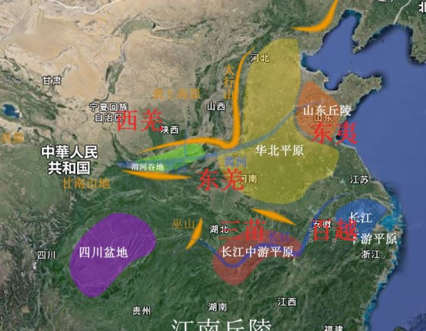

- [复旦国史概要](http://gsgy.fudan.edu.cn/yuanliu/gailun.htm)
- 《先秦史》 吕思勉
- 《西周史》 杨宽
- [中国历史地图集](https://www.osgeo.cn/map/m030b)
- [春秋战国脉络-简书](https://www.jianshu.com/p/bbf359208c94)
- [春秋战国脉络-知乎](https://www.zhihu.com/question/30376558)

##  史前

#### 部落


####  邦国

- 良渚
- 陶寺
- 石峁

- 王城岗遗址
- 新砦遗址文化
- 二里头  洛阳偃师区

满天星斗，月明星稀，广域的王权使得散乱的邦国逐渐黯淡


## 上古

**盘古开天辟地**

```
天地浑沌如鸡子。盘古生在其中。
万八千岁。天地开辟。阳清为天。阴浊为地。
盘古在其中。一日九变。神于天。圣于地。
天日高一丈。地日厚一丈。盘古日长一丈。
如此万八千岁。天数极高。地数极深。盘古极长。
故天去地九万里。后乃有三皇。
 ——《三五历记》
```

**三皇五帝**

三皇五帝地指定各有出入，以下仅作参考

- 遂人氏 伏羲氏 神农氏 
- 黄帝 颛顼 帝喾 尧 舜

```
昔少典娶于有蟜氏，生黄帝、炎帝。黄帝以姬水成，炎帝以姜水成。
成而异德，故黄帝为姬，炎帝为姜。
二帝用师以相济也，异德之故也。
——《国语·晋语》

1. 蟜jiǎo, 古书上的一种毒虫
```

- 黄帝与炎帝战于阪泉之野，与蚩尤战于逐鹿之野
- 尧舜禅让
- 大禹治水  
- 尧舜禹三苗之争




大禹：

河南许昌 禹州市

四川羌族  禹步

大禹故里

死，葬会稽山  大禹陵

秦始皇 会稽刻石  李斯书碑文  祭大禹

水书 代代相传 水书先生 鬼师  二里头陶器文字部分与水书相应

## 夏

夏禹,立于阳城. 太康始，迁于斟鄩(zhēn xún).


```
禹於是遂即天子位，南面朝天下，國號曰夏后，姓姒氏。
...
夏后帝啟，禹之子，其母涂山氏之女也。  
有扈氏不服，啟伐之，大戰於甘。將戰，作甘誓，乃召六卿申之。啟曰：「嗟！六事之人，予誓告女：有扈氏威侮五行，怠棄三正，天用勦絕其命。今予維共行天之罰。左不攻于左，右不攻于右，女不共命。御非其馬之政，女不共命。用命，賞于祖；不用命，僇于社，予則帑僇女。」遂滅有扈氏。天下咸朝。
  
夏后帝啟崩，子帝太康立。帝太康失國，昆弟五人，須于洛汭，作五子之歌。  
太康崩，弟中康立，是為帝中康。帝中康時，羲、和湎淫，廢時亂日。胤往征之，作胤征。   
中康崩，子帝相立。帝相崩，子帝少康立。帝少康崩，子帝予立。帝予崩，子帝槐立。
帝槐崩，子帝芒立。帝芒崩，子帝泄立。帝泄崩，子帝不降立。帝不降崩，弟帝扃立。
帝扃崩，子帝廑立。帝廑崩，立帝不降之子孔甲，是為帝孔甲。帝孔甲立，好方鬼神，事淫亂。
夏后氏德衰，諸侯畔之。天降龍二，有雌雄，孔甲不能食，未得豢龍氏。
陶唐既衰，其后有劉累，學擾龍于豢龍氏，以事孔甲。孔甲賜之姓曰御龍氏，受豕韋之後。
龍一雌死，以食夏后。夏后使求，懼而遷去。
 
孔甲崩，子帝皋立。帝皋崩，子帝發立。帝發崩，子帝履癸立，是為桀。
帝桀之時，自孔甲以來而諸侯多畔夏，桀不務德而武傷百姓，百姓弗堪。
乃召湯而囚之夏臺，已而釋之。湯修德，諸侯皆歸湯，湯遂率兵以伐夏桀。
桀走鳴條，遂放而死。桀謂人曰：「吾悔不遂殺湯於夏臺，使至此。」
湯乃踐天子位，代夏朝天下。湯封夏之後，至周封於杞也。

——《史记·夏本纪》
```

太康失国
后羿代夏
少康中兴

五观之乱

**羿代夏政**

夏帝相不贤明，有穷氏后羿攻夏。后羿荒于田猎，被臣下寒浞所杀。寒浞灭夏帝相，夏朝中绝。相子少康收集夏朝余众灭有穷氏，恢复夏朝，少康中兴。

## 商 殷

商汤代夏


```
殷契，母曰簡狄，有娀氏之女。
...
(帝舜)封于商，賜姓子氏。
...
成湯，自契至湯八遷。湯始居亳，從先王居，作帝誥。
——《史记·殷本紀》
```

契居住在殷，建立商国。契传到相土，迁都于商丘。相土四传到振，亦称王亥，为有易国杀。王亥之子上甲微灭有易国。上甲微六传至成汤，建都于亳，今山东曹县附近，任用贤相伊尹。灭夏。

期间十几代兴衰，迁都凡有五次。传至盘庚，迁都殷地，今河南安阳。三传至武丁。

武丁八传到纣，为周所灭。

商朝时，石器时代进入铜器时代，畜牧业进入农业，穴居时代进入室居时代。


考古：

郑州商城遗址

盘庚迁殷都， 商故称殷  殷都 殷墟 安阳

历法卜骨碑林

## 西周

姬姓部族，始祖后稷。与姜氏婚。建国于有邰，今陕西武功县附近。起于戎狄之间。

公刘迁豳(bīn)，今陕西豳县附近。

古公亶父復修后稷、公劉之業，積德行義，國人皆戴之。

商武丁封于周地。

公亶父迁于岐山之南，名周原。

有史实记录的时代。

周文王昌被商王命为西伯，为其征伐。迁都丰。

武王发，盟津渡河，战于牧野，灭商。迁都于镐，。


**分封**  

- 三恪
    - 虞舜后代，胡工封于陈，河南淮阳
    - 黄帝之后于蓟
    - 帝尧之后于祝/杞
- 纣王之子武庚于殷北部，殷墟
- 微子启于宋，商丘
- 同姓封国：管叔鲜，蔡叔度,周公旦...

**周公平叛**

武王死后，成王既幼，周公摄政，平定武庚叛乱/东夷。

封姜子牙于齐，原东夷之地。

迁殷贵族到洛邑，为东都成周，原都城称为宗周。

**帝王大事**

- 成王，封周公后人于鲁
- 康王
- 昭王
- 穆王
- 共王
- 懿王
- 孝王
- 夷王
- 厉王
- 共和
- 宣王
- 幽王

**西周王朝的衰落**

周幽王烽火戏诸侯, 为犬戎所杀。

```
又廢申后，去太子也。申侯怒，與繒、西夷犬戎攻幽王。
幽王舉烽火徵兵，兵莫至。
遂殺幽王驪山下，虜褒姒，盡取周賂而去。
於是諸侯乃即申侯而共立故幽王太子宜臼，是為平王，以奉周祀。   
平王立，東遷于雒邑，辟戎寇。
平王之時，周室衰微，諸侯彊并弱，齊、楚、秦、晉始大，政由方伯。
——《史记·周本紀》
```

**考古**

陕西省 宝鸡市  周原

## 神话

青龙  白虎 朱雀 玄武

三苗 驩兜( huān dōu )、鲧(gǔn)) 共工

饕餮(tāo tiè)，混沌，梼杌(táo wù)和穷奇

