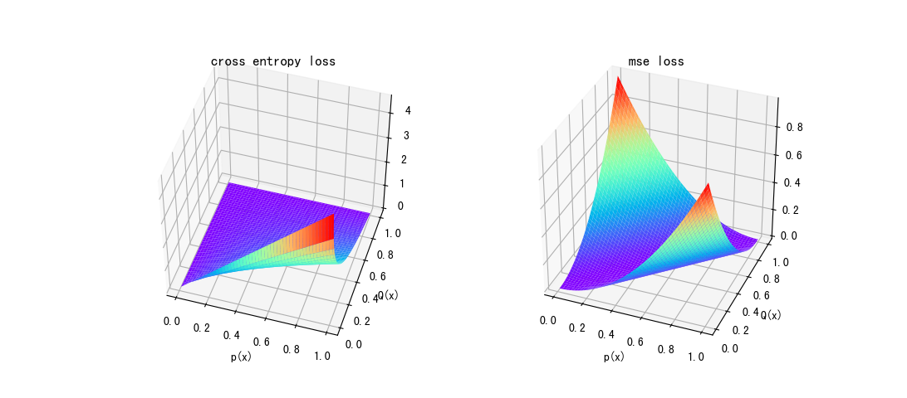

## 信息量

$$I(x)=-logP(x)$$

从数学表达式中可以看出，概率越小的事件的信息量越大。

## 熵

又称为香农熵(Shannon Entropy)，定义为信息量的期望：

$$H(x)=\mathbb{E}_{x \sim P}[I(x)]=\sum_{i=1}^{N} P\left(x_{i}\right) I\left(x_{i}\right)=-\sum_{i=1}^{N} P\left(x_{i}\right) \log P\left(x_{i}\right)$$

在一般的认知中，熵表示了事物混乱的程度，也可以从这个角度理解概率中熵的含义。根据数学表达式可以看出，如果该事件只有一个取值，则其信息量为0,熵为0,即这样确定性的事件，熵值最低,可以认为是"最不混乱"的概率分布。而如果一个分布有过多可能性，则这一分布的信息熵也越大;如果该事件的不同取值的概率不同，则信息熵也越大。从这种简单的分析中可以看出一些粗浅的认知：该表达式反映出的概率分布的混乱程度指的是事件有较多的可能性以及各个事件发生的概率不一致。

## KL散度

KL散度又称为相对熵，定义为真实分布和预测分布之间信息量差的期望,描述了预测分布和真实分布之间的距离/差异。

$$D_{K L}(P \| Q)=\sum_{i=1}^{N} P\left(x_{i}\right) \log \frac{P\left(x_{i}\right)}{Q\left(x_{i}\right)}=\sum_{i=1}^{N} P\left(x_{i}\right)\left[\log P\left(x_{i}\right)-\log Q\left(x_{i}\right)\right]$$

既然涉及到距离那么应该有三条性质：

1. 分布相同则为0
2. 分布不同则大于0
3. 分布越不同则距离数值越大

KL散度很明显满足第一条。另外根据jensen不等式可以证明KL散度是大于等于0的。第三条中差异的程度则是由数学表达式定义的，这里不再深究哪种类型的预测分布会距离会更大。

KL散度另外特别注意这里面定义中使用的分布针对的是同一事件，而不是不同事件。根据以上三条性质可以发现，当事件的概率分布P确定的时候， 表达式$-\sum P(x_i)Q(x_i)$的最小值也就确定了，即分布P的熵，而任何不同于P的概率分布在P下的熵都将大于最小值。

**分布不同则大于0 证明**

- 凸函数定义： $t f\left(x_{1}\right)+(1-t) f\left(x_{2}\right) \geq f\left(t x_{1}+(1-t) x_{2}\right), t\in [0,1]$
- jensen不等式：凸函数定义的泛化表达

$$f\left(\sum_{i=1}^{M} \lambda_{i} x_{i}\right) \leq \sum_{i=1}^{M} \lambda_{i} f\left(x_{i}\right) , \sum i=1\\
f(E(x)) \leq E(f(x)), \text{在概率论中的常用表达}$$

- 由于$f(Q(x))=log \frac{P(x)}{Q(x)}$ 为凸函数, 则

$$\begin{aligned} D_{K L}(P \| Q)&=\sum_{i=1}^{N} P\left(x_{i}\right) \log \frac{P\left(x_{i}\right)}{Q\left(x_{i}\right)} \\
&=\mathbb{E}_{x \sim P}(\log \frac{P\left(x_{i}\right)}{Q\left(x_{i}\right)}) \\
&\geq -log(\mathbb{E}_{x \sim P}(\log \frac{Q\left(x_{i}\right)}{P\left(x_{i}\right)})) \\
&=-log(P(x_i)\log \frac{Q\left(x_{i}\right)}{P\left(x_{i}\right)}) \\
&=-log(\sum P(x_i)) \\
&= -log 1=0\end{aligned} $$


## 交叉熵(cross_entropy)

如前所述，KL散度已能用来描述预测分布$Q(x_i)$和真实分布$P(x_i)$之间的差异，则KL散度可以作为损失函数，即：

$$\begin{aligned} \widetilde L&=D_{K L}(P \| Q)    \\
&=\underbrace{\sum_{i=1}^{N} P(x_{i})\log P(x_{i})}_{此项为KL散度的下界，并且为常数}-\sum_{i=1}^{N} P(x_{i})\log Q(x_{i}) \end{aligned}$$

由于第一项为常数项，故不影响损失函数的梯度，则：

$$\arg \min \widetilde L=\arg \min L \\
\text{其中: } L = \sum_{i=1}^{N} P(x_{i})\log Q(x_{i})$$

此即为交叉熵损失函数。

cross entropy loss:
$$H:=-\sum_iy_i'log(y_i)$$

当然概率差值的平方和也可以用来作为距离，但是交叉熵在概率的衡量上更有优势。如下图所示，MSE损失只跟差值成正比，在差值为1时达到最大值。而交叉熵则是随着真实概率的增大，损失有增大的趋势，即对于真实概率较大的预测值会有更大的梯度，而在真实值为1,预测为0时逼近最大值。



```python
import matplotlib.pyplot as plt
from mpl_toolkits.mplot3d import Axes3D
import numpy as np

x=np.linspace(0.01,1,100)
y=np.linspace(0.01,1,100)

[xx,yy]=np.meshgrid(x,y)
zz1=-xx*np.log(yy)
zz2=(xx-yy)**2

fig = plt.figure()
ax1 = fig.add_subplot(121,projection='3d')  #这种方法也可以画多个子图
ax2 = fig.add_subplot(2,projection='3d')  #这种方法也可以画多个子图
ax1.plot_surface(xx,yy,zz1,cmap='rainbow')
ax1.set_xlabel("p(x)")
ax1.set_ylabel("Q(x)")
ax1.set_title("cross entropy loss")
ax2.plot_surface(xx,yy,zz2,cmap='rainbow')
ax2.set_xlabel("p(x)")
ax2.set_ylabel("Q(x)")
ax2.set_title("mse loss")

plt.show()
```


## ref

- [cs231 in stanford](http://cs231n.github.io/)

$$\bigtriangledown f(x)=f(x)\bigtriangledown \log f(x)$$

- [Visual Information Theory](https://colah.github.io/posts/2015-09-Visual-Information/)
