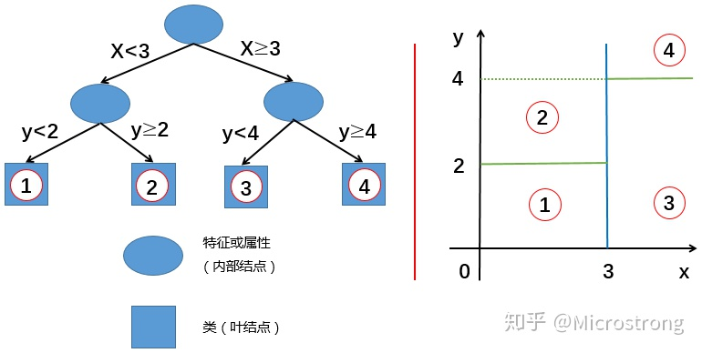

## intro

决策树(decision tree): 根据各个特征构建的二叉树(多叉树)，并将该树用于分类或回归任务。

- 节点(node)
    - 内部节点(interior node): 分类节点，二叉树的除最低一层的节点
    - 叶节点(leaf node): 结果节点，二叉树最低一层
- 有向边(directed edge)
- 分类树:  用于分类任务
- 回归树: 用于回归任务

决策树的处理步骤一般分为三步：

- 选择一种构建算法，即以哪个目标来构建树
- 构建决策树
- 剪枝：优化树结构

树的生成算法：

|算法|支持模型 |树结构|特征选择|连续值|缺失值|剪枝|
|---|---|---|---|---|---|---|---|
|ID3|分类 |多叉树|信息增益|不支持|不支持|不支持|
|C4.5|分类 |多叉树|信息增益率|支持|支持|支持|
|CART|分类/回归 |二叉树|基尼指数/均方差|支持|支持|支持|

CART: 分类回归树(classification and regression tree), 既指树的生成算法，也有人把通过该算法生成的树叫做`CART树`.

## 生成算法特征选择

**信息熵(Information Entropy)**

$$H(X)=-\sum_{i=1}^{n} p\left(x_{i}\right) \log p\left(x_{i}\right)$$

概率越小的事情信息量越大。一个事件的信息量随着发生的概率的减少而递减。信息熵代表了对该事件的信息量的期望。

**条件熵**

已知随机变量X的条件下随机变量Y的不确定性，$H(Y|X)$：
$$\begin{aligned}
H(Y \mid X) &=\sum_{x \in X} p(x) H(Y \mid X=x) \\
&=-\sum_{x \in X} p(x) \sum_{y \in Y} p(y \mid x) \log p(y \mid x) \\
&=-\sum_{x \in X} \sum_{y \in Y} p(x, y) \log p(y \mid x)
\end{aligned}$$

**信息增益(Information Gain)**

$$Gain(D,a)=Ent(D)-\sum_{v=1}^V\frac{|D^v|}{|D|}Ent(D^v)$$

**信息增益率(Information Gain Ratio)**
**基尼指数(Gini Index)**

## 过拟合

- 限制树的深度/尺寸
- [剪枝] 判断一棵子树存在分叉和没有分叉单独成为叶子节点时的误差，如果修剪之后误差更小，那么我们就减去这棵子树

[剪枝](https://mp.weixin.qq.com/s?__biz=MzUyMTM5OTM2NA==&mid=2247485607&idx=1&sn=185f9f42219c3bec275b3e56fad1a448&chksm=f9daf58ccead7c9a0e43bf08b829736c355bc70e4b1d2e59498561ca9465cdec583f206a3825&scene=21#wechat_redirect)

## ref-blog

- [CSDN-决策树(分类树、回归树）](https://blog.csdn.net/weixin_36586536/article/details/80468426)
- [zhihu-Regression Tree 回归树](https://zhuanlan.zhihu.com/p/82054400)
- [深入浅出理解决策树算法（二）-ID3算法与C4.5算法](https://zhuanlan.zhihu.com/p/26760551)

## ref-script

- [imylu](https://github.com/tushushu/imylu/tree/master/imylu)
- [jack-cherish](https://github.com/Jack-Cherish/Machine-Learning)
- [ailearning-机器学习实战](https://github.com/apachecn/AiLearning)

