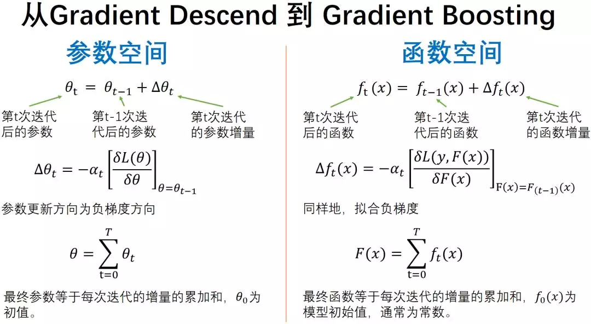

## intro

1984：CART - Classification and Regression Trees, Breiman
1986：ID3 - Iterative Dichotomizer3, Ross Quinlan (ITERATIVE: doing something again and again, usually to improve it)
1993：C4.5 - Ross Quinlan (C4.5 is an extension of Quinlan's earlier ID3 algorithm.)
1995：Adaboost - Adaptive Boosting, Freund and Schapire
1996：Bootstrap aggregating, also called bagging, Freund and Schapire (reduces variance and helps to avoid overfitting)
1999：Gradient Boosting, Friedman
2001：Random Forests, Breiman
2014：XGBoost - eXtreme Gradient Boosting, Tianqi Cheng
2016：LightGBM - call our new GBDT implementation with GOSS and EFBLightGBM, Microsoft
2017：CatBoost - Categorical and Boosting, Yandex

CatBoost > LightGBM > XGBoost > Random Forests > GB , Adaboost >= Desicion Tree = CART + ID3 +C4.5 > Gini Index, Information Gain Ratio, Information Gain >= Entropy ( Conditional Entropy, Relative Entropy = Kullback-Leibler Divergence, Cross Entropy )

## Gradient Boosting

Boosting is a method of combining many weak learners (tree) into a strong classifier.

梯度提升的原理相当于是结合多个简单的决策树进行线性组合，以达到更加精确的预测的目的。

训练过程：

0. 输入：
    - 训练数据集：$T=\left\{\left(x_{1}, y_{1}\right),\left(x_{2}, y_{2}\right), \ldots,\left(x_{N}, y_{N}\right)\right\}$, 
    - 损失函数：$L(y, f(x))$
    - 回归树: $F_M$
1. 根据损失函数初始化第一个弱学习器(在下式中是要求一个常数c，在实际应用中，如果损失函数为均方差，则c为输出值的平均值)：

$$F_{0}(x)=\underset{c}{\arg \min } \sum_{i=1}^{N} L\left(y_{i}, c\right)$$

2. 串行建立回归树：
    - 2.1 根据上一颗树计算残差(损失函数的负梯度，近似为残差)：

    $$r_{m, i}=-\left[\frac{\partial L\left(y_{i}, F\left(x_{i}\right)\right)}{\partial F(x)}\right]_{F(x)=F_{m-1}(x)}$$

    - 2.2 重组数据$(x_i,r_{m,i})$,进行新一颗树的拟合

    $$c_{m, j}=\underset{c}{\arg \min } \sum_{x_{i} \in R_{m, j}} L\left(y_{i}, F_{m-1}\left(x_{i}\right)+c\right)$$

    - 2.3 更新学习器

    $$F_{m}(x)=F_{m-1}(x)+\sum_{j=1}^{J_{m}} c_{m, j} I\left(x \in R_{m, j}\right)$$

梯度提升可视化：

梯度提升对应梯度下降。梯度下降是为了在参数空间消除误差，而梯度提升是为了在函数空间逼近真值。

## 正则化

## Ensemble

[集成学习](https://www.cnblogs.com/pinard/p/6131423.html)

- 串行： boosting
- 并行： bagging， random forest

## ref

- blog
    - [梯度提升（Gradient Boosting）算法](https://mp.weixin.qq.com/s/Ods1PHhYyjkRA8bS16OfCg)
    - [zhihu-深入理解GBDT回归算法](https://zhuanlan.zhihu.com/p/81016622)
    - [zhihu-深入理解提升树（Boosting tree）算法](https://zhuanlan.zhihu.com/p/84139957)
    - [zhihu-XGBoost: 从0开始理解](https://zhuanlan.zhihu.com/p/88955721)
    - [Gradient Boosting Machines](https://uc-r.github.io/gbm_regression)
- open code
    - [WeChat-zhihu-csdnblog-code](https://github.com/Microstrong0305/WeChat-zhihu-csdnblog-code/tree/master/Ensemble%20Learning/GBDT_Regression)
