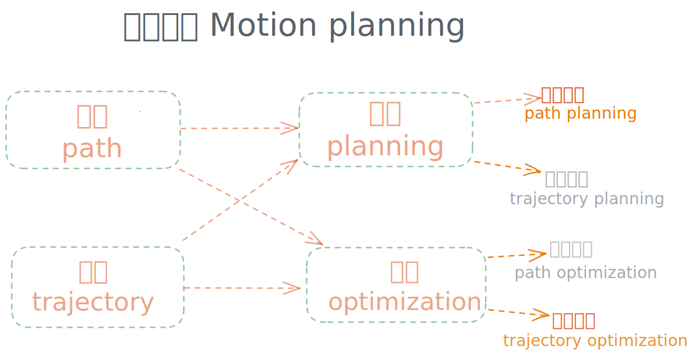

## 关于运动规划的叫法

关于运动规划,在技术博客或者论文里经常见到的有五个词, 分别是`运动规划`,`路径规划`,`轨迹规划`,`轨迹优化`, `路径优化`. 在这几个词之间, 它们的关系可以这样描述:
- 在广义的概念上,这五个词可以通用
- 在狭义的概念上,这五个词有其侧重点
- `运动规划`包含了这几个词所有的含义, 无论在任何时候,都可以直接使用`运动规划`来描述运动规划这件事

在狭义的概念上,可以认为`运动规划`是一个总集, 而`路径规划`,`轨迹规划`,`轨迹优化`, `路径优化`这四个词是相互有重叠的子集. 在区分这些子集之前, 先规定一下两组词的区别, 即路径VS轨迹, 规划VS优化.

路径 VS 轨迹: 运动规划的问题一般可以描述为, 在状态空间$\mathcal{C}$内, 找到一条无碰撞的最优序列$\mathcal{P} = \{x_i,| x_i \in \mathcal{C}_{free}\}$(*这里故意使用序列, 而不用路径或轨迹一词*). 当运动规划只关注状态量$x_i$(比如位置,姿态),这条序列被称为**路径**. 除了状态量,当运动规划也关注运动学或动力学因素(状态量对于时间的微分,比如速度, 加速度)的时候, 这条序列被称为**轨迹**. 当然轨迹在有些时候也不限于时间因素. 比如对于二维的导航小车, 在泊车场景下一般会计算一条曲率连续的轨迹, 这里曲率连续的要求也可以认为是轨迹一侧的运动学的要求,虽然这里面没有对于时间的要求. 这样的路径也可以称为轨迹, 连续曲率路径的优化问题一般也被称为轨迹优化问题. 这是狭义上两者的区别,当然在广义上两者也可以通用.

规划 VS 优化: 优化一般指需要一个初解,然后通过不断的迭代得到最终结果,大部分是通过最优化方法得到可行的结果. 而规划不需要迭代,直接通过采样或搜索的方式找到可行解. 再次重申一遍,这里是狭义上两者的区别, 在广义上,规划和优化大部分情况可以通用. 而规划比优化更通用, 比如对于A*,RRT*这种纯粹采样或搜索的方法不适用优化一词, 而即便对于一个优化问题也可以称为是"通过优化方法而求解的规划问题". 

因此,再把以上两组词两两组合,可得到四个有所特指的狭义概念. 根据以上讨论,可大概总结如下:
- 路径规划: 针对状态量的规划问题
- 轨迹规划: 考虑运动学因素的规划问题
- 轨迹优化: 通过迭代方法求解的考虑运动学因素的规划问题
- 路径优化: 通过迭代方法求解的不考虑运动学因素的规划问题

**运动规划 VS 最优控制**

在运动规划和最优控制领域都有`轨迹优化`的概念.狭义的理解: 从最优控制的角度，轨迹优化侧重于在满足状态约束情况下获得最优的控制量, 即轨迹中的运动学或动力学因素。从运动规划角度，轨迹优化侧重于获得最优的状态量。当然在广义的情况下两者也是统一的。

🐶 另外对于考虑运动学和动力学因素的规划,其实还有一个词叫做`Kinodynamic planning`或`Kinodynamic motion planning` 🐂🐂🐂

以上 个人浅见

## planner

- search
    - a-star
    - decomposition methods
    - cell decomposition
    - mixed integer planning
    Approximate decompositions for complex environments
- sampled based
    - RRT-sharp
    - RRTx
    - Kinodynamic-RRT*
    - LQR-RRT*
- topology
    - triangulation
    - cell-decomposition
    - visibility graph

- optimization based
    - direct
    - indirect, shooting

## 周边

#### 规划器性能

- 概率完备(probabilistically complete): finds a feasible path with probability approaching one as the number of iterations approaches infinity.
- 渐进最优(asymptotic optimality): the path is shotest with enough time

#### 几何表征

- 构形空间(configuration space, C-space): representation of robot manipulation states

#### 碰撞检测

- FCL: Flexible Collision Library
- PCD: Proximity Collision Detection

## ref
- conference
    - [RSS:Robotics: Science and Systems](https://roboticsconference.org/)
        - [RSS 2022](https://roboticsconference.org/)
    - [T-RO: IEEE Transactions on Robotics](https://ieeexplore.ieee.org/xpl/RecentIssue.jsp?punumber=8860)
    - [IJRA: International Journal of Robotics and Automation](https://ijra.iaescore.com/index.php/IJRA)
    - [IROS]()
    - [ICRA]()
- paper source
    - [Robotics: Science and Systems](http://www.roboticsproceedings.org/rss17/index.html)
- lab
    - [IML: Intelligent motion laboratory](https://motion.cs.illinois.edu/index.html)
    - [GAMMA: Motion and path planning](http://gamma.cs.unc.edu/research/robotics/)
    - [Robot Locomotion Group](http://groups.csail.mit.edu/locomotion/)
- course
    - [MIT 6.832: Underactuated Robotics](http://underactuated.csail.mit.edu/Spring2021/)
        - [code](https://github.com/RussTedrake/underactuated)
- project
    - [2d path planning maps](https://www.movingai.com/benchmarks/grids.html)
    - [PythonRobotics](https://github.com/AtsushiSakai/PythonRobotics)
    - [PathPlanning](https://github.com/zhm-real/PathPlanning)
    - [Motion Planning Library with ROS](https://github.com/moribots/motion_planning)
    - [Robot-Motion-Planning-Algorithms](https://github.com/vinaybysani/Robot-Motion-Planning-Algorithms)
    - [drake](https://drake.mit.edu/gallery.html)
- paper
    - [2015 Homotopy-Based Divide-and-Conquer Strategy for Optimal Trajectory Planning via Mixed-Integer Programming]()
    - project
        - [Kris' Locomotion and Manipulation Planning Toolkit](https://github.com/krishauser/Klampt)
        - [robotic manipulators - python](https://github.com/Sarrasor/RoboticManipulators/blob/main/rr_robot_dynamics.py)
        - [Kris Hauser's LMPL ](https://github.com/panjia1983/KLMPL)

## 综述

运动规划
路径规划
轨迹规划
轨迹优化

运动规划的三个层次：

- l0: 无碰撞(collision free)路径
- l1: 运动学可行(kinetically feasible)路径， 考虑速度，加速度(速度连续可导，加速度连续)
- l2: 动力学可行(dynamically feasible)路径， 考虑力

运动规划包括了所有的概念。从广义的含义上讲，上述说法是一致的。从狭义的说法上，路径规划一般只包含无碰撞的路径点（l0）;而轨迹则包含了运动学或动力学信息(l1, l2)。

规划和优化：广义上，轨迹规划包括了轨迹XX的所有概念。而从狭义上，规划一般指从无到有，而优化则需要一个合法的初值进行迭代。进而，把从无到有的问题归类为狭义的规划问题(以0-1表示);把从有到更优的问题归类为狭义的优化问题(以1-2表示);

运动规划和最优控制：最优控制是在动力系统的约束下在特定的时间内，找到使特定的损失函数最优的控制过程，而这个过程在机器人领域实际上就是运动轨迹（当然最优控制的应用范围更加广泛，这只是其概念覆盖的一小部分，比如最优控制也可以用在电路设计等系统中）。比如我们要控制一个倒立摆，实际上就是找到摆球的轨迹的过程。同样是机器人的运动，最优控制侧重控制体的状态方程，即机器人本体动力学结构的复杂性，即在这样一个微分方程的约束下找到可控的轨迹;而运动规划侧重在一个复杂的外部环境中，找到无碰撞的轨迹。考虑一个倒立摆，我们可以用两个量来表示其当前的状态，所以其自由度为2.如果通过运动规划的思路，直接把它转换为2维C空间的点进行规划（比如 a*, rrt）的话，则应该是一条直线，但是这样的路径倒立摆是走不出来的，因为其自身的状态方程所限（非完整性约束），这里用最优控制的方法来解就比较容易。考虑另外一个情况，一个机械臂从货柜里面取物体。如果还用最优控制的思路做，则把碰撞检测转换到约束里会变得很复杂，求解很耗时。如果用运动规划，比如rrt则很快能给出一个大致可行的路径。之后再通过轨迹优化的方法就能获得一个机器人切实可行的轨迹。最优控制中也有轨迹优化的概念，比如轨迹最短时间，最小能量，人形机器人/腿式机器人的姿态优化，而这些其实也是运动规划会考虑的内容，也是两者结合比较紧密的地方。因此在本文中，关于基于最优控制的相关方法会归类到轨迹优化里面。

- 运动规划
    - 路径规划：
        - 路径规划（0-1）
            - search based:
                - Djska, a*, D*
            - sample based:
                - rrt, rrt*
        - 路径优化（1-2）
            - elastic-band
    - 轨迹规划/轨迹优化
        - 轨迹规划（0-1）
            - l1-0-1: 
                - CHOMP, STOMP, trajOpt, 
                - hybrid a*, TEB
            - l2-0-1: optimal control(collocation, pseudospectral)
        - 轨迹优化（1-2）
            - l1-1-2: 轨迹拟合, DWA
            - l2-1-2: 

通用，非通用， 低维， 高维

local, global

平面车和无人机：路径规划
机械臂：运动规划
人形机器人：轨迹优化(位姿优化)

