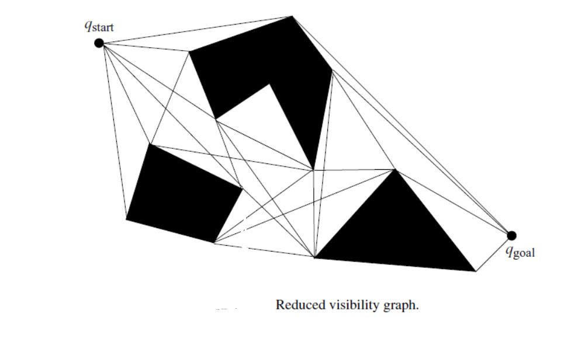
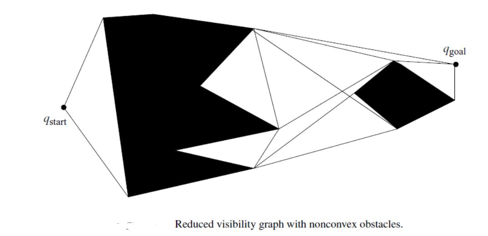
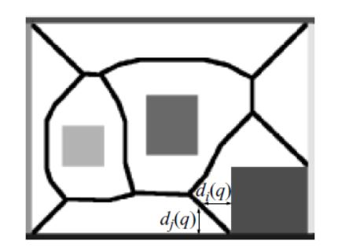

- accessibility
- departability
- connectivity

## visibility graph

connect the node if they could be seen from each other.

Visibility maps tend to apply to two-dimensional configuration spaces with polygonal obstacles.

**reduced visibility graph**

constructed from supporting and separating lines. This approach deceases the number of edges.

## generalized voronoi diagram

The generalized Voronoi diagram is the set of tpoints where the distance to the two closest obstacles is the same.

## the Rod-Hierarchical Generalized Voronoi Graph

Define a roadmap in a non-Euclidean configuration space.

