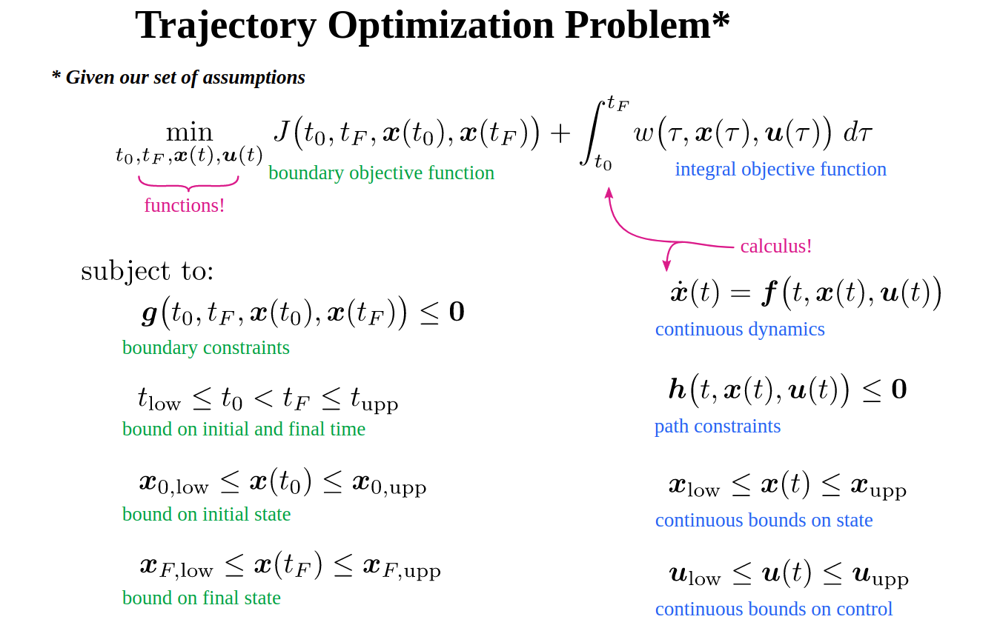

## 2003-Reactive Nonholonomic Trajectory Generation via Parametric Optimal Control

**Abstract**

1. parametric trajectory reduce computation time, at the cost os potentially introducing suboptimality

## optimization

- [polytraj](https://github.com/jsford/PolyTraj)
- [Trajectory Optimization motion planning](https://github.com/bestvibes/motion-planner)
- [Convex Optimization for motion plannin](https://github.com/Theochiro/motion-planning)
- [trajopt](https://rll.berkeley.edu/trajopt/doc/sphinx_build/html/)

路径: 可以称为一条曲线，但是这条曲线本身并不依赖时间因子。同样的一条曲线可以以不同的速度运动。因此这条曲线上面的导数并不代表速度，如果在二维(X-Y), 这个导数代表了不同纬度速度的比值,而不是速度本身。

曲线：曲线需要有规律。这个规律是指可以用有限个参数的函数来表示，这样才能约束点与点之间的关系。另一方面，为了满足运动学特性，需要曲线n阶连续(速度，加速度...),所以一般会选择多项式来进行曲线拟合。曲线需要满足一些条件，比如路经点的位置，速度，加速度等作为约束。这样的曲线可能有无数条，因此再定义一个目标函数(比如，路径最短，能量最小等)转化为一个优化问题，求出在该目标函数下最优的一条曲线。

参数方程(以二维平面举例)：若只关注曲线，没有速度，加速度，则位置以s为参数进行表示。

曲率: 描述了几何体的弯曲程度。在二维平面上，曲率表示了曲线上某个点的切线方向角对弧长的转动率。曲率代表了曲线本身的特性。

$$\kappa=\kappa(s)  \\
\theta=\int \kappa(s)ds$$

尺度: 不同尺度相同位置的点会得到相同的曲线， 这样会造成原本只需首尾是曲线中间大部分是直线的解没办法得到。即曲线只适合较短路径的拟合？(受制于参数方程的本身特性)

避障：如何避障？这也决定了参数方程拟合的方式适合短距离无障碍物的假设空间。

规划 or 轨迹优化: 这种方法更适合在有了路径点之后，对路径进行轨迹化。

- 为路径添加时间序列
- 基于优化的规划
- 轨迹优化(会改变路径点)

轨迹:

## 轨迹优化

- 约束： 系统动力学。边界条件
- 可行解: 满足约束的解
- 目标函数: 包含边界项和积分项
- 最优解: 最小化目标函数的解

## 变分法

设优化目标是使加速度的积分最小:

$$J=\int_{0}^{1} u^{2}(\tau) d \tau=\int_{0}^{1} \ddot{x}^{2}(\tau) d \tau$$

其对应泛函：

$$\mathcal{L}(x, \dot{x}, \ddot{x}|t)=\mathcal{L}(\ddot{x}|t)=\ddot{x}^{2}$$

根据E-L(欧拉拉格朗日)方程:
    $$\frac{\partial \mathcal{L}}{\partial x}-\frac{d}{dt}(\frac{\partial \mathcal{L}}{\partial x'})-\frac{d^2}{dt^2}(\frac{\partial \mathcal{L}}{\partial x''}) =0$$
可推导出x具有三次多项式的形式：
$$x^{(4)}=0$$

同理可以求得:

- 3次多项式：最小加速度
- 5次多项式：最小jerk
- 7次多项式： 最小snapw

## 轨迹拟合

通过连续曲线连接路经点

维度：拟合的曲线参数组数跟数据点的维度一致

**polynomials**

三次多项式曲线： $\theta(t)=a_0+a_1t+a_2t^2+a_3t^3$

边界条件:

$$\begin{bmatrix}\theta_i \\ \theta_{i+1} \\ \dot\theta_i \\ \dot\theta_{i+1}  \end{bmatrix} =
\begin{bmatrix} 1 & 0& 0&0 \\
     1 & \Delta t& \Delta t^2&\Delta t^3 \\
      0 & 1& 0&0 \\
     0 & 1& 2\Delta t& 3\Delta t^2 
 \end{bmatrix}  \begin{bmatrix} a_0 \\a_1\\a_2\\a_3\end{bmatrix}$$

保证速度连续，有唯一解

多个数据点 -> 曲线拟合：

- n个数据点， m维度
- (n-1)*m条曲线， 4*(n-1)*m个
- 首尾边界条件 + 中间边界条件 + 中间连续条件 = 4*m+2*(n-2)*m+2*(n-2)*m=4*(n-1)*m

**正交多项式**

根据变分法中求得的微分方程，需要根据具体条件解出该方程的参数。这里可以使用正交多项式来求解。

两类常用正交多项式：
    
$$\begin{aligned}
\text{基于Taylor展开的指数多项式}\quad &1, t, t^{2}, t^{3}, \ldots\\
\text{基于Fourier展开的三角多项式}\quad&1, \sin t, \cos t, \sin 2 t, \cos 2 t, \ldots
\end{aligned}$$

- 多项式轨迹拟合:
    - 最小加速度： $x(t)=a_{0}+a_{1} t+a_{2} t^{2}+a_{3} t^{3}$
    - 最小jerk: $\quad x(t)=a_{0}+a_{1} t+a_{2} t^{2}+a_{3} t^{3}+a_{4} t^{4}+a_{5} t^{5}$
    - 最小snap: $\quad x(t)=a_{0}+a_{1} t+a_{2} t^{2}+a_{3} t^{3}+a_{4} t^{4}+a_{5} t^{5}+a_{6} t^{6}+a_{7} t^{7}$
- 三角函数轨迹拟合:
    - 正弦轨迹: $ x(t)=a_{0}+a_{1} \cos a_{2} t+a_{3} \sin a_{2} t $
    - 摆线轨迹: $ x(t)=a_{0}+a_{1} t-a_{2} \sin a_{3} t $
    - Fourier轨迹: $x(t)=\frac{A_{0}}{2}+\sum_{n=1}^{\infty}\left[A_{n} \cos n t+B_{n} \sin n t\right]$

    $$\begin{gathered}
A_{0}=\frac{1}{\pi} \int_{-\pi}^{\pi} x(t) d t \\
A_{n}=\frac{1}{\pi} \int_{-\pi}^{\pi} x(t) \cos n t d t \\
B_{n}=\frac{1}{\pi} \int_{-\pi}^{\pi} x(t) \sin n t d t
\end{gathered}$$

## 数值积分

插值型数值积分方法：

1. 梯形公式： $I_{1}(f)=\frac{b-a}{2}(f(a)+f(b))$
2. Simspon公式: $I_{2}(f)=\frac{b-a}{6}\left(f(a)+4 f\left(\frac{a+b}{2}\right)+f(b)\right)$
3. cote
4. gauss
5. 复化Simspon
6. ....

## 离散空间

轨迹优化是一个求解泛函优化的问题。可以将该问题离散化。转化为一个函数优化的问题，降低求解难度。（泛函优化和函数优化）即直接求解轨迹点而不关注该函数的表达式。把一个微分方程转化为有m*n（维度*控制点）个优化参数的优化问题。以下是两种常用的微分/积分近似方法。

**Trapezoidal Collocation**：
    $$\min _{u(t)} \int_{t_{0}}^{t_{N}} u^{2}(\tau) d \tau \approx \min _{u_{0} . . u_{N}} \sum_{k=0}^{N-1} \frac{1}{2}\left(h_{k}\right)\left(u_{k}^{2}+u_{k+1}^{2}\right) \\
    \int_{t_{0}}^{t_{F}} w(\tau, \boldsymbol{x}(\tau), \boldsymbol{u}(\tau)) d \tau \quad \approx \sum_{k=0}^{N-1} \frac{1}{2} h_{k} \cdot\left(w_{k}+w_{k+1}\right)$$

system dynamics:

$$\begin{aligned}
\dot{\boldsymbol{x}} &=\boldsymbol{f}, \\
\int_{t_{k}}^{t_{k+1}} \dot{\boldsymbol{x}} d t &=\int_{t_{k}}^{t_{k+1}} \boldsymbol{f} d t, \\
\boldsymbol{x}_{k+1}-\boldsymbol{x}_{k} & \approx \frac{1}{2} h_{k} \cdot\left(\boldsymbol{f}_{k+1}+\boldsymbol{f}_{k}\right)
\end{aligned}$$

**Simpspon**

$$\int_{t_{0}}^{t_{F}} w(\tau) d \tau \approx \sum_{k=0}^{N-1} \frac{h_{k}}{6}\left(w_{k}+4 w_{k+\frac{1}{2}}+w_{k+1}\right)$$

system dynamics
$$\begin{aligned}
&x_{k+1}-x_{k}=\frac{1}{6} h_{k}\left(\boldsymbol{f}_{k}+4 \boldsymbol{f}_{k+\frac{1}{2}}+\boldsymbol{f}_{k+1}\right) \\
&x_{k+\frac{1}{2}}=\frac{1}{2}\left(x_{k}+x_{k+1}\right)+\frac{h_{k}}{8}\left(\boldsymbol{f}_{k}-\boldsymbol{f}_{k+1}\right)
\end{aligned}$$

**曲线插值**

为了从控制点恢复连续轨迹，需要进行曲线插值。

梯形配置法(Trapezoidal Collocation)求解：

$$\begin{gathered}
\boldsymbol{f}(t)=\dot{\boldsymbol{x}}(t) \approx \boldsymbol{f}_{k}+\frac{\tau}{h_{k}}\left(\boldsymbol{f}_{k+1}-\boldsymbol{f}_{k}\right) \\
\boldsymbol{x}(t)=\int \dot{\boldsymbol{x}}(t) d \tau \approx \boldsymbol{c}+\boldsymbol{f}_{k} \tau+\frac{\tau^{2}}{2 h_{k}}\left(\boldsymbol{f}_{k+1}-\boldsymbol{f}_{k}\right) \\
\qquad \boldsymbol{x}(t) \approx \boldsymbol{x}_{k}+\boldsymbol{f}_{k} \tau+\frac{\tau^{2}}{2 h_{k}}\left(\boldsymbol{f}_{k+1}-\boldsymbol{f}_{k}\right)
\end{gathered}$$

Simpson配置法(Hermite–Simpson Collocation)求解:

$$\tau=t-t_{k}  \\
h_{k}=t_{k+1}-t_{k} \\
\boldsymbol{u}(t)=\frac{2}{h_{k}^{2}}\left(\tau-\frac{h_{k}}{2}\right)\left(\tau-h_{k}\right) \boldsymbol{u}_{k}-\frac{4}{h_{k}^{2}}(\tau)\left(\tau-h_{k}\right) \boldsymbol{u}_{k+\frac{1}{2}}+\frac{2}{h_{k}^{2}}(\tau)\left(\tau-\frac{h_{k}}{2}\right) \boldsymbol{u}_{k+1}    \\
\begin{aligned}
&\boldsymbol{x}(t)=\int \dot{\boldsymbol{x}} d t \\
&=\int\left[\boldsymbol{f}_{k}+\left(-3 \boldsymbol{f}_{k}+4 \boldsymbol{f}_{k+\frac{1}{2}}-\boldsymbol{f}_{k+1}\right)\left(\frac{\tau}{h_{k}}\right)+\left(2 \boldsymbol{f}_{k}-4 \boldsymbol{f}_{k+\frac{1}{2}}+2 \boldsymbol{f}_{k+1}\right)\left(\frac{\tau}{h_{k}}\right)^{2}\right] d t
\end{aligned}   \\
\begin{aligned}
\boldsymbol{x}(t)=& \boldsymbol{x}_{k}+\boldsymbol{f}_{k}\left(\frac{\tau}{h_{k}}\right)+\frac{1}{2}\left(-3 \boldsymbol{f}_{k}+4 \boldsymbol{f}_{k+\frac{1}{2}}-\boldsymbol{f}_{k+1}\right)\left(\frac{\tau}{h_{k}}\right)^{2} \\
&+\frac{1}{3}\left(2 \boldsymbol{f}_{k}-4 \boldsymbol{f}_{k+\frac{1}{2}}+2 \boldsymbol{f}_{k+1}\right)\left(\frac{\tau}{h_{k}}\right)^{3}
\end{aligned}$$

## 

- mesh refinement: 
    - h-method: increase number of segments
    - p-method: increase polynomial order

## ref

- blog 
    - [参数化最优控制 约束-控制-图形参数](https://blog.csdn.net/Neo11111/article/details/105960645)
    - [基于多项式螺旋曲线的轨迹优化](https://blog.csdn.net/github_39582118/article/details/117754864?utm_medium=distribute.pc_relevant.none-task-blog-2~default~baidujs_title~default-1.control&spm=1001.2101.3001.4242)
    - [trajectory optimization slides](http://www.matthewpeterkelly.com/tutorials/trajectoryOptimization/cartPoleCollocation.svg#frame1129)
        - [OptimTraj-maTLAB](https://github.com/MatthewPeterKelly/OptimTraj/tree/master/demo/cartPole)
        - [2017-An Introduction to Trajectory Optimization: How to Do Your Own Direct Collocation]()
    - [Transcription Methods for Trajectory Optimization](https://arxiv.org/pdf/1707.00284.pdf)
    - [轨迹优化04. 轨迹拟合 & 轨迹插值](https://zhuanlan.zhihu.com/p/342012866)
- project
    
- course
    - [台大机器人学之运动学——林沛群-b站](https://www.bilibili.com/video/BV1v4411H7ez)
- paper
    