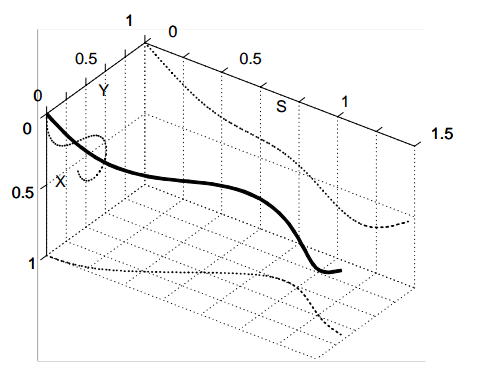

## trajopt

## chomp

functional gradient: 泛函梯度

$$\bar{\nabla} u[\xi]=\frac{\partial v}{\partial \xi}-\frac{d}{d t} \frac{\partial v}{\partial \xi^{\prime}}$$

梯度下降：

$$\xi_{i+1}=\xi_{i}-\eta_{i} \bar{\nabla} U[\xi]$$

## 2003-Reactive Nonholonomic Trajectory Generation via Parametric Optimal Control

**Abstract**

1. parametric trajectory reduce computation time, at the cost os potentially introducing suboptimality

**Formulation**
for a vehicle actuated in curvature and speed:

$$\begin{array}{ll}
\dot{x}(t)=V(t) \cos \theta(t) & \dot{\theta}(t)=\kappa(t) V(t) \\
\dot{y}(t)=V(t) \sin \theta(t) & { }_{\mathrm{K}}(t)=u(t)
\end{array}$$

from time to distance(以行驶举例作为参数):

$$\begin{aligned}
&x(s)=\int_{0}^{s} \cos \theta(s) d s \quad \theta(s)=\int_{0}^{s} \kappa(s) d s \\
&y(s)=\int_{0} \sin \theta(s) d s \quad \kappa(s)=u(s)
\end{aligned}$$

变分法把最优控制问题转化为非线性优化问题。

**solution using polynominal spirals**

$$\begin{aligned}
\kappa(s) &=a+b s+c s^{2}+d s^{3}+\cdots \\
\frac{d}{d s} x(s) &=\cos \theta(s) \\
\frac{d}{d s} y(s) &=\sin \theta(s) \\
\frac{d}{d s} \theta(s)&=\kappa(s)
\end{aligned}
$$

**polytraj 代码原理**

- path：只有路径，以曲率为路径长度的函数
    - start($x_s,y_s,\theta_s,\kappa_s$)
    - end($x_e,y_e,\theta_e,\kappa_e$)
    - 初始化一个曲率多项式: $\kappa(s) =a+b s+c s^{2}+d s^{3}+\cdots$
    - 根据动力学约束根据起点求终点, 并最小化终点误差：

    $end\_state=\int_0^1g(\kappa)   \\
    \min_{s,a,b,\cdots} \quad J=||\Delta e||^2$
    - 在代码中使用了Simpson积分公式，首先估计了路径总长度，然后根据路径点均分。
- trajectory：加入了速度和加速度，一条曲线为曲率函数，一条为加速度
    - start($x_s,y_s,\theta_s,\kappa_s, v_s, a_s$)
    - end($x_e,y_e,\theta_e,\kappa_e$)

## ref

- blog 
    - [参数化最优控制 约束-控制-图形参数](https://blog.csdn.net/Neo11111/article/details/105960645)
    - [基于多项式螺旋曲线的轨迹优化](https://blog.csdn.net/github_39582118/article/details/117754864?utm_medium=distribute.pc_relevant.none-task-blog-2~default~baidujs_title~default-1.control&spm=1001.2101.3001.4242)
- project 
    - [trajopt](https://rll.berkeley.edu/trajopt/doc/sphinx_build/html/)
- course
- paper
    - [2011-Parallel Algorithms for Real-time Motion Planning](https://www.ri.cmu.edu/pub_files/2011/7/mcnaughton-thesis.pdf)
    - [2003-parametric trajectory reduce computation time, at the cost os potentially introducing suboptimality]()
    