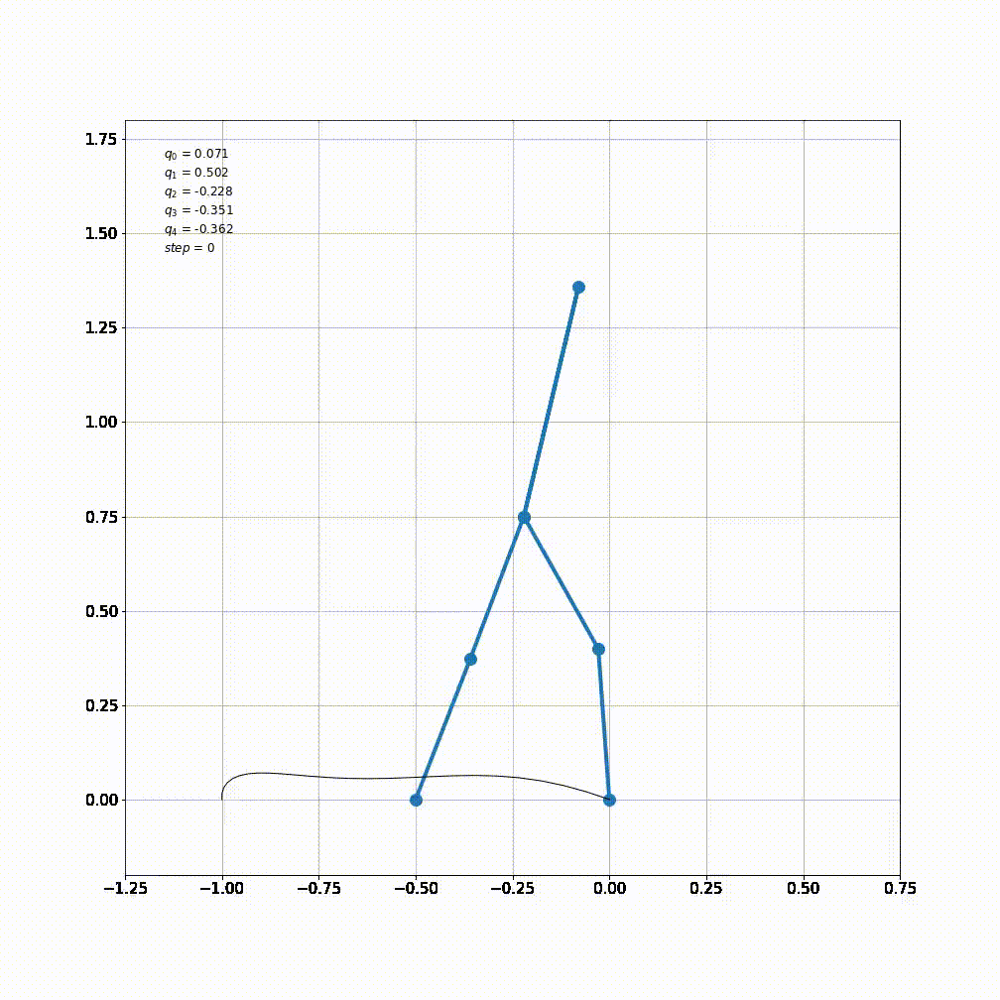
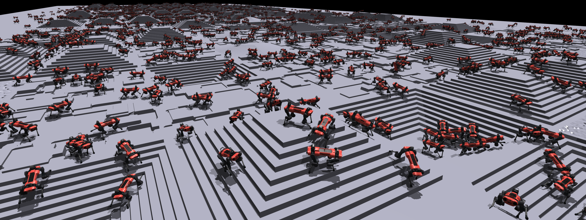

## library

- [drake](https://drake.mit.edu/)
- [openrave]()
- [pyomo]()
- [gekko]()
- [komo-RAI](https://github.com/MarcToussaint/rai)

## projects

- motion planner
    - [py_obca](https://github.com/maozaizhou/py_obca)
    - [Hybrid A* by karlkurzer](https://github.com/karlkurzer/path_planner)
    - [trajopt](https://rll.berkeley.edu/trajopt/doc/sphinx_build/html/)
- trajectory optimization
    - [CHORDS:Collocation methods for second or higher order systems](https://github.com/AunSiro/optibot)
        - [Collocation Methods for Second Order Systems]()
        - error in source code: change `schemas` to `piecewise`
    - [Pontryagin-Differentiable-Programming](https://github.com/wanxinjin/Pontryagin-Differentiable-Programming)
- biped trajectory optimization
    - [biped_trajectory_optimization](https://github.com/IvLabs/biped_trajectory_optimization)
    - [kemba-trajectory-optimisation](https://github.com/chrismailer/kemba-trajectory-optimisation)
    - [Learning To Walk in Minutes](https://leggedrobotics.github.io/legged_gym/)

| PROJECT                     | EXAMPLE                                              |
| --------------------------- | ---------------------------------------------------- |
| CHORDS                      |  |
| Learning To Walk in Minutes |      |

