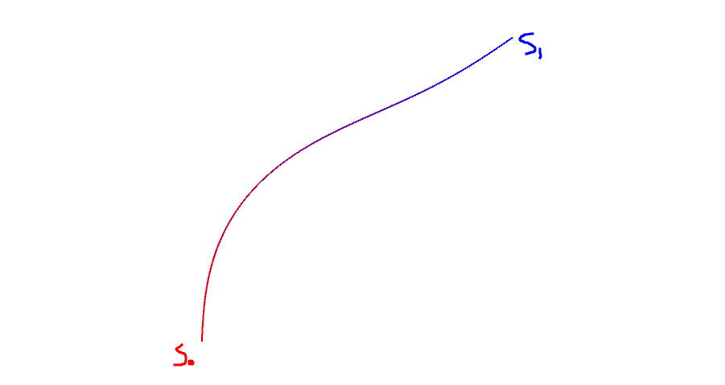
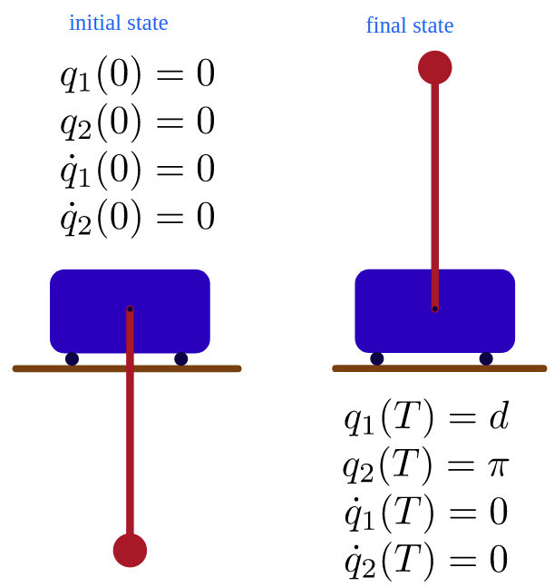
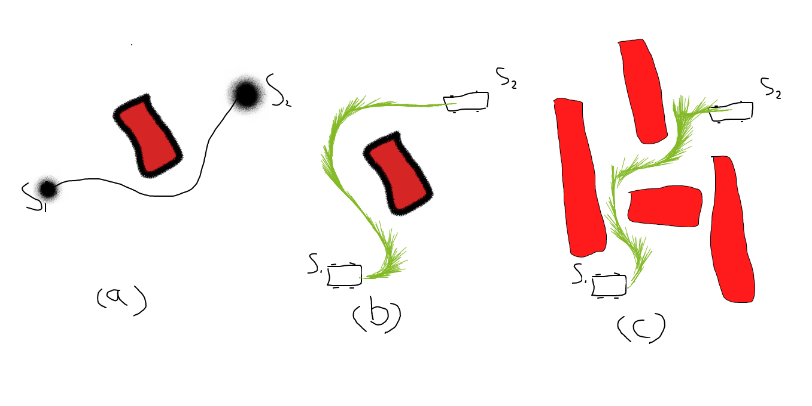

轨迹优化，并不太准确，这里的重点在轨迹上，即怎么产生一条轨迹。

首先，在讨论轨迹之前，定义一下什么是路径。从运动规划角度，路径是由一系列离散位置点组成的：

$$\mathcal{P}=\{(x,)\}, x\in \mathcal{R}^n$$

而轨迹在其基础上增加了动力学因子，这样不仅决定了机器人行走的路径形状，也决定了时序，即什么时候到了哪个位置。

$$\mathcal{J}=\{(x,v,a,...)\}, x\in \mathcal{R}^n\\
\begin{align}x&: 位置  \\
               v&: 速度 \\
               a&: 加速度\end{align}$$

据个人总结，关于轨迹的讨论有三个方向：

1. 根据已有路径点（或者是轨迹点）生成轨迹（轨迹拟合，轨迹通过路经点，不改变路径形状）
2. 直接生成轨迹
3. 根据已有路经点，对其进行优化，并可能改变路经形状（轨迹优化）

## 根据已有点生成轨迹——轨迹拟合

先考虑二维平面两个轨迹点的轨迹拟合：

$$(x_0^1,x_0^2,v_0^1,v_0^2),\quad (x_1^1,x_1^2,v_1^1,v_1^2)$$

常用的方法是通过多项式进行拟合。在二维平面上有两个维度，每个维度都用一个多项式。这里每个维度有四个已知变量，可以用两个三次多项式求出解析解。

$$s_1=a_1+b_1t+c_1t^2+d_1t^3, t\in [0,T]\\
s_2=a_2+b_2t+c_2t^2+d_2t^3, t\in [0,T]\\
\begin{bmatrix}s_1(0) \\s_1(T) \\s_1'(0) \\s_1'(T) \\
s_2(0) \\s_2(T) \\s_2'(0) \\s_2'(T) \end{bmatrix} \begin{bmatrix}a_1 \\a_1+b_1T+c_1T^2+d_1T^3 \\
b_1 \\b_1+2c_1T+3d_1T^2 \\
a_2 \\a_2+b_2T+c_2T^2+d_2T^3 \\
b_2 \\b_2+2c_2T+3d_2T^2  \end{bmatrix} = \begin{bmatrix}x_0^1 \\x_1^1 \\v_0^1 \\v_1^1 \\
x_0^2 \\x_1^2 \\v_0^2 \\v_1^2 \\ \end{bmatrix} $$

如果有多个数据点，则每两点之间拟合一个多项式。

上述的应用一般是根据少量的轨迹点拟合之后，插值得到更加细粒度的轨迹点。

这里能得出解析解是因为路经点的速度已知，若路经点的速度未知，并只给出首尾的速度边界条件，则多项式会有冗余参数，无法求得解析解，这时就可以加入优化目标，比如

$$J=min \sum a^2$$

事实上若s为更高阶的多项式，优化目标也会更加丰富：

$$\begin{align}J&=min \sum a^2 \quad &a=s'' \quad s\in polynominal^3 \\ 
J&=min \sum jerk^2 \quad &jerk=s''' \quad s\in polynominal^5\\
J&=min \sum snap^2 \quad &snap=s'''' \quad s\in polynominal^7
\end{align}$$

## 直接生成轨迹——轨迹规划

这里讨论的是给定起点和终点状态直接生成连续的轨迹，而不依赖中间路经点。

轨迹规划是个人约定，业界不一定是这个含义

> 为什么需要轨迹

考虑上图(a)中平面两个点$s_1,s_2$, 如果没有其他障碍物，则直接直线相连就是最优路径. 而对于图(b)中的平面小车，假设其可以转向，起始状态为：$s_1=(x^1_1,x^2_1,\theta_1=0), s_1=(x^1_2,x^2_2,\theta_2=0)$。对于单纯的路径规划而言这个小车的规划结果跟图(a)中的质点是一样的，直接直线相连。但是在实际中这样的轨迹小车是没办法走的，小车的横向运动必须依赖于前轮纵向转弯，即小车三个维度的运动（纵向，横向，旋转）是耦合的，这种耦合使得小车只能走类似上图中绿色线条的轨迹而不能走一个斜线。

所谓的这种"耦合"性的约束，指的就是机器人的动力学方程(这种耦合有更加专业的描述，比如非完整性约束，欠驱动)，或者控制系统中的状态方程。比如质点的运动模型是最简单的:

$$\begin{bmatrix} \dot{x} \\ \dot{v} \end{bmatrix} = \begin{bmatrix} v \\ a \end{bmatrix} \quad \underrightarrow{\text{对于二维}} \quad
\begin{bmatrix} \dot{x^1} \\ \dot{x^2} \\ \dot{v^1} \\ \dot{v^2} \end{bmatrix}=\begin{bmatrix} v^1 \\ v^2 \\ a^1 \\ a^2 \end{bmatrix}$$

车辆常用的自行车模型可以看出其耦合性：

$$\begin{align}
 \dot{x} &=v\cdot cos(\theta)  \\
 \dot{y} &=v\cdot sin(\theta)  \\
 \dot{\theta} &=\frac{v \cdot tan(\phi)}{L}  \\
 \dot{v} &= a
\end{align}$$

而轨迹优化的目的就是使得计算的结果满足动力学方程，这样才是一条机器人能走的路。

> 轨迹：运动规划 vs 最优控制

上述规划出满足动力学方程的轨迹的过程也是最优控制的范畴。最优控制是在动力系统的约束下在特定的时间内，找到使特定的损失函数最优的控制过程，而这个过程在机器人领域实际上就是运动轨迹（当然最优控制的应用范围更加广泛，这只是其概念覆盖的一小部分，比如最优控制也可以用在电路设计等系统中）。比如我们要控制一个倒立摆，实际上就是找到摆球的轨迹的过程:

$$q_1: \text{小车移动距离}\\
q_2: \text{摆球偏角}$$

\* 图片引用自[trajectory optimization by Matthew Kelly](http://www.matthewpeterkelly.com/tutorials/trajectoryOptimization/cartPoleCollocation.svg#frame1100)

在部分机器人运动的问题上最优控制和轨迹优化指的是同样的过程，虽然两者的覆盖范围并没有完全重叠，但是在本小节所讨论的机器人运动轨迹上是相同的。

既然运动规划的结果并不能让机器人实际行走，而最优控制/轨迹优化能直接计算出符合动力学的轨迹，那么运动规划存在的意义是什么。

考虑在规划中加入障碍物。上图（a）中通过常用的比如搜索或采样的方法可以很快找到一条路径。而图（b）中如果直接采用最优控制的方法，则不得不在约束条件中加入障碍物约束。而最优控制是一个数值计算和优化的过程，如果这样的障碍物比较多(如图c),那么这个最优化过程通常很耗时间或者很难解得出来，但这种障碍物数量和分布情况在运动规划问题中是很常见，也是也比较容易处理的。因此通常见到的最优控制在计算的时候很少会有复杂障碍物的约束，而运动规划则很少见到没有障碍物的问题。总结一下可以看出，运动规划过程考虑更多的同时也比较善于处理的是外界对自身运动的限制，这也是运动规划中通常把机器人看成质点，把规划空间抽象成状态空间的原因。而最优控制更加关注自身动力学的限制，通常是一段较短距离，假设不会发生障碍物碰撞的优化过程，有时也把这个过程叫做局部规划。当然运动规划中也有动力学约束的规划的概念，比如hybrid a*, drnamic rrt等，这些一般是针对低维的平面小车或者是空间飞行器。而对更高阶维度的机械臂，通常采用先规划出路径，在通过轨迹拟合的方法添加时间戳的方式，这也是上一小节讨论的范围。

> 最优控制

对于一个机器人，约定了初始状态和终点状态以及定义了动力学方程之后，符合约束的轨迹通常会有很多条，即轨迹有冗余。有冗余就可以加入优化目标求得最优轨迹。这是最优控制比较简单的理解。

\* 图片引用自[trajectory optimization by Matthew Kelly](http://www.matthewpeterkelly.com/tutorials/trajectoryOptimization/cartPoleCollocation.svg#frame1100)

上图中优化目标的积分项是轨迹优化中常用的指标，这在离散空间里被定义成了累加：
$$\begin{align}J&=\int a^2\approx min \sum a^2 \quad &a=s'' \\ 
J&=\int jerk^2\approx min \sum jerk^2 \quad &jerk=s''' \\
J&=\int snap^2\approx min \sum snap^2 \quad &snap=s'''' \end{align}$$

根据最优控制理论，一般有两种常用的解法：变分法和配点法(variational method and collocation methods, 中文翻译名不一定对)。

变分法是根据微分方程以及欧拉拉格朗日方程(E-L)直接解出目标函数最优的函数形式，在根据边界条件求得函数参数得出最终的函数方程。

比如假设优化目标是使加速度的积分最小:

$$J=\int_{0}^{1} u^{2}(\tau) d \tau=\int_{0}^{1} \ddot{x}^{2}(\tau) d \tau$$

其对应泛函：

$$\mathcal{L}(x, \dot{x}, \ddot{x}|t)=\mathcal{L}(\ddot{x}|t)=\ddot{x}^{2}$$

根据E-L(欧拉拉格朗日)方程:
    $$\frac{\partial \mathcal{L}}{\partial x}-\frac{d}{dt}(\frac{\partial \mathcal{L}}{\partial x'})-\frac{d^2}{dt^2}(\frac{\partial \mathcal{L}}{\partial x''}) =0$$
可推导出x具有三次多项式的形式：
$$x^{(4)}=a_0\\
x=a+bt+ct^2+dt^3$$

在根据边界条件求得$a,b,c,d$.

同理总结为:

- 3次多项式：最小加速度
- 5次多项式：最小jerk
- 7次多项式： 最小snap

这也是上一小节所讨论的采用多项式拟合的理论支撑。

## 根据已有路经点进行优化

在这一小节中，对路经点的优化会改变路经点本身的数值。

其实在上一小节中从无到有的过程已经体现了通过改变路径点进行优化的过程了（比如把原始路径当作初值扔到上述的优化问题中）。但是也正如前所述，上述的方法难以处理复杂的障碍物的情况。对于简单的障碍物，可以用方程表述的，比如平面中的一个圆，可以列出与圆碰撞检测的方程，并把该方程放到约束条件中，从而计算出无碰撞的路径。但是当障碍物无法用方程描述，或者方程非常复杂的时候，就难以找到关于障碍物距离的梯度，也就难以对问题进行优化。因此这里的关键是如何对障碍物相关的代价进行定义，以方便方程能够进行梯度优化。

目前了解到的三个知名度较高的轨迹优化的方法：CHOMP， STOMP， TrajOpt， 其核心思路都是在上一小节的基础上增加了对障碍物的定义，然后通过梯度进行优化。另外这三种方法也都是“标准的”在构型空间里对轨迹进行优化的方法，即所有的动力学方程都被简化为质点模型，这也是运动规划比较通用的形式，也是更加适合机械臂的方法（假设机械臂各个关节的运动相互独立）。

## 一些想法

轨迹: 可以称为一条曲线，但是这条曲线本身并不依赖时间因子。同样的一条曲线可以以不同的速度运动。因此这条曲线上面的导数并不代表速度，如果在二维(X-Y), 这个导数代表了不同纬度速度的比值,而不是速度本身。

曲线：曲线需要有规律。这个规律是指可以用有限个参数的函数来表示，这样才能约束点与点之间的关系。另一方面，为了满足运动学特性，需要曲线n阶连续(速度，加速度...),所以一般会选择多项式来进行曲线拟合。曲线需要满足一些条件，比如路经点的位置，速度，加速度等作为约束。这样的曲线可能有无数条，因此再定义一个目标函数(比如，路径最短，能量最小等)转化为一个优化问题，求出在该目标函数下最优的一条曲线。

参数方程(以二维平面举例)：若只关注曲线，没有速度，加速度，则位置以s为参数进行表示。

曲率: 描述了几何体的弯曲程度。在二维平面上，曲率表示了曲线上某个点的切线方向角对弧长的转动率。曲率代表了曲线本身的特性。

$$\kappa=\kappa(s)  \\
\theta=\int \kappa(s)ds$$

尺度: 不同尺度相同位置的点会得到相同的曲线， 这样会造成原本只需首尾是曲线中间大部分是直线的解没办法得到。即曲线只适合较短路径的拟合？(受制于参数方程的本身特性)

## optimization library

- [ceres_sandbox](https://github.com/superjax/ceres_sandbox/blob/master/lib/factors/include/factors/dynamics_1d.h)

## ref

- blog 
    - [trajectory optimization slides](http://www.matthewpeterkelly.com/tutorials/trajectoryOptimization/cartPoleCollocation.svg#frame1129)
        - [OptimTraj-maTLAB](https://github.com/MatthewPeterKelly/OptimTraj/tree/master/demo/cartPole)
        - [2017-An Introduction to Trajectory Optimization: How to Do Your Own Direct Collocation]()
    - [Transcription Methods for Trajectory Optimization](https://arxiv.org/pdf/1707.00284.pdf)
    - [轨迹优化04. 轨迹拟合 & 轨迹插值](https://zhuanlan.zhihu.com/p/342012866)
    - [Tutorial 6: Trajectory Optimization for Underactuated Robots -Day 2 - Tuesday, July 24](https://www.youtube.com/watch?v=4BZRP6h12lI)
    - [Optimal Control Tutorial 3 - Trajectory Optimization](https://www.youtube.com/watch?v=x4l-Cjxxufg)
- project
    - [polytraj](https://github.com/jsford/PolyTraj)
    - [Trajectory Optimization motion planning](https://github.com/bestvibes/motion-planner)
    - [Convex Optimization for motion plannin](https://github.com/Theochiro/motion-planning)
    - [trajopt](https://rll.berkeley.edu/trajopt/doc/sphinx_build/html/)
    - [kRRT* with fast RO](https://github.com/kyleYehh/kino_sampling_with_regional_opti)
    - [RacingTrajectoryOptimization](https://github.com/janismac/RacingTrajectoryOptimization)
- course
    - [台大机器人学之运动学——林沛群-b站](https://www.bilibili.com/video/BV1v4411H7ez)
- paper
    