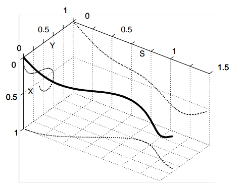

## 2003-Reactive Nonholonomic Trajectory Generation via Parametric Optimal Control

**Abstract**

1. parametric trajectory reduce computation time, at the cost os potentially introducing suboptimality

**Formulation**
for a vehicle actuated in curvature and speed:

$$\begin{array}{ll}
\dot{x}(t)=V(t) \cos \theta(t) & \dot{\theta}(t)=\kappa(t) V(t) \\
\dot{y}(t)=V(t) \sin \theta(t) & { }_{\mathrm{K}}(t)=u(t)
\end{array}$$

from time to distance(以行驶举例作为参数):

$$\begin{aligned}
&x(s)=\int_{0}^{s} \cos \theta(s) d s \quad \theta(s)=\int_{0}^{s} \kappa(s) d s \\
&y(s)=\int_{0} \sin \theta(s) d s \quad \kappa(s)=u(s)
\end{aligned}$$

变分法把最优控制问题转化为非线性优化问题。

**solution using polynominal spirals**

$$\begin{aligned}
\kappa(s) &=a+b s+c s^{2}+d s^{3}+\cdots \\
\frac{d}{d s} x(s) &=\cos \theta(s) \\
\frac{d}{d s} y(s) &=\sin \theta(s) \\
\frac{d}{d s} \theta(s)&=\kappa(s)
\end{aligned}
$$

**polytraj 代码原理**

- path：只有路径，以曲率为路径长度的函数
    - start($x_s,y_s,\theta_s,\kappa_s$)
    - end($x_e,y_e,\theta_e,\kappa_e$)
    - 初始化一个曲率多项式: $\kappa(s) =a+b s+c s^{2}+d s^{3}+\cdots$
    - 根据动力学约束根据起点求终点, 并最小化终点误差：

    $end\_state=\int_0^1g(\kappa)   \\
    \min_{s,a,b,\cdots} \quad J=||\Delta e||^2$
    - 在代码中使用了Simpson积分公式，首先估计了路径总长度，然后根据路径点均分。
- trajectory：加入了速度和加速度，一条曲线为曲率函数，一条为加速度
    - start($x_s,y_s,\theta_s,\kappa_s, v_s, a_s$)
    - end($x_e,y_e,\theta_e,\kappa_e$)

## 参数方程/参数曲线/样条曲线：五次样条和三次螺旋线对比

都是参数方程：样条曲线可以选择一个定义域为[0,1]的控制量

- quintic splines:  对于二维平面，x和y分别由一个五次样条参数曲线生成，一共有12个参数。在设置完边界条件之后存在封闭解。但是难以对于曲率做控制。

$$\begin{gathered}
x(u)=\alpha_{5} u^{5}+\alpha_{4} u^{4}+\alpha_{3} u^{3}+\alpha_{2} u^{2}+\alpha_{1} u+\alpha_{0} \\
y(u)=\beta_{5} u^{5}+\beta_{4} u^{4}+\beta_{3} u^{3}+\beta_{2} u^{2}+\beta_{1} u+\beta_{0} \\
u \in[0,1]
\end{gathered}$$

曲率变化

$$\kappa(u)=\frac{x^{\prime}(u) y^{\prime \prime}(u)-y^{\prime}(u) x^{\prime \prime}(u)}{\left(x^{\prime}(u)^{2}+y^{\prime}(u)^{2}\right)^{\frac{3}{2}}}$$

- Polynomial Spirals：曲率被定义为路径长度的多项式函数，方便对曲率做控制。由于曲率值不会像在五次样条曲线中那样迅速变化。一般通过限制螺旋线和螺旋线中仅几个点的曲率，就很可能满足了整个曲线上的曲率约束。但是由于位置的计算是三角函数的积分形式，难以找出封闭解，因此需要数值逼近。

$$\begin{gathered}
x(s)=x_{0}+\int_{0}^{s} \cos \left(\theta\left(s^{\prime}\right)\right) d s^{\prime} \\
y(s)=y_{0}+\int_{0}^{s} \sin \left(\theta\left(s^{\prime}\right)\right) d s^{\prime} \\
\int_{0}^{s} f\left(s^{\prime}\right) d s^{\prime} \approx \frac{s}{3 n}\left(f(0)+4 f\left(\frac{s}{n}\right)+2 f\left(\frac{2 s}{n}\right)+\cdots+f(s)\right)
\end{gathered}$$

曲率约束：除了边界点之外，把线段分成三段，对中间两个点($/frac{1}{3}s, frac{2}{3}s$)作曲率约束。

$$|\kappa(\frac{s}{3})|\leq\kappa_{max} \\
|\kappa(\frac{2s}{3})|\leq\kappa_{max}$$

## parameter remapping

参数重映射：选取三段平分点的曲率和弧长作为五个参数，反解原始曲率曲线参数的a,b,c,d.降低数值迭代的不稳定性

$$\begin{array}{cc}
k(0)=p 0 & a(p)=p 0 \\
k\left(\frac{s_{G}}{3}\right)=p 1 & b(p)=-\frac{11 p 0-18 p 1+9 p 2-2 p 3}{2 s_{G}} \\
k\left(\frac{2 s_{G}}{3}\right)=p 2 & c(p)=\frac{9(2 p 0-5 p 1+4 p 2-p 3)}{2 s_{G}^{2}} \\
k\left(s_{G}\right)=p 3 & d(p)=-\frac{9(p 0-3 p 1+3 p 2-p 3)}{2 s_{G}^{3}}
\end{array}$$

## ref

- blog 
    - [参数化最优控制 约束-控制-图形参数](https://blog.csdn.net/Neo11111/article/details/105960645)
    - [基于多项式螺旋曲线的轨迹优化](https://blog.csdn.net/github_39582118/article/details/117754864?utm_medium=distribute.pc_relevant.none-task-blog-2~default~baidujs_title~default-1.control&spm=1001.2101.3001.4242)
    - [Smooth Local Planning 实现](https://zhuanlan.zhihu.com/p/93980119)
- project 
- course
- paper
    - [2011-Parallel Algorithms for Real-time Motion Planning](https://www.ri.cmu.edu/pub_files/2011/7/mcnaughton-thesis.pdf)
    - [2003-parametric trajectory reduce computation time, at the cost os potentially introducing suboptimality]()
    - [2008-Online Safe Trajectory Generation for Quadrotors Using Fast Marching Method and Bernstein Basis Polynomial]()
    