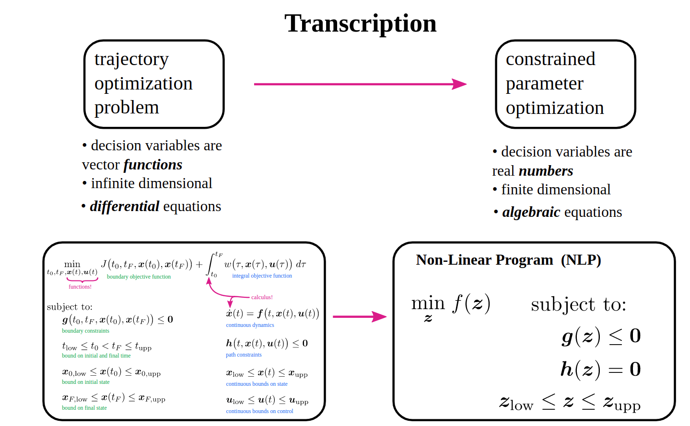
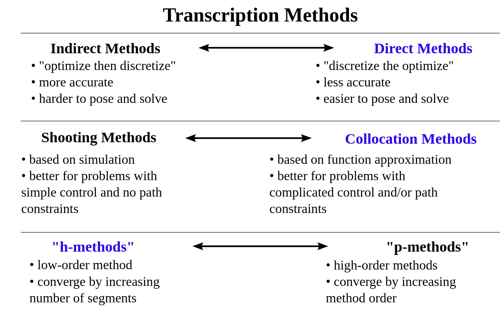
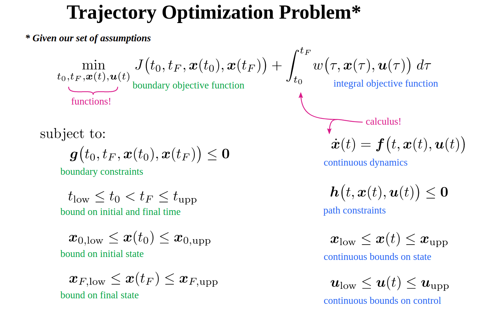

- optimization based motion planning
- optimization based optimal control


从最优控制的角度，轨迹优化侧重于在满足状态约束情况下获得最优的控制量。从运动规划角度，轨迹优化侧重于获得最优的状态量。当然大部分情况下两者是统一的。

## Methods form Optimal control perspective

最优控制的解法一般有三种方法：

- <font style='background: #007f16;color: #ffffff;opacity:1.0;border-radius: 5px; padding:5px;'>Dynamic Programming</font>: Solve Hamilton-Jacobi-Bellman Equations over the entire state space.
- <font style='background: #007f16;color: #ffffff;opacity:1.0;border-radius: 5px; padding:5px;'>Indirect Methods</font>: Transcribe problem then find where the slope of the objective is zero.
- <font style='background: #007f16;color: #ffffff;opacity:1.0;border-radius: 5px; padding:5px;'>Direct Methods</font>: Transcribe problem then find the minimum of the objective function

轨迹优化主要关注第三种即直接法，通过构造一个优化问题进行求解。直接法又分为shooting和collocation方法，主要是从状态方程的表示方法上区分的。

**<font color='Tomato'>Direct method</font>**
<font color='Tomato'>Shooting:</font> 离散控制量,根据状态方程通过积分求得状态量
- single shooting
- multiple shooting

$$\begin{aligned}\min_{u^0 \cdots u^t}&\quad \sum(J(x^t)) \\
s.t. & \quad x^{t+1} = f(x^t, u^t)\end{aligned}$$

<font color='Tomato'>Collocation(Simultaneous method):</font>同时离散控制量和状态量,把状态方程当作等式约束
- Direct collocation
- Orthogonal collocation
$$\begin{aligned}\min_{u^0 \cdots u^t, x^0 \cdots x^t}&\quad \sum(J(x^t)) \\
s.t. & \quad x^{t+1} = f(x^t, u^t)\end{aligned}$$

<font color='Tomato'>Pseudospectral(伪谱法):</font>

## Methods form motion planning perspective

运动规划的视角更关注状态的相关约束怎么表示，比如轨迹的曲率，障碍物的表示等等。这些轨迹优化的方法难以进行系统性的区分。比较知名的基于优化的规划器：

- TEB
- CHOMP
- STOMP
- TrajOpt
- ...


运动规划视角: 轨迹拟合 轨迹插值 轨迹优化
## 离散空间




轨迹优化是一个求解泛函优化的问题。可以将该问题离散化。转化为一个函数优化的问题，降低求解难度。（泛函优化和函数优化）即直接求解轨迹点而不关注该函数的表达式。把一个微分方程转化为有m*n（维度*控制点）个优化参数的优化问题。

微分方程和离散法对比：基于微分方程的变分法是更加精确的解法，但是求解通常比较困难，特别在复杂问题以及有约束的情况下。而离散优化的方法则更加通用，降低求解复杂度，虽然牺牲了一些精确性（由于插值的存在，曲线可能不是最优）。



- mesh refinement: 
    - h-method: increase number of segments
    - p-method: increase polynomial order

## 轨迹优化

- 约束： 系统动力学。边界条件
- 可行解: 满足约束的解
- 目标函数: 包含边界项和积分项
- 最优解: 最小化目标函数的解



## 变分法

设优化目标是使加速度的积分最小:

$$J=\int_{0}^{1} u^{2}(\tau) d \tau=\int_{0}^{1} \ddot{x}^{2}(\tau) d \tau$$

其对应泛函：

$$\mathcal{L}(x, \dot{x}, \ddot{x}|t)=\mathcal{L}(\ddot{x}|t)=\ddot{x}^{2}$$

根据E-L(欧拉拉格朗日)方程:
    $$\frac{\partial \mathcal{L}}{\partial x}-\frac{d}{dt}(\frac{\partial \mathcal{L}}{\partial x'})-\frac{d^2}{dt^2}(\frac{\partial \mathcal{L}}{\partial x''}) =0$$
可推导出x具有三次多项式的形式：
$$x^{(4)}=0$$

同理可以求得:

- 3次多项式：最小加速度
- 5次多项式：最小jerk
- 7次多项式： 最小snapw

## 轨迹拟合

通过连续曲线连接路经点

维度：拟合的曲线参数组数跟数据点的维度一致

**polynomials**

三次多项式曲线： $\theta(t)=a_0+a_1t+a_2t^2+a_3t^3$

边界条件:

$$\begin{bmatrix}\theta_i \\ \theta_{i+1} \\ \dot\theta_i \\ \dot\theta_{i+1}  \end{bmatrix} =
\begin{bmatrix} 1 & 0& 0&0 \\
     1 & \Delta t& \Delta t^2&\Delta t^3 \\
      0 & 1& 0&0 \\
     0 & 1& 2\Delta t& 3\Delta t^2 
 \end{bmatrix}  \begin{bmatrix} a_0 \\a_1\\a_2\\a_3\end{bmatrix}$$

保证速度连续，有唯一解

多个数据点 -> 曲线拟合：

- n个数据点， m维度
- (n-1)*m条曲线， 4*(n-1)*m个
- 首尾边界条件 + 中间边界条件 + 中间连续条件 = 4*m+2*(n-2)*m+2*(n-2)*m=4*(n-1)*m

**正交多项式**

根据变分法中求得的微分方程，需要根据具体条件解出该方程的参数。这里可以使用正交多项式来求解。

两类常用正交多项式：
    
$$\begin{aligned}
\text{基于Taylor展开的指数多项式}\quad &1, t, t^{2}, t^{3}, \ldots\\
\text{基于Fourier展开的三角多项式}\quad&1, \sin t, \cos t, \sin 2 t, \cos 2 t, \ldots
\end{aligned}$$

- 多项式轨迹拟合:
    - 最小加速度： $x(t)=a_{0}+a_{1} t+a_{2} t^{2}+a_{3} t^{3}$
    - 最小jerk: $\quad x(t)=a_{0}+a_{1} t+a_{2} t^{2}+a_{3} t^{3}+a_{4} t^{4}+a_{5} t^{5}$
    - 最小snap: $\quad x(t)=a_{0}+a_{1} t+a_{2} t^{2}+a_{3} t^{3}+a_{4} t^{4}+a_{5} t^{5}+a_{6} t^{6}+a_{7} t^{7}$
- 三角函数轨迹拟合:
    - 正弦轨迹: $ x(t)=a_{0}+a_{1} \cos a_{2} t+a_{3} \sin a_{2} t $
    - 摆线轨迹: $ x(t)=a_{0}+a_{1} t-a_{2} \sin a_{3} t $
    - Fourier轨迹: $x(t)=\frac{A_{0}}{2}+\sum_{n=1}^{\infty}\left[A_{n} \cos n t+B_{n} \sin n t\right]$

    $$\begin{gathered}
A_{0}=\frac{1}{\pi} \int_{-\pi}^{\pi} x(t) d t \\
A_{n}=\frac{1}{\pi} \int_{-\pi}^{\pi} x(t) \cos n t d t \\
B_{n}=\frac{1}{\pi} \int_{-\pi}^{\pi} x(t) \sin n t d t
\end{gathered}$$

## 数值积分

插值型数值积分方法：

1. 梯形公式： $I_{1}(f)=\frac{b-a}{2}(f(a)+f(b))$
2. Simspon公式: $I_{2}(f)=\frac{b-a}{6}\left(f(a)+4 f\left(\frac{a+b}{2}\right)+f(b)\right)$
3. cote
4. gauss
5. 复化Simspon
6. ....

<font color='Tomato'>Runge-Kutta methods</font>

对于一个积分问题, 我们希望通过离散的微分得到积分值. 举例来说,对于初值问题:
$$y' = f(t, y), y(t_0) = y_0$$

这里f是已知的,即导数是可以精确得到的.如果已知$y_n$, 在较小时间步长$h$下, 可以得到$y_{n+1}$:

$$y_{n+1} = y_n + h\cdot f(t_n, y_n)$$

这也被称为<font style='background: #007f16;color: #ffffff;opacity:1.0;border-radius: 5px; padding:5px;'>一阶精度的欧拉公式</font>, 其累积误差为$O(h)$.

一种改进的欧拉法:

$$y_{n+1} = y_n + \frac{h}{2}\cdot (f(t_n, y_n)+f(t_n + h, y_n + hf(t_n, y_n))$$

<font style='background: #007f16;color: #ffffff;opacity:1.0;border-radius: 5px; padding:5px;'>Runge-Kutta方法</font>进一步修正了迭代方法:

$$\begin{aligned}y_{n+1} &= y_n + \frac{h}{6}\cdot (k_1+2k_2+2k_3+k_4) \\
\text{其中:}&\\
k_1 &=f(t_n, y_n)\\
k_1 &=f(t_n + \frac{h}{2}, y_n + \frac{h}{2}k_1)\\
k_1 &=f(t_n + \frac{h}{2}, y_n+ \frac{h}{2}k_2)\\
k_1 &=f(t_n + h, y_n + hk_3)
\end{aligned}$$

- $k_1$是时间段开始时的斜率；
- $k_2$是时间段中点的斜率，通过欧拉法采用斜率$k_1$来决定y在点tn + h/2的值；
- $k_3$也是中点的斜率，但是这次采用斜率$k_2$决定y值；
- $k_4$是时间段终点的斜率，其y值用$k_3$决定。

上述是4阶Runge-Kutta方法, 也被称为RK4, 其每步的误差是$h^5$阶，而总积累误差为$h^4$阶.

```python
'''implemented in shooting method'''
f = Function(x, u)-> [xdot, L] # L(x, u) is the cost
Q = 0 # overall cost
for j in range(M):
       k1, k1_q = f(X, U)
       k2, k2_q = f(X + DT/2 * k1, U)
       k3, k3_q = f(X + DT/2 * k2, U)
       k4, k4_q = f(X + DT * k3, U)
       X=X+DT/6*(k1 +2*k2 +2*k3 +k4)
       Q = Q + DT/6*(k1_q + 2*k2_q + 2*k3_q + k4_q)

```

**<font color='Tomato'>Trapezoidal</font>**


Integrals:

$$\min _{u(t)} \int_{t_{0}}^{t_{N}} u^{2}(\tau) d \tau \approx \min _{u_{0} . . u_{N}} \sum_{k=0}^{N-1} \frac{1}{2}\left(h_{k}\right)\left(u_{k}^{2}+u_{k+1}^{2}\right) \\
\int_{t_{0}}^{t_{F}} w(\tau, \boldsymbol{x}(\tau), \boldsymbol{u}(\tau)) d \tau \quad \approx \sum_{k=0}^{N-1} \frac{1}{2} h_{k} \cdot\left(w_{k}+w_{k+1}\right)$$

system dynamics:

$$\begin{aligned}
\dot{\boldsymbol{x}} &=\boldsymbol{f}, \\
\int_{t_{k}}^{t_{k+1}} \dot{\boldsymbol{x}} d t &=\int_{t_{k}}^{t_{k+1}} \boldsymbol{f} d t, \\
\boldsymbol{x}_{k+1}-\boldsymbol{x}_{k} & \approx \frac{1}{2} h_{k} \cdot\left(\boldsymbol{f}_{k+1}+\boldsymbol{f}_{k}\right)
\end{aligned}$$

Interpolation: 从控制点恢复连续轨迹

$$\begin{gathered}
\boldsymbol{f}(t)=\dot{\boldsymbol{x}}(t) \approx \boldsymbol{f}_{k}+\frac{\tau}{h_{k}}\left(\boldsymbol{f}_{k+1}-\boldsymbol{f}_{k}\right) \\
\boldsymbol{x}(t)=\int \dot{\boldsymbol{x}}(t) d \tau \approx \boldsymbol{c}+\boldsymbol{f}_{k} \tau+\frac{\tau^{2}}{2 h_{k}}\left(\boldsymbol{f}_{k+1}-\boldsymbol{f}_{k}\right) \\
\qquad \boldsymbol{x}(t) \approx \boldsymbol{x}_{k}+\boldsymbol{f}_{k} \tau+\frac{\tau^{2}}{2 h_{k}}\left(\boldsymbol{f}_{k+1}-\boldsymbol{f}_{k}\right)
\end{gathered}$$

**<font color='Tomato'>Hermite–Simpson</font>**

$$\int_{t_{0}}^{t_{F}} w(\tau) d \tau \approx \sum_{k=0}^{N-1} \frac{h_{k}}{6}\left(w_{k}+4 w_{k+\frac{1}{2}}+w_{k+1}\right)$$

system dynamics
$$\begin{aligned}
&x_{k+1}-x_{k}=\frac{1}{6} h_{k}\left(\boldsymbol{f}_{k}+4 \boldsymbol{f}_{k+\frac{1}{2}}+\boldsymbol{f}_{k+1}\right) \\
&x_{k+\frac{1}{2}}=\frac{1}{2}\left(x_{k}+x_{k+1}\right)+\frac{h_{k}}{8}\left(\boldsymbol{f}_{k}-\boldsymbol{f}_{k+1}\right)
\end{aligned}$$

Interpolation: 从控制点恢复连续轨迹

$$\tau=t-t_{k}  \\
h_{k}=t_{k+1}-t_{k} \\
\boldsymbol{u}(t)=\frac{2}{h_{k}^{2}}\left(\tau-\frac{h_{k}}{2}\right)\left(\tau-h_{k}\right) \boldsymbol{u}_{k}-\frac{4}{h_{k}^{2}}(\tau)\left(\tau-h_{k}\right) \boldsymbol{u}_{k+\frac{1}{2}}+\frac{2}{h_{k}^{2}}(\tau)\left(\tau-\frac{h_{k}}{2}\right) \boldsymbol{u}_{k+1}    \\
\begin{aligned}
&\boldsymbol{x}(t)=\int \dot{\boldsymbol{x}} d t \\
&=\int\left[\boldsymbol{f}_{k}+\left(-3 \boldsymbol{f}_{k}+4 \boldsymbol{f}_{k+\frac{1}{2}}-\boldsymbol{f}_{k+1}\right)\left(\frac{\tau}{h_{k}}\right)+\left(2 \boldsymbol{f}_{k}-4 \boldsymbol{f}_{k+\frac{1}{2}}+2 \boldsymbol{f}_{k+1}\right)\left(\frac{\tau}{h_{k}}\right)^{2}\right] d t
\end{aligned}   \\
\begin{aligned}
\boldsymbol{x}(t)=& \boldsymbol{x}_{k}+\boldsymbol{f}_{k}\left(\frac{\tau}{h_{k}}\right)+\frac{1}{2}\left(-3 \boldsymbol{f}_{k}+4 \boldsymbol{f}_{k+\frac{1}{2}}-\boldsymbol{f}_{k+1}\right)\left(\frac{\tau}{h_{k}}\right)^{2} \\
&+\frac{1}{3}\left(2 \boldsymbol{f}_{k}-4 \boldsymbol{f}_{k+\frac{1}{2}}+2 \boldsymbol{f}_{k+1}\right)\left(\frac{\tau}{h_{k}}\right)^{3}
\end{aligned}$$


## 最优控制

- [Numerical Optimal Control-course](https://www.syscop.de/teaching/ss2020/numerical-optimal-control-online)
- [NUMERICAL METHODS FOR OPTIMAL CONTROL](https://mariozanon.wordpress.com/numerical-methods-for-optimal-control/)
- [zhihu - optimal control](https://www.zhihu.com/column/c_1378929738640089088)


## ref

- blog 
    - [trajectory optimization slides](http://www.matthewpeterkelly.com/tutorials/trajectoryOptimization/cartPoleCollocation.svg#frame1129)
        - [OptimTraj-maTLAB](https://github.com/MatthewPeterKelly/OptimTraj/tree/master/demo/cartPole)
        - [2017-An Introduction to Trajectory Optimization: How to Do Your Own Direct Collocation]()
    - [Transcription Methods for Trajectory Optimization](https://arxiv.org/pdf/1707.00284.pdf)
    - [轨迹优化04. 轨迹拟合 & 轨迹插值](https://zhuanlan.zhihu.com/p/342012866)
    - [Trajectory Optimization 多种优化方法如何选择](https://zhuanlan.zhihu.com/p/478927012)
    - [cartPole dynamics](http://www.matthewpeterkelly.com/tutorials/cartPole/)
     - [Optimal_Control ppt](https://github.com/MeMory-of-MOtion/summer-school/blob/master/materials/memmo_summer_school_Optimal_Control_Nicolas_Mansard.pdf)
- project
    - [cartpole_casadi_cplusplus](https://github.com/ytwboxing/cartpole_casadi_cplusplus)
    
- course
    - [台大机器人学之运动学——林沛群-b站](https://www.bilibili.com/video/BV1v4411H7ez)
    - [CS287-FA19](https://people.eecs.berkeley.edu/~pabbeel/cs287-fa19/0)

```
L1 Course Introduction: https://youtu.be/xWPViQ6LI-Q
L2 MDPs: Exact Methods: https://youtu.be/H_9YQBN45fo
L3 Discretization of Continuous State Space MDPs: https://youtu.be/mJlAfKc4990
L4 Function Approximation / Feature-based Representations: https://youtu.be/I0LykEdXDPk
L5 LQR, iterative LQR / Differential Dynamic Programming: https://youtu.be/S5LavPCJ5vw 
L6 Unconstrained Optimization: https://youtu.be/77dOsZbAGgU
L7 Constrained Optimization: https://youtu.be/gFewyKcDFXI
L8 Optimization-based Control: Collocation, Shooting, MPC (basics/foundations): https://youtu.be/ha60pQdepMY 
L9 Optimization-based Control: Collocation, Shooting, MPC, Contact-Invariant Optimization (advanced) -- Igor Mordatch: https://youtu.be/pBCVQbZtv78 
L10 Motion Planning: RRT, PRM, Trajopt, 3-d poses: https://youtu.be/ZDuoQRutcfk
L11 Probability Review, Bayes Filters, Multivariate Gaussians: https://youtu.be/xamzdNUN1o0
L12 Kalman Filtering, EKF, UKF -- Ignasi Clavera: https://youtu.be/eCjffhEeQyw
L13 Smoother, MAP, Maximum Likelihood, EM, KF parameter estimation: https://youtu.be/qHLLMg0Teg4 
L14 Particle Filters -- Wolfram Burgard: https://youtu.be/8k--yWn8_ds 
L15 POMDPs: https://youtu.be/2dNp7QyoF_k
L17 Imitation Learning -- Laura Smith: https://youtu.be/8uQkk-JFHtA 
L18 RL1: Policy Gradients: https://youtu.be/LsKXJl-_kzk 
L19 RL2: Off-policy RL: https://youtu.be/QASqaj_HUZw
L20 RL3: Model-based RL: https://youtu.be/Y2XBiUtZo1k
L21 How do simulators work? https://youtu.be/HRp6DH5M7Co
L22 Sim2Real -- Josh Tobin: https://youtu.be/ac_W9IgKX2c
L23 INDUSTRY: Skydio (drones): Adam Bry/Hayk Martirosyan: https://youtu.be/Yizyv8MpYfg
L24 Backstories behind how some papers were originated and came together: https://youtu.be/kr6k_SyKsh0
L25 Autonomous Helicopters and Course Wrap-Up: https://youtu.be/qKZhtYviqSU


Full Course: https://people.eecs.berkeley.edu/~pabbeel/cs287-fa19/
```
- paper
    