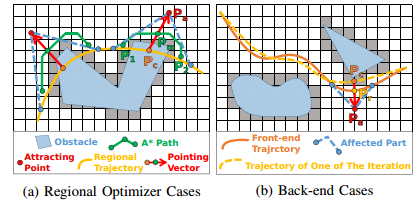

- elastic band
- chomp
- stomp
- trajopt
- itomp

轨迹优化的层次：安全， 轨迹平滑， 控制可行。运动规划侧重前两个， 最优控制侧重后两个。而在轨迹规划既涉及到运动规划，又涉及到最优控制，因此概念上覆盖全部的三个层次。

- collision-free：
- kinematically feasible
- dynamically feasible

优化的方法：区别在与对约束函数或者是目标函数的整理。类似于直接计算并不太好计算，而是进一步整理成另一种更加容易计算或者是更加高效的形式

## 2021 - Integrating Fast Regional Optimization into Sampling-based Kinodynamic Planning for Multirotor Flight

**intro**

1. use kinodynamic rrt* as the heuristic plan, then optimized by a regional trajectory optimizer
2. this optimizer is a sequence of QP problem
3. regional trajectory optimizer reference:
    - [2016-A framework to integrate local information into optimal path planning]()
    - [2018-Dancing prm*: Simultaneous planning of sampling and optimization with configuration free space approximation]()
    - [2019 Volumetric tree*: Adaptive sparse graph for effective exploration of homotopy classes]()

**related workd**

regional optimization: consider the local domain information, such as CHOMP

problem: inefficient for narrow passage situation

**methodogy**

k-rrt*: 

- solve BVP by Pontryagin Maximum Principle, obtaining the optimal transition time τ∗ and deriving the unconstrained optimal transition  rajectory as a 5th-degree polynomial.
- check collision, if the path is violated, then relax τ to get a new polynominal

quadratic objective function:

1. smoothness cost: squared jerk
2. resemblance cost: distance to original trajectory
3. collision cost: distance to some anchor point, which  providing dragging force to draw the collided part to nearby collision-free areaas

$$\begin{aligned}
J_{c} &=\sum_{a p \in A P s} \int_{t_{s, a p}}^{t_{e, a p}}\left[p(t)-p_{a p}(t)\right]^{2} d t \\
&=\sum_{a p \in A P s} \sum_{i \in L}\left(\mathbf{c}_{i}-\mathbf{c}_{i}^{a p}\right)^{\top} \int_{t_{s, i, a p}}^{t_{c, i, a p}} \mathbf{t t}^{\top} d t\left(\mathbf{c}_{i}-\mathbf{c}_{i}^{a p}\right) \\
&=\sum_{a p \in A P s}\left(\mathbf{c}-\mathbf{c}^{a p}\right)^{\top} \mathbf{Q}_{c, a p}\left(\mathbf{c}-\mathbf{c}^{a p}\right)
\end{aligned}$$

iteractive optimization process

1. solve the quadratic objective iteractively
2. it cillides with new obstacles, adding new attracting points to provide accurate dragging force
3. if the state and control violate saturations, increase time duration
4. selection of the attracting points: 标记轨迹中碰撞区域（更高维度中很难决定哪些区域是碰撞的）的起点和终点，通过A* 快速找到一条无碰撞路径。选取碰撞轨迹区段中点与A*路径中点向外延伸作为`attracting point`.,通过局部选择牵引点的方式避免计算碰撞梯度

**overview**

对于障碍物的表达： 使用A* 选取牵引点，以与牵引点的距离作为优化梯度避开障碍物

**trajectory refinement**
## trajopt

#### introduction

1. use l1 penalties for equality and inequality
2. computed signed distance using convex-convex collision detection

#### related work

轨迹优化是最优控制中的一个基本概念。

- potential field
- CHOMP
- STOMP
- ITOMP

#### Sequential Convex Optimization

solves a non-convex optimization problem by repeatedly constructing a convex subproblem—an approximation to the problem around the current iterate x

turning the infeasible constraints into penalty:

$$g_i(x) \leq 0 \quad \longrightarrow \quad  |g_i(x)|^+ \\
h_i(x)  =0 \quad \longrightarrow \quad  |h_i(x)| \\
\text{where}\quad |x|^+ = \max(x,0)$$

two loops:

- outer loop(PenaltyIteration):  increase the penalty coefficient µ until all the constraints are satisfied
- next loop(ConvexifyIteration): repeatedly construct a convex approximation to the problem 

l2 VS l1:

## chomp

functional gradient: 泛函梯度

$$\bar{\nabla} u[\xi]=\frac{\partial v}{\partial \xi}-\frac{d}{d t} \frac{\partial v}{\partial \xi^{\prime}}$$

梯度下降：

$$\xi_{i+1}=\xi_{i}-\eta_{i} \bar{\nabla} U[\xi]$$

## stomp

## moveit 三种轨迹优化方法对比

- Time-optimal Trajectory Parameterization
- Iterative Spline Parameterization
- Iterative Parabolic Time Parameterization

## time optimal path

## 2014-TOPP

A General, Fast, and Robust Implementation of the Time-Optimal Path Parameterization Algorithm

#### introduction

three families of methods：

- dynamic programming: divide the$(s, \dot{s})$ plane into a grid and find the optimal trajectory in the $(s,\dot{s})$ plane
- convex optimization: discretize the s-axis into N segments and subsequently convert into a convex optimization problem
- numerical integration: Pontryagin Maximum Principle(庞特里雅金极大原理 ), the optimal trajectory in the $(s, \dot{s})$ plane is known to be “bang-bang” and can thus be found by integrating successively the maximum and minimum accelerations $\ddot{s}$. But the programming is difficult with the so-called dynamic singularities

This paper develops a numerical integration method considering the dynamic singularities.

bang-bang control: 起停式控制，有迟滞区间。在最优控制中，若最优控制信号为其上限或下限，则该最优控制问题可以以起停式控制为最优解。起停式控制常出现在最短时间的最佳控制问题中[2]。例如要车辆行驶一定距离，且从出发到最后停止的时间要最短，其解法是在经过某一“切换点”前用最大油门加速，过切换点后以最大刹车方式刹车，让车停在想要的位置。---- [wiki](https://zh.wikipedia.org/wiki/%E8%B5%B7%E5%81%9C%E5%BC%8F%E6%8E%A7%E5%88%B6)

#### improve the robustness of the numerical integration approach

General formulation of the TOPP problem:

## ref

- blog 
- paper
    - [trajectory planning for automatic machines and robots]()
    - time optimal path
        - Numerical Integration
            - [2016-Essential Properties of Numerical Integration for Time-optimal Trajectory Planning Along a Specified Path]()
            - [2013-A general, fast, and robust implementation of the time-optimal path parameterization algorithm]()
            - [2018_TOPP_A New Approach to Time-Optimal Path Parameterization Based on Reachability Analysis](https://arxiv.org/abs/1707.07239)
                - [code-github](https://github.com/quangounet/TOPP)
                - [Improved IPTP by fitting a cubic spline](https://github.com/ros-planning/moveit/pull/382)
                - [github-Improved IPTP](https://github.com/ros-planning/moveit/tree/master/moveit_core/trajectory_processing/src)
            - [2019-Time-optimal path tracking for robots a numerical integration-like approach combined with an iterative learning algorithm]()
        - convex optimization
            - [Time-Optimal Path Tracking for Robots: A Convex Optimization Approach]()
            - [2012_IJRR_Collisionfree and smooth trajectory computation in cluttered environments]()
            - [2012-rss-TOTG-Time-optimal trajectory generation for path following with bounded acceleration and velocity](http://www.roboticsproceedings.org/rss08/p27.pdf)
                - [projects](http://www.golems.org/projects/traj.html)
                - [code](https://github.com/tobiaskunz/trajectories)
            - [2013-Fast Interpolation and Time-Optimization on Implicit Contact Submanifolds]()
                - [project](https://motion.cs.illinois.edu/mintos/)
            
    - motion planning
        - [2013_rss_Finding locally optimal, collision-free trajectories with sequential convex optimization]()
            - [blog](https://rll.berkeley.edu/trajopt/rss/)
        - [2009-CHOMP:Gradient optimization techniques for efficient motion planning]()
        - [2011_icra_STOMP: Stochastic trajectory optimization for motion planning]()
            - [matlab implementation](https://github.com/ChenhaoLiu-SeasPenn/Intro-to-Robo-Proj)
        - [2012_ICAPS_ITOMP: Incremental trajectory optimization for real-time replanning in dynamic environments]()
        - [2017_ISRR_Fast any time motion planning in point clouds by interleaving sampling and interior point optimization]()
        - [trajopt](https://rll.berkeley.edu/trajopt/doc/sphinx_build/html/) 
            - [code](https://github.com/joschu/trajopt)
        - [2011-Parallel Algorithms for Real-time Motion Planning](https://www.ri.cmu.edu/pub_files/2011/7/mcnaughton-thesis.pdf)
        - [itomp]()
            - [blog](https://gamma.cs.unc.edu/ITOMP/ITOMP_ROS/)
            - [github - code](https://github.com/Chpark/itomp)
        - [gpmp2: Gaussian Process Motion Planner 2](https://github.com/gtrll/gpmp2)
        - [2017 Search-based Motion Planning for Quadrotors using Linear Quadratic Minimum Time Control](https://arxiv.org/abs/1709.05401)
            - [source code]()
        - [2019 - Guaranteed Sequential Trajectory Optimization (GuSTO)](https://github.com/StanfordASL/GuSTO.jl)
    - grasp motion planning
        - [2020_ICRA_GOMP: Grasp-Optimized Motion Planning for Bin Picking]()
- project
    - [Time-Optimal Path Following with Bounded Acceleration and Velocity](https://github.com/tobiaskunz/trajectories)

