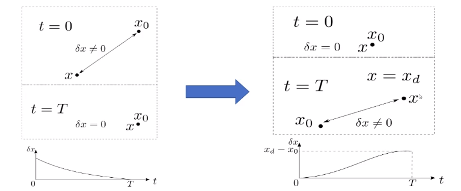

轨迹和控制：对单个关节的控制可能无法实现整体的最有优运动。

- model based
    - Differential Dynamic Programming
    - Direct Collocation
    - Planning As Interface

## 动力学

## 非线性系统的线性化

选择泰勒展开的参考点为 $x_{0}, u_{0}$ 对于函数 $f(x, u)$, 在点 $x_{0}, u_{0}$ 处 通过一阶泰勒展开获得它的线性化函数为
$$
f(x, u)=f\left(x_{0}, u_{0}\right)+\left.\frac{\partial f}{\partial x}\right|_{x=x_{0}}\left(x-x_{0}\right)+\left.\frac{\partial f}{\partial u}\right|_{u=u_{0}}\left(u-u_{0}\right)
$$
如果我们定义 $x=x_{0}+\delta x$ 和 $u=u_{0}+\delta u$, 则 $\dot{x}=\dot{x}_{0}+\delta \dot{x}$,由此可以 获得
$$
\delta \dot{x}=\left.\frac{\partial f}{\partial x}\right|_{x=x_{0}} \delta x+\left.\frac{\partial f}{\partial u}\right|_{u=u_{0}} \delta u
$$
如果我们把 $\delta x=x-x_{0}$ 当做我们要研究的状态 $x, \delta u=u-u_{0}$ 为 控制量 $u$, 然后令 $A=\left.\frac{\partial f}{\partial x}\right|_{x=x_{0}}$ 且 $B=\left.\frac{\partial f}{\partial u}\right|_{u=u_{0}}$, 则
$$
\dot{\delta x}=A \delta x+B \delta u
$$

## 二次型调节器

LQR: Linear Quadratic Regulator

如果所研究的系统是线性的，且性能指标为状态变量和控制变量的二次型函数，则最优控制问题称为线性二次型问题。 而LQR是指求解线性二次型问题常用的方法。

线性定常连续系统：

$$\begin{aligned}
&\dot{x}(t)=A x(t)+B u(t) \\
&y(t)=C x(t)+D u(t)
\end{aligned}$$

一般连续时间系统：

$$\begin{aligned}
&\dot{x}(t)=f[x(t), u(t), t] \\
&y(t)=g[x(t), u(t), t]
\end{aligned}$$

线性时变连续系统: 
$$
\begin{aligned}
&\dot{x}(t)=A(t) x(t)+B(t) u(t) \\
&y(t)=C(t) x(t)+D(t) u(t)
\end{aligned}
$$

令$x$为误差，$w$为误差项系数,令$Q=w_x^Tw_x, R=w_u^Tw_u$为半正定矩阵，也是误差系数.

$$J=\int_{0}^{\infty}\left(x^{T} Q x+u^{T} R u\right) d t$$

系统稳定时，$u(t)=-Kx(t), \dot{x}(t)=(A-B K) x(t)$,带入代价函数得到:

$$\begin{gathered}
J=\int_{0}^{\infty}\left(x^{T} Q x+u^{T} R u\right) d t \\
=\int_{0}^{\infty} x^{T}(t)\left(Q+K^{T} R K\right) x(t) d t
\end{gathered}$$

我们要找到这个积分的原函数, 为了找到 $K$, 假设存在一个常量矩阵 $P$, 使得
$$
\frac{d}{d t}\left(x(t)^{T} P x(t)\right)=-x^{T}(t)\left(Q+K^{T} R K\right) x(t)
$$
对式 $(8)$ 两边取微分
$$
\dot{x}^{T}(t) P x(t)+x^{T}(t) P \dot{x}(t)+x^{T}(t) Q x(t)+x^{T}(t) K^{T} R K x(t)=0
$$
将状态方程代入 $(9):$
$$
x^{T}(t)\left((A-B K)^{T} P+P(A-B K)+Q+K^{T} R K\right) x(t)=0
$$
这个式子要成立的话, 括号里的项必须为恒为零。
$$
(A-B K)^{T} P+P(A-B K)+Q+K^{T} R K=0
$$

进一步化简：
$$
A^{T} P+P A+Q+K^{T} R K-K^{T} B^{T} P-P B K=0
$$
为了约掉K，取 $K=R^{-1} B^{T} P$, 代入上式得:
$$
A^{T} P+P A+Q-P B R^{-1} B^{T} P=0
$$

上式为Riccati方程，解得P。最后根据反馈矩阵 $K=R^{-1}B^TP$得到K

1. 选择参数矩阵Q，R
2. 求解Riccati方程得到矩阵P
3. 根据公式计算K

#### 求解
离散化以后的整个问题变成
$$
\begin{array}{ll}
\min _{u} & J=\sum_{n=0}^{T} x[n]^{T} Q x[n]+u[n]^{T} R u[n] \\
\text { s.t. } & x[n+1]=A x[n]+B u[n]
\end{array}
$$
我们从 $S[N]=Q$ 开始反向求解 Riccati difference equation
$$
S[n-1]=Q+A^{T} S[n] A-A^{T} S[n] B\left(R+B^{T} S[n] B\right)^{-1} B^{T} S[n] A
$$
然后每一个时刻的最优控制为
$$
u[n]^{*}=-R^{-1} B^{T} S[n] x[n]=-K[n] x[n]
$$

#### Differential Dynamic Programming

LQR是将状态调节到0,而轨迹跟踪是系统误差为0。

LQR是在 $\delta x \neq 0$， 期望通过控制量在一定时间以后使得$\delta x = 0$。另一个类似的问题是反过来，一开始 $\delta x =0$, 期望在一定时间以后使得 $\delta x $为某一常量。

则优化问题变为：

$$\begin{array}{ll}
\min _{\delta u} & J=\left(\delta x[N]-\delta x_{d}\right)^{T} Q_{f}\left(\delta x[N]-\delta x_{d}\right)+\sum_{n=0}^{N-1} \delta x[n]^{T} Q \delta x[n]+\delta u[n]^{T} R \delta u[n] \\
\text { s.t. } & \delta x[n+1]=A \delta x[n]+B \delta u[n] \\
& \delta x(0)=0
\end{array}$$

其中.$\delta x_{d}=x_{d}-x_{0}, Q_{f}$ 是远大于$Q$的正定矩阵. $A，B$在不同的位置需要局部线性化。

因子图

- Factor graphs and GTSAM: A hands-on introduction
- Factor graphs for robot perception.

## ref

- blog
    - [csdn LQR：Linear Quadratic Regulator](https://blog.csdn.net/tauyangdao/article/details/108058222#31__53)
    - [LINEAR-QUADRATIC REGULATION FOR NON-LINEAR SYSTEMS USING FINITE DIFFERENCES](https://studywolf.wordpress.com/2015/11/10/linear-quadratic-regulation-for-non-linear-systems-using-finite-differences/)
    - [THE ITERATIVE LINEAR QUADRATIC REGULATOR ALGORITHM](https://studywolf.wordpress.com/2016/02/03/the-iterative-linear-quadratic-regulator-method/)
        - [code](https://github.com/studywolf/control/blob/master/studywolf_control/controllers/lqr.py)
- paper
    - [Control-limited differential dynamic programmin]()
    - [DIRCON](https://github.com/mposa/DIRCON)
    - [Synthesis and Stabilization of Complex Behaviors through Online Trajectory Optimization](https://homes.cs.washington.edu/~todorov/papers/TassaIROS12.pdf)

